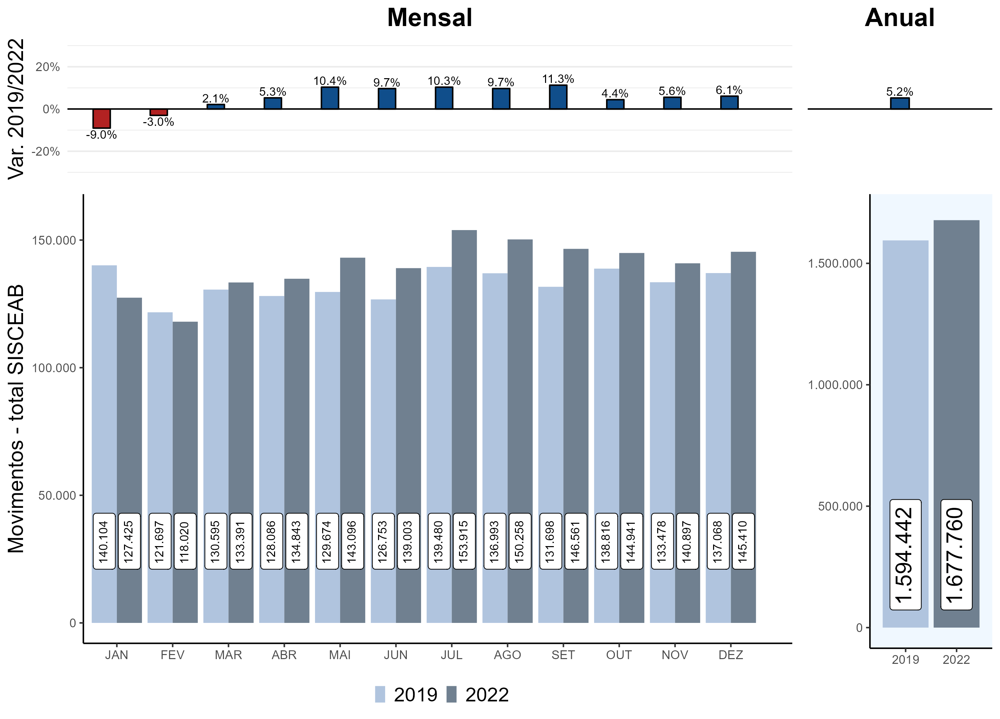

# Introdução

## Gestão por performance

A Organização de Aviação Civil Internacional (OACI) é uma agência especializada das Nações Unidas que tem por objetivo desenvolver princípios e técnicas para a navegação aérea internacional fomentando o planejamento e o desenvolvimento do transporte aéreo global, promovendo o desenvolvimento de todos os aspectos da indústria de aviação civil internacional.

A OACI enfatiza a importância de uma gestão baseada em performance e estimula Estados, Regiões e Organizações a se envolverem e participarem de atividades de análise comparativa de desempenho, divulgando seus resultados para fornecer à comunidade ATM internacional uma oportunidade de monitorar a sua evolução.

Ao promover uma gestão por performance, os Estados são orientados a utilizarem um conjunto de indicadores-chave de performance (KPI – Key Performance Indicators), que forneçam os meios de identificar deficiências e priorizar investimentos, além de compartilhar problemas de desempenho e melhores práticas em um nível regional e global, medindo e documentando os benefícios de desempenho produzidos pelas implementações de novas tecnologias e conceitos.

Desta forma, a gestão por performance permite que todas as partes envolvidas analisem a performance do sistema de navegação aérea corrente e futuro e tomem ações, caso necessário, de modo a preencher a lacuna entre o desempenho corrente e o desempenho esperado.

Assim, a CP-ATM, em atendimento ao Plano de Performance ATM do DECEA (PCA 100-3), dentre outras atribuições, atua na definição de indicadores de performance, na realização de análises pós-operações e em demais produtos de monitoramento do desempenho do SISCEAB, colaborando, assim, com a otimização da gestão por performance no âmbito do DECEA. 

### Plano Global de Navegação Aérea - GANP 

O GANP é o mais alto documento estratégico de navegação aérea da OACI, constituindo diretrizes para conduzir a evolução do sistema global de navegação aérea e apoiando o planejamento para implementações em nível local (Estados isolados) e regional (grupos de Estados).

O objetivo do GANP é acomodar todas as operações dos usuários do espaço aéreo de maneira segura e economicamente viável, ao mesmo tempo em que busca a redução do impacto ambiental da aviação.

Este relatório de performance concentra-se em um subconjunto das onze Áreas de Performance (KPA) do GANP. A relação entre as áreas de desempenho e as ambições da comunidade ATM estão descritas no quadro a seguir.

| KPA        |AMBIÇÃO DE DESEMPENHO|
|:-------------:| :-------------: |
|ACESSO E EQUIDADE|Nenhum membro da comunidade aeronáutica excluído ou tratado de forma injusta|
|CAPACIDADE|Capacidade nominal  facilmente compatível com a demanda.                Eventos inesperados não interromperão a prestação do serviço e não afetarão significativamente o desempenho do sistema|
|CUSTO-BENEFÍCIO|Sem aumento do custo total direto dos Serviços de Navegação Aérea.         Aumento significativo da produtividade dos Serviços de Navegação Aérea, independentemente da demanda|
|EFICIÊNCIA|Redução da distância entre a eficiência de voo alcançada e a trajetória ótima desejada|
|MEIO AMBIENTE|Ineficiências induzidas pelos Serviços de Navegação Aérea progressivamente eliminadas para contribuir com os objetivos globais da OACI relacionadas à emissões de CO2 Benefícios obtidos com os ganhos de eficiência de voo|
|FLEXIBILIDADE|Absorção das alterações necessárias às trajetórias dos voos|
|INTEROPERABILIDADE|Compatibilidade de sistemas em nível operacional e técnico|
|PARTICIPAÇÃO DA COMUNIDADE ATM|Máxima utilização partilhada dos recursos da navegação aérea|
|PREVISIBILIDADE|Sem variabilidade da entrega dos Serviços de Navegação Aérea|
|SEGURANÇA OPERACIONAL (Safety)|Sem acidentes relacionados com os Serviços de Navegação Aérea e redução significativa (50%) dos incidentes graves|
|SEGURANÇA DA AVIAÇÃO (Security)|Sem interrupções significativas devido a incidentes cibernéticos|

A visão do GANP reflete os objetivos do sistema de navegação aérea, que incluem desafios, oportunidades e tendências tecnológicas. A evolução impulsionada por essa visão produzirá um sistema de navegação aérea global de alto desempenho que atende às crescentes expectativas da sociedade.

Neste plano, é proposta uma estrutura de quatro camadas composta pelos níveis global (estratégico e técnico), regional e nacional, os quais fornecem uma estrutura para o alinhamento dos planos regionais, sub-regionais e nacionais. A estrutura de quatro camadas facilita a tomada de decisões ao fornecer uma direção estratégica estável para a evolução do sistema de navegação aérea e, ao mesmo tempo, indicando o grau de relevância, ao longo do tempo, para o conteúdo técnico a ser tratado.

## Abrangência

Os indicadores de performance apresentados neste documento foram calculados por meio de informações coletadas das melhores fontes de dados em termos de qualidade, regularidade e disponibilidade. Comparações de atividades operacionais requerem padronização do modus operandi, definições e entendimento comuns, mesmo considerando as particularidades de cada localidade. 

As informações descritas neste relatório não abordam todas as onze KPA previstas no GANP, concentrando-se nas informações relativas às características do sistema e nas áreas de Previsibilidade, Eficiência, Capacidade, Custo-Benefício, Segurança Operacional (Safety), Segurança da Aviação (Security) e Participação da Comunidade ATM. Além disso, projetos relacionados ao ATM também foram considerados.

## Âmbito geográfico

Este relatório abrange todo o espaço aéreo sob responsabilidade do Brasil sobre terra e mar, que ultrapassa a área sobrejacente ao território brasileiro e alcança uma significativa parte do Oceano Atlântico, conforme tratados internacionais, estendendo-se além de suas fronteiras e perfazendo um total de 22 milhões de km2 sob gestão estratégica da Aeronáutica.

O controle do espaço aéreo brasileiro é integrado: as funções de Defesa Aérea e de Controle de Tráfego Aéreo são desempenhadas pelo DECEA, um órgão governamental subordinado ao Comando da Aeronáutica e ao Ministério da Defesa.

Ao DECEA compete a implementação de equipamentos, órgãos e sistemas, bem como o controle e a supervisão das Organizações subordinadas, provendo diretrizes estratégicas necessárias para a condução das ações executadas pelas suas Organizações Regionais, os quatro Centros Integrados de Defesa Aérea e Controle de Tráfego Aéreo (CINDACTA), distribuídos como áreas de responsabilidade próprias de cinco Regiões de Informação de Voo (FIR), e o Centro Regional de Controle do Espaço Aéreo Sudeste (CRCEA-SE), com as seguintes estruturas de jurisdição:

## Escopo

O escopo de análise foi definido pela necessidade de identificar um conjunto comum de fontes de dados com níveis de detalhamento e cobertura adequados. Atendendo ao previsto no PCA 100-3, dentro das KPA já mencionadas, fazem parte do escopo do relatório as seguintes localidades:

## Âmbito temporal

Este relatório aborda o desempenho monitorado no SISCEAB para o período de 1º JAN 2022 a 31 DEZ 2022.

## Retomada da demanda nacional pós-COVID-19

Os impactos da pandemia da COVID-19 na indústria do transporte aéreo foram significativos e sem precedentes, estendendo-se durante a maior parte de 2020 e por todo o ano de 2021. A aviação internacional foi o segmento que mais sofreu com as medidas sanitárias impostas, em função do surgimento de novas variantes e do aumento no número de casos. 

A Erro! Autoreferência de indicador não válida. apresenta o total de voos realizados no SISCEAB em 2022, considerando os serviços prestados pelos diversos órgãos de controle. É possível observar a retomada das operações aéreas em quase todos os meses do último ano, com operações sempre próximas ou acima do total de 2019 (pré-pandemia). Vale ressaltar que o “Total de Voos no SISCEAB” conta todos os voos realizados no país, em espaço aéreo controlado, a partir dos planos de voo ativos. Adiante, ao se analisar no 2.4.1 as operações por segmento da aviação (Comercial Doméstica, Comercial Internacional e Geral), são consideradas as operações de pouso e decolagem nos principais aeroportos do país.

Os meses de maior movimento em 2022 foram julho e agosto, registrando 153.915 e 150.258 voos, respectivamente. Ao final do ano, o total de operações aéreas no SISCEAB ficou 5,2% acima do total de 2019.

