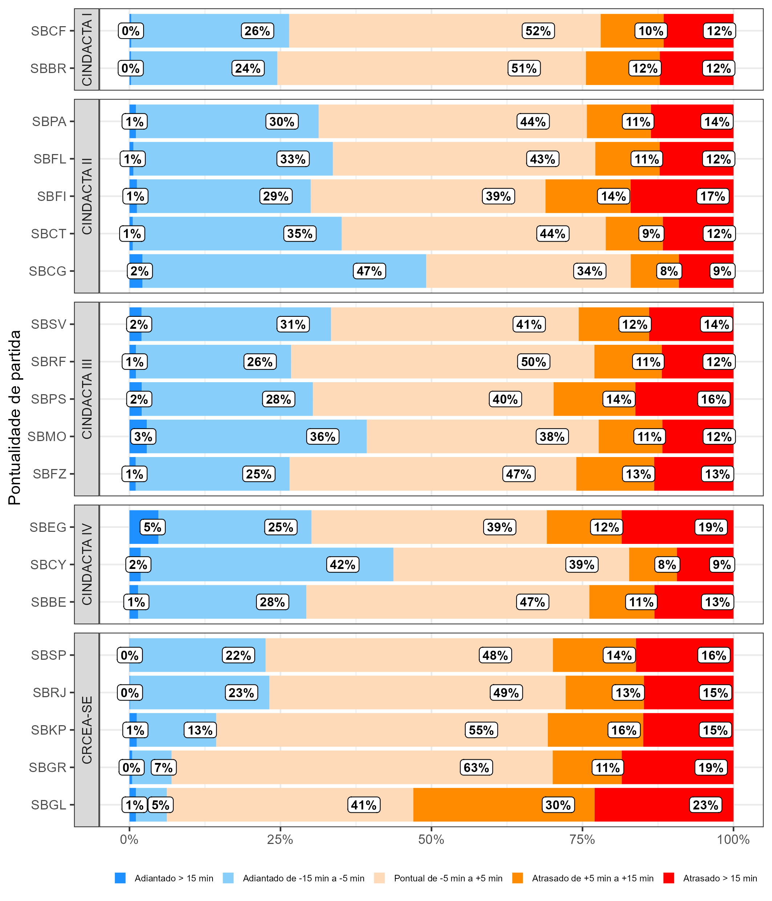
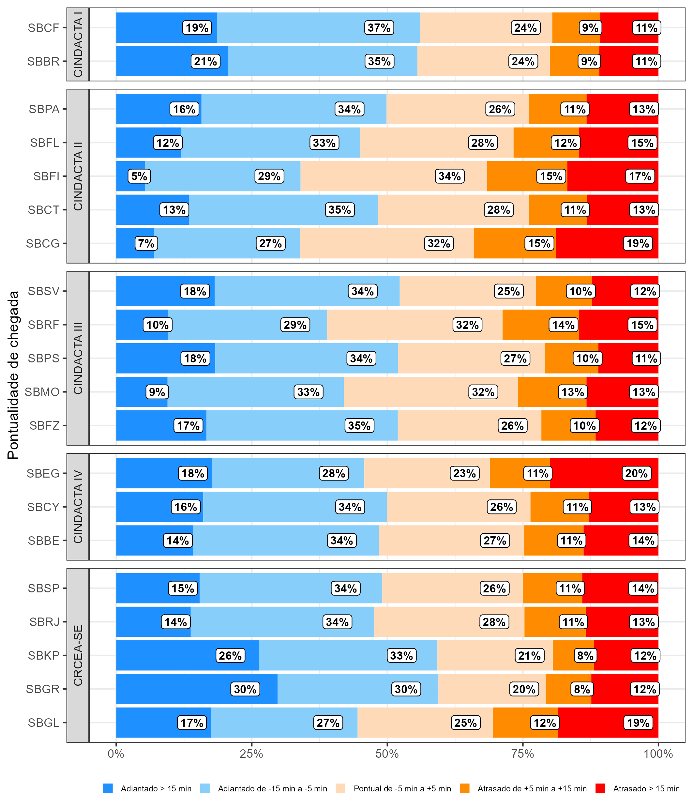

```{r setup, include=FALSE, echo=FALSE}


library(tidyverse)
library(lubridate)
library(dplyr)
library(readr)
library(patchwork) #pacote que soma os gráficos 
library(leaflet)#pacote para mapas dinamicos
library(geobr)#pacote para mapa simples
library(readxl)
library(sf)#pacote para mapa simples
library(rgdal) #pacote para API
library(httr) #pacote para API
library(jsonlite) #pacote para API
library(scales)
library(ggtext)
library(gridExtra)
library(Rcpp)# pacote usado para corrigir um erro
library(ggimage)#pacote para salvar os gráficos como imagem
library(flexdashboard)
library(ggrepel)
library(zoo)

```

```{r echo=FALSE, message=FALSE, warning=FALSE}
URL_BASE <- "http://siatfm.cgna.intraer/api/performance?apiUser=silveiralss&apiToken=7a11719421134986058a25ea58a3b002e2c185d5&area="

BDS_KPI_01 <- GET("http://siatfm.cgna.intraer/api/performance?apiUser=silveiralss&apiToken=7a11719421134986058a25ea58a3b002e2c185d5&area=KPI_01")
BDS_KPI_01_TEXT <- content(BDS_KPI_01, "text")
BDS_KPI_01_JSON <- fromJSON(BDS_KPI_01_TEXT,flatten = TRUE)
BDS_KPI_01_DF <- as.data.frame(BDS_KPI_01_JSON) %>%
  select(movimentos.ano,movimentos.percentual_ano, movimentos.regiao,movimentos.aero,movimentos.jan:movimentos.dez) %>% 
  mutate(movimentos.percentual_ano=movimentos.percentual_ano, movimentos.jan=movimentos.jan,
         movimentos.fev=movimentos.fev, movimentos.mar=movimentos.mar,
         movimentos.abr=movimentos.abr, movimentos.mai=movimentos.mai,
         movimentos.jun=movimentos.jun, movimentos.jul=movimentos.jul,
         movimentos.ago=movimentos.ago, movimentos.set=movimentos.set,
         movimentos.out=movimentos.out, movimentos.nov=movimentos.nov,
         movimentos.dez=movimentos.dez)

#uma maneira mais fácil de modificar o nome das colunas é usando o colnames()

COL_NAMES_KPI01 <- c("ANO", "PONTUALIDADE_ANO","REGIONAL","AERO","JAN","FEV","MAR","ABR", "MAI", "JUN", "JUL", "AGO", "SET", "OUT", "NOV", "DEZ")

colnames(BDS_KPI_01_DF) <- COL_NAMES_KPI01

######################

BDS_KPI_01_REGIONAL <- GET("http://siatfm.cgna.intraer/api/performance?apiUser=silveiralss&apiToken=7a11719421134986058a25ea58a3b002e2c185d5&area=KPI_01&regional=s")
BDS_KPI_01_TEXT_REGIONAL <- content(BDS_KPI_01_REGIONAL, "text")
BDS_KPI_01_JSON_REGIONAL <- fromJSON(BDS_KPI_01_TEXT_REGIONAL,flatten = TRUE)
BDS_KPI_01_REGIONAL_DF <- as.data.frame(BDS_KPI_01_JSON_REGIONAL)


########

BDS_KPI_02 <- GET("http://siatfm.cgna.intraer/api/performance?apiUser=silveiralss&apiToken=7a11719421134986058a25ea58a3b002e2c185d5&area=KPI_02")
BDS_KPI_02_TEXT <- content(BDS_KPI_02, "text")
BDS_KPI_02_JSON <- fromJSON(BDS_KPI_02_TEXT,flatten = TRUE)
BDS_KPI_02_DF <- as.data.frame(BDS_KPI_02_JSON)

########

BDS_KPI_02_REGIONAL <- GET("http://siatfm.cgna.intraer/api/performance?apiUser=silveiralss&apiToken=7a11719421134986058a25ea58a3b002e2c185d5&area=KPI_02&regional=s")
BDS_KPI_02_REGIONAL_TEXT <- content(BDS_KPI_02_REGIONAL, "text")
BDS_KPI_02_REGIONAL_JSON <- fromJSON(BDS_KPI_02_REGIONAL_TEXT,flatten = TRUE)
BDS_KPI_02_REGIONAL_DF <- as.data.frame(BDS_KPI_02_REGIONAL_JSON)


#########

BDS_KPI_06 <- GET("http://siatfm.cgna.intraer/api/performance?apiUser=silveiralss&apiToken=7a11719421134986058a25ea58a3b002e2c185d5&area=KPI_06")
BDS_KPI_06_TEXT <- content(BDS_KPI_06, "text")
BDS_KPI_06_JSON <- fromJSON(BDS_KPI_06_TEXT,flatten = TRUE)
BDS_KPI_06_DF <- as.data.frame(BDS_KPI_06_JSON)

##########


BDS_IDBR_06_TWR <- GET("http://siatfm.cgna.intraer/api/performance?apiUser=silveiralss&apiToken=7a11719421134986058a25ea58a3b002e2c185d5&area=IDBR_06&regional=TWR")
BDS_IDBR_06_TWR_TEXT <- content(BDS_IDBR_06_TWR, "text")
BDS_IDBR_06_TWR_JSON <- fromJSON(BDS_IDBR_06_TWR_TEXT,flatten = TRUE)
BDS_IDBR_06_TWR_DF <- as.data.frame(BDS_IDBR_06_TWR_JSON)

############

BDS_IDBR_06_APP <- GET("http://siatfm.cgna.intraer/api/performance?apiUser=silveiralss&apiToken=7a11719421134986058a25ea58a3b002e2c185d5&area=IDBR_06&regional=APP")
BDS_IDBR_06_APP_TEXT <- content(BDS_IDBR_06_APP, "text")
BDS_IDBR_06_APP_JSON <- fromJSON(BDS_IDBR_06_APP_TEXT,flatten = TRUE)
BDS_IDBR_06_APP_DF <- as.data.frame(BDS_IDBR_06_APP_JSON)

############

BDS_IDBR_06_ACC <- GET("http://siatfm.cgna.intraer/api/performance?apiUser=silveiralss&apiToken=7a11719421134986058a25ea58a3b002e2c185d5&area=IDBR_06&regional=ACC")
BDS_IDBR_06_ACC_TEXT <- content(BDS_IDBR_06_ACC, "text")
BDS_IDBR_06_ACC_JSON <- fromJSON(BDS_IDBR_06_ACC_TEXT,flatten = TRUE)
BDS_IDBR_06_ACC_DF <- as.data.frame(BDS_IDBR_06_ACC_JSON)

BDS_IDBR_06_ACC_DF <- BDS_IDBR_06_ACC_DF %>% mutate(ACC = case_when(movimentos.aero == "BRASIL" ~ "SISCEAB",
                         movimentos.aero == "SBBS" ~ "ACC Brasília",
                         movimentos.aero == "SBCW" ~ "ACC Curitiba",
                         movimentos.aero == "SBRE" ~ "ACC Recife",
                         movimentos.aero == "SBAZ" ~ "ACC Amazônico",
                         movimentos.aero == "SBAO" ~ "ACC Atlântico"))

##########


BDS_KPI_08_C40 <- GET("http://siatfm.cgna.intraer/api/performance?apiUser=silveiralss&apiToken=7a11719421134986058a25ea58a3b002e2c185d5&area=KPI_08_C40")
BDS_KPI_08_C40_TEXT <- content(BDS_KPI_08_C40, "text")
BDS_KPI_08_C40_JSON <- fromJSON(BDS_KPI_08_C40_TEXT,flatten = TRUE)
BDS_KPI_08_C40_DF <- as.data.frame(BDS_KPI_08_C40_JSON)%>%
  select(movimentos.ano,movimentos.percentual_ano, movimentos.regiao,movimentos.aero,movimentos.jan:movimentos.dez)

COL_NAMES_KPI08_c40 <- c("ANO", "PONTUALIDADE_ANO","REGIONAL","AERO","JAN","FEV","MAR","ABR", "MAI", "JUN", "JUL", "AGO", "SET", "OUT", "NOV", "DEZ")

colnames(BDS_KPI_08_C40_DF) <- COL_NAMES_KPI08_c40

##########

BDS_KPI_08_C100 <- GET("http://siatfm.cgna.intraer/api/performance?apiUser=silveiralss&apiToken=7a11719421134986058a25ea58a3b002e2c185d5&area=KPI_08_C100")
BDS_KPI_08_C100_TEXT <- content(BDS_KPI_08_C100, "text")
BDS_KPI_08_C100_JSON <- fromJSON(BDS_KPI_08_C100_TEXT,flatten = TRUE)
BDS_KPI_08_C100_DF <- as.data.frame(BDS_KPI_08_C100_JSON)%>%
  select(movimentos.ano,movimentos.percentual_ano, movimentos.regiao,movimentos.aero,movimentos.jan:movimentos.dez)

COL_NAMES_KPI08_c100 <- c("ANO", "PONTUALIDADE_ANO","REGIONAL","AERO","JAN","FEV","MAR","ABR", "MAI", "JUN", "JUL", "AGO", "SET", "OUT", "NOV", "DEZ")

colnames(BDS_KPI_08_C100_DF) <- COL_NAMES_KPI08_c100

##########
#UNIÃO DO KPI08 C40COM C100

#bind_cols() é usado para unir colunas de df diferentes

BDS_KPI08_C40_C100 <- bind_cols(BDS_KPI_08_C40_DF$ANO,
                                BDS_KPI_08_C40_DF$REGIONAL,
                                BDS_KPI_08_C40_DF$AERO,
                                BDS_KPI_08_C40_DF$PONTUALIDADE_ANO,
                                BDS_KPI_08_C100_DF$PONTUALIDADE_ANO)

COL_NAMES_KPI08_c40_c100 <- c("ANO","REGIONAL","AERO", "PONTUALIDADE_ANO_C40",
                              "PONTUALIDADE_ANO_C100")

colnames(BDS_KPI08_C40_C100) <- COL_NAMES_KPI08_c40_c100
#########################################################
#BDS KPI 08 POR REGIONAL

BDS_KPI_08_C40_REGIONAL <- GET("http://siatfm.cgna.intraer/api/performance?apiUser=silveiralss&apiToken=7a11719421134986058a25ea58a3b002e2c185d5&area=KPI_08_C40&regional=s")
BDS_KPI_08_C40_REGIONAL_TEXT <- content(BDS_KPI_08_C40_REGIONAL, "text")
BDS_KPI_08_C40_REGIONAL_JSON <- fromJSON(BDS_KPI_08_C40_REGIONAL_TEXT,flatten = TRUE)
BDS_KPI_08_C40_REGIONAL_DF <- as.data.frame(BDS_KPI_08_C40_REGIONAL_JSON)%>%
  select(movimentos.ano,movimentos.percentual_ano, movimentos.regiao,movimentos.aero,movimentos.jan:movimentos.dez)

COL_NAMES_KPI08_c40_REGIONAL <- c("ANO", "PONTUALIDADE_ANO","REGIONAL","AERO","JAN","FEV","MAR","ABR", "MAI", "JUN", "JUL", "AGO", "SET", "OUT", "NOV", "DEZ")

colnames(BDS_KPI_08_C40_REGIONAL_DF) <- COL_NAMES_KPI08_c40_REGIONAL
################
BDS_KPI_08_C100_REGIONAL <- GET("http://siatfm.cgna.intraer/api/performance?apiUser=silveiralss&apiToken=7a11719421134986058a25ea58a3b002e2c185d5&area=KPI_08_C100&regional=s")
BDS_KPI_08_C100_REGIONAL_TEXT <- content(BDS_KPI_08_C100_REGIONAL, "text")
BDS_KPI_08_C100_REGIONAL_JSON <- fromJSON(BDS_KPI_08_C100_REGIONAL_TEXT,flatten = TRUE)
BDS_KPI_08_C100_REGIONAL_DF <- as.data.frame(BDS_KPI_08_C100_REGIONAL_JSON)%>%
  select(movimentos.ano,movimentos.percentual_ano, movimentos.regiao,movimentos.aero,movimentos.jan:movimentos.dez)

COL_NAMES_KPI08_c100_REGIONAL <- c("ANO", "PONTUALIDADE_ANO","REGIONAL","AERO","JAN","FEV","MAR","ABR", "MAI", "JUN", "JUL", "AGO", "SET", "OUT", "NOV", "DEZ")

colnames(BDS_KPI_08_C100_REGIONAL_DF) <- COL_NAMES_KPI08_c100_REGIONAL
#########################
#unindo o KPI 08 por REGIONAL

BDS_KPI08_C40_C100_REGIONAL <- bind_cols(BDS_KPI_08_C40_REGIONAL_DF$ANO,
                                BDS_KPI_08_C40_REGIONAL_DF$REGIONAL,
                                BDS_KPI_08_C40_REGIONAL_DF$AERO,
                                BDS_KPI_08_C40_REGIONAL_DF$PONTUALIDADE_ANO,
                                BDS_KPI_08_C100_REGIONAL_DF$PONTUALIDADE_ANO)

COL_NAMES_KPI08_c40_c100_REGIONAL <- c("ANO","REGIONAL","AERO", "PONTUALIDADE_ANO_C40",
                              "PONTUALIDADE_ANO_C100")

colnames(BDS_KPI08_C40_C100_REGIONAL) <- COL_NAMES_KPI08_c40_c100_REGIONAL
BDS_KPI08_C40_C100_REGIONAL<- BDS_KPI08_C40_C100_REGIONAL %>% pivot_longer(cols = PONTUALIDADE_ANO_C40:PONTUALIDADE_ANO_C100,
                                             names_to = "C40_100",
                                             values_to = "ADICIONAL")


#BDS_KPI08_C40_C100_REGIONAL %>% mutate("40"="40", "100"="100") %>% 
#  unite()


#########################################################
#foi necessário criar uma BDS mensal para o KPI 08


#algumas vezes é necessário usar O pivot_longer() para transpor colunas em linhas

BDS_KPI_08_C40_MES <- BDS_KPI_08_C40_DF %>% 
  pivot_longer(cols = JAN:DEZ,
               names_to = "MES",
               values_to = "ADICIONAL") %>% 
  mutate("XXX"= "40") %>% 
  unite("AERO", c("AERO","XXX"))

BDS_KPI_08_C100_MES <- BDS_KPI_08_C100_DF %>% 
  pivot_longer(cols = JAN:DEZ,
               names_to = "MES",
               values_to = "ADICIONAL")%>% 
  mutate("XXX"= "100") %>% 
  unite("AERO", c("AERO","XXX"))


BDS_KPI_08_MES <- bind_rows(BDS_KPI_08_C40_MES,BDS_KPI_08_C100_MES)


##########

BDS_KPI_09 <- GET("http://siatfm.cgna.intraer/api/performance?apiUser=silveiralss&apiToken=7a11719421134986058a25ea58a3b002e2c185d5&area=KPI_09")
BDS_KPI_09_TEXT <- content(BDS_KPI_09, "text")
BDS_KPI_09_JSON <- fromJSON(BDS_KPI_09_TEXT,flatten = TRUE)
BDS_KPI_09_DF <- as.data.frame(BDS_KPI_09_JSON)

##########

BDS_KPI_10 <- GET("http://siatfm.cgna.intraer/api/performance?apiUser=silveiralss&apiToken=7a11719421134986058a25ea58a3b002e2c185d5&area=KPI_10")
BDS_KPI_10_TEXT <- content(BDS_KPI_10, "text")
BDS_KPI_10_JSON <- fromJSON(BDS_KPI_10_TEXT,flatten = TRUE)
BDS_KPI_10_DF <- as.data.frame(BDS_KPI_10_JSON)

##########

BDS_KPI_11 <- GET("http://siatfm.cgna.intraer/api/performance?apiUser=silveiralss&apiToken=7a11719421134986058a25ea58a3b002e2c185d5&area=KPI_11")
BDS_KPI_11_TEXT <- content(BDS_KPI_11, "text")
BDS_KPI_11_JSON <- fromJSON(BDS_KPI_11_TEXT,flatten = TRUE)
BDS_KPI_11_DF <- as.data.frame(BDS_KPI_11_JSON)

##########

BDS_KPI_13 <- GET("http://siatfm.cgna.intraer/api/performance?apiUser=silveiralss&apiToken=7a11719421134986058a25ea58a3b002e2c185d5&area=KPI_13")
BDS_KPI_13_TEXT <- content(BDS_KPI_13, "text")
BDS_KPI_13_JSON <- fromJSON(BDS_KPI_13_TEXT,flatten = TRUE)
BDS_KPI_13_DF <- as.data.frame(BDS_KPI_13_JSON)

##########
BDS_KPI_13_REGIONAL <- GET("http://siatfm.cgna.intraer/api/performance?apiUser=silveiralss&apiToken=7a11719421134986058a25ea58a3b002e2c185d5&area=KPI_13&regional=s")
BDS_KPI_13_REGIONAL_TEXT <- content(BDS_KPI_13_REGIONAL, "text")
BDS_KPI_13_REGIONAL_JSON <- fromJSON(BDS_KPI_13_REGIONAL_TEXT,flatten = TRUE)
BDS_KPI_13_REGIONAL_DF <- as.data.frame(BDS_KPI_13_REGIONAL_JSON)

##########

BDS_KPI_14 <- GET("http://siatfm.cgna.intraer/api/performance?apiUser=silveiralss&apiToken=7a11719421134986058a25ea58a3b002e2c185d5&area=KPI_14")
BDS_KPI_14_TEXT <- content(BDS_KPI_14, "text")
BDS_KPI_14_JSON <- fromJSON(BDS_KPI_14_TEXT,flatten = TRUE)
BDS_KPI_14_DF <- as.data.frame(BDS_KPI_14_JSON)%>%
  select(movimentos.ano,movimentos.percentual_ano, movimentos.regiao,movimentos.aero,movimentos.jan:movimentos.dez) %>% 
  mutate(movimentos.percentual_ano=movimentos.percentual_ano, movimentos.jan=movimentos.jan,
         movimentos.fev=movimentos.fev, movimentos.mar=movimentos.mar,
         movimentos.abr=movimentos.abr, movimentos.mai=movimentos.mai,
         movimentos.jun=movimentos.jun, movimentos.jul=movimentos.jul,
         movimentos.ago=movimentos.ago, movimentos.set=movimentos.set,
         movimentos.out=movimentos.out, movimentos.nov=movimentos.nov,
         movimentos.dez=movimentos.dez)
COL_NAMES_KPI14 <- c("ANO", "PONTUALIDADE_ANO","REGIONAL","AERO","JAN","FEV","MAR","ABR", "MAI", "JUN", "JUL", "AGO", "SET", "OUT", "NOV", "DEZ")

colnames(BDS_KPI_14_DF) <- COL_NAMES_KPI14

#####
BDS_KPI_14_REGIONAL <- GET("http://siatfm.cgna.intraer/api/performance?apiUser=silveiralss&apiToken=7a11719421134986058a25ea58a3b002e2c185d5&area=KPI_14&regional=s")
BDS_KPI_14_TEXT_REGIONAL <- content(BDS_KPI_14_REGIONAL, "text")
BDS_KPI_14_JSON_REGIONAL <- fromJSON(BDS_KPI_14_TEXT_REGIONAL,flatten = TRUE)
BDS_KPI_14_REGIONAL_DF <- as.data.frame(BDS_KPI_14_JSON_REGIONAL)


####################

PONT_ARR_DEP <- bind_cols(BDS_KPI_14_DF$ANO,BDS_KPI_14_DF$AERO,BDS_KPI_14_DF$PONTUALIDADE_ANO,BDS_KPI_01_DF$PONTUALIDADE_ANO)
COL_NAMES_ARR_DEP <- c("ANO","AERO", "PONT.ARR","PONT.DEP")
colnames(PONT_ARR_DEP) <- COL_NAMES_ARR_DEP

PONT_ARR_DEP <- PONT_ARR_DEP %>% filter(ANO==2022)


##########

BDS_KPI_15 <- GET("http://siatfm.cgna.intraer/api/performance?apiUser=silveiralss&apiToken=7a11719421134986058a25ea58a3b002e2c185d5&area=KPI_15")
BDS_KPI_15_TEXT <- content(BDS_KPI_15, "text")
BDS_KPI_15_JSON <- fromJSON(BDS_KPI_15_TEXT,flatten = TRUE)
BDS_KPI_15_DF <- as.data.frame(BDS_KPI_15_JSON)


#abaixo crio um df para poder fazer a variação entre o ano de 2022 e 2019

VAR15_2022 <- BDS_KPI_15_DF %>% filter(movimentos.ano=="2022") %>% filter(movimentos.total_movimentos>3500)#QUANDO NECESSÁRIO É SÓ SUBSTITUIR O "2000" PELO VALOR NECESSÁRIO
VAR15_2021 <- BDS_KPI_15_DF %>% filter(movimentos.ano=="2021") %>% filter(movimentos.fluxo%in%VAR15_2022$movimentos.fluxo)
VAR15 <- bind_cols(VAR15_2021,VAR15_2022$movimentos.percentual_ano_70,VAR15_2022$movimentos.total_movimentos) %>% 
  #FOI CRIADO O VAR15 PARA CRIAR O LABEL DE VARIAÇÃO 
  transmute(ROTA=movimentos.fluxo,VAR21=movimentos.percentual_ano_70,VAR22=...24,MOVIMENTOS.21=movimentos.total_movimentos, MOVIMENTOS.22=...25 ) %>% 
  mutate(VAR= (VAR22-VAR21)/VAR21, VAR.ANO=(MOVIMENTOS.22-MOVIMENTOS.21)/MOVIMENTOS.21)


##########

BDS_KPI_TOTAL_AZ <- GET("http://siatfm.cgna.intraer/api/performance?apiUser=silveiralss&apiToken=7a11719421134986058a25ea58a3b002e2c185d5&area=Total&regional=SBAZ")
BDS_KPI_TOTAL_AZ_TEXT <- content(BDS_KPI_TOTAL_AZ, "text")
BDS_KPI_TOTAL_AZ_JSON <- fromJSON(BDS_KPI_TOTAL_AZ_TEXT,flatten = TRUE)
BDS_KPI_TOTAL_AZ_DF <- as.data.frame(BDS_KPI_TOTAL_AZ_JSON)

##########

BDS_KPI_TOTAL_AO <- GET("http://siatfm.cgna.intraer/api/performance?apiUser=silveiralss&apiToken=7a11719421134986058a25ea58a3b002e2c185d5&area=Total&regional=SBAO")
BDS_KPI_TOTAL_AO_TEXT <- content(BDS_KPI_TOTAL_AO, "text")
BDS_KPI_TOTAL_AO_JSON <- fromJSON(BDS_KPI_TOTAL_AO_TEXT,flatten = TRUE)
BDS_KPI_TOTAL_AO_DF <- as.data.frame(BDS_KPI_TOTAL_AO_JSON)

##########

BDS_KPI_TOTAL_BS <- GET("http://siatfm.cgna.intraer/api/performance?apiUser=silveiralss&apiToken=7a11719421134986058a25ea58a3b002e2c185d5&area=Total&regional=SBBS")
BDS_KPI_TOTAL_BS_TEXT <- content(BDS_KPI_TOTAL_BS, "text")
BDS_KPI_TOTAL_BS_JSON <- fromJSON(BDS_KPI_TOTAL_BS_TEXT,flatten = TRUE)
BDS_KPI_TOTAL_BS_DF <- as.data.frame(BDS_KPI_TOTAL_BS_JSON)

##########

BDS_KPI_TOTAL_CW <- GET("http://siatfm.cgna.intraer/api/performance?apiUser=silveiralss&apiToken=7a11719421134986058a25ea58a3b002e2c185d5&area=Total&regional=SBCW")
BDS_KPI_TOTAL_CW_TEXT <- content(BDS_KPI_TOTAL_CW, "text")
BDS_KPI_TOTAL_CW_JSON <- fromJSON(BDS_KPI_TOTAL_CW_TEXT,flatten = TRUE)
BDS_KPI_TOTAL_CW_DF <- as.data.frame(BDS_KPI_TOTAL_CW_JSON)

##########

BDS_KPI_TOTAL_RE <- GET("http://siatfm.cgna.intraer/api/performance?apiUser=silveiralss&apiToken=7a11719421134986058a25ea58a3b002e2c185d5&area=Total&regional=SBRE")
BDS_KPI_TOTAL_RE_TEXT <- content(BDS_KPI_TOTAL_RE, "text")
BDS_KPI_TOTAL_RE_JSON <- fromJSON(BDS_KPI_TOTAL_RE_TEXT,flatten = TRUE)
BDS_KPI_TOTAL_RE_DF <- as.data.frame(BDS_KPI_TOTAL_RE_JSON)

##########

BDS_KPI_TOTAL_Brasil <- GET("http://siatfm.cgna.intraer/api/performance?apiUser=silveiralss&apiToken=7a11719421134986058a25ea58a3b002e2c185d5&area=Total&regional=Brasil")
BDS_KPI_TOTAL_Brasil_TEXT <- content(BDS_KPI_TOTAL_Brasil, "text")
BDS_KPI_TOTAL_Brasil_JSON <- fromJSON(BDS_KPI_TOTAL_Brasil_TEXT,flatten = TRUE)
BDS_KPI_TOTAL_Brasil_DF <- as.data.frame(BDS_KPI_TOTAL_Brasil_JSON)

##########

BDS_KPI_TOTAL <- GET("http://siatfm.cgna.intraer/api/performance?apiUser=silveiralss&apiToken=7a11719421134986058a25ea58a3b002e2c185d5&area=Total")
BDS_KPI_TOTAL_TEXT <- content(BDS_KPI_TOTAL, "text")
BDS_KPI_TOTAL_JSON <- fromJSON(BDS_KPI_TOTAL_TEXT,flatten = TRUE)
BDS_KPI_TOTAL_DF <- as.data.frame(BDS_KPI_TOTAL_JSON)

#########

BDS_KPI_COMER <- GET("http://siatfm.cgna.intraer/api/performance?apiUser=silveiralss&apiToken=7a11719421134986058a25ea58a3b002e2c185d5&area=Comercial")
BDS_KPI_COMER_TEXT <- content(BDS_KPI_COMER, "text")
BDS_KPI_COMER_JSON <- fromJSON(BDS_KPI_COMER_TEXT,flatten = TRUE)
BDS_KPI_COMER_DF <- as.data.frame(BDS_KPI_COMER_JSON)

##########

BDS_KPI_GERAL <- GET("http://siatfm.cgna.intraer/api/performance?apiUser=silveiralss&apiToken=7a11719421134986058a25ea58a3b002e2c185d5&area=Geral")
BDS_KPI_GERAL_TEXT <- content(BDS_KPI_GERAL, "text")
BDS_KPI_GERAL_JSON <- fromJSON(BDS_KPI_GERAL_TEXT,flatten = TRUE)
BDS_KPI_GERAL_DF <- as.data.frame(BDS_KPI_GERAL_JSON)

#################
COL.NAMES.MOV <- c("ANO", "TOTAL","JAN","FEV","MAR","ABR", "MAI", "JUN", "JUL", "AGO", "SET", "OUT", "NOV", "DEZ")

MOV_GERAL <- BDS_KPI_GERAL_DF %>% select(movimentos.ano, movimentos.total,movimentos.jan:movimentos.dez) %>% 
  group_by(movimentos.ano) %>% summarise(movimentos.total = sum(movimentos.total),
                                         movimentos.jan = sum(movimentos.jan),
                                         movimentos.fev = sum(movimentos.fev),
                                         movimentos.mar = sum(movimentos.mar),
                                         movimentos.abr = sum(movimentos.abr),
                                         movimentos.mai = sum(movimentos.mai),
                                         movimenos.jun = sum(movimentos.jun),
                                         movimentos.jul = sum(movimentos.jul),
                                         movimentos.ago = sum(movimentos.ago),
                                         movimentoss.set = sum(movimentos.set),
                                         movimentos.out = sum(movimentos.out),
                                         movimentos.nov = sum(movimentos.nov),
                                         movimentos.dez = sum(movimentos.dez)) %>% 
  `colnames<-`(COL.NAMES.MOV) %>% pivot_longer(cols = JAN:DEZ,
                                               names_to = "MES",
                                               values_to = "MOV") %>% 
  mutate(ANO=as.factor(ANO),MES= factor(MES, levels = c("JAN","FEV","MAR","ABR","MAI","JUN","JUL","AGO","SET","OUT","NOV","DEZ")))


###########

BDS_KPI_MIL <- GET("http://siatfm.cgna.intraer/api/performance?apiUser=silveiralss&apiToken=7a11719421134986058a25ea58a3b002e2c185d5&area=Militar")
BDS_KPI_MIL_TEXT <- content(BDS_KPI_MIL, "text")
BDS_KPI_MIL_JSON <- fromJSON(BDS_KPI_MIL_TEXT,flatten = TRUE)
BDS_KPI_MIL_DF <- as.data.frame(BDS_KPI_MIL_JSON)


#########

BDS_KPI_MEDIA <- GET("http://siatfm.cgna.intraer/api/performance?apiUser=silveiralss&apiToken=7a11719421134986058a25ea58a3b002e2c185d5&area=Media")
BDS_KPI_MEDIA_TEXT <- content(BDS_KPI_MEDIA, "text")
BDS_KPI_MEDIA_JSON <- fromJSON(BDS_KPI_MEDIA_TEXT,flatten = TRUE)
BDS_KPI_MEDIA_DF <- as.data.frame(BDS_KPI_MEDIA_JSON)

######### 
#BDS PARA MOVIMENTOS DA AVIAÇÃO COMERCIAL DOMÉSTICA (01)

BDS_KPI_COMERCIAL_NAC <- GET("http://siatfm.cgna.intraer/api/performance?apiUser=silveiralss&apiToken=7a11719421134986058a25ea58a3b002e2c185d5&area=Comercial-Nac")
BDS_KPI_COMERCIAL_NAC_TEXT <- content(BDS_KPI_COMERCIAL_NAC, "text")
BDS_KPI_COMERCIAL_NAC_JSON <- fromJSON(BDS_KPI_COMERCIAL_NAC_TEXT,flatten = TRUE)
BDS_KPI_COMERCIAL_NAC_DF <- as.data.frame(BDS_KPI_COMERCIAL_NAC_JSON) %>% 
  select(movimentos.ano, movimentos.total,movimentos.jan:movimentos.dez)
COL.NAMES.MOV <- c("ANO", "TOTAL","JAN","FEV","MAR","ABR", "MAI", "JUN", "JUL", "AGO", "SET", "OUT", "NOV", "DEZ")
colnames(BDS_KPI_COMERCIAL_NAC_DF) <- COL.NAMES.MOV

#AJUSTES NA BDS PARA CRIAR O GRÁFICO PARA O ANO DE 2022
MOV_COM_DOMESTC <- BDS_KPI_COMERCIAL_NAC_DF %>% 
  pivot_longer(cols = JAN:DEZ,
               names_to = "MES",
               values_to = "MOV") %>% 
  mutate(MES=factor(MES,levels = c("JAN","FEV","MAR","ABR","MAI","JUN","JUL","AGO","SET","OUT","NOV","DEZ")), ANO=as.character(ANO)) 
MOV_COM_DOMESTC_2019 <- MOV_COM_DOMESTC %>% filter(ANO=="2019")
MOV_COM_DOMESTC_2022 <- MOV_COM_DOMESTC %>% filter(ANO=="2022")
MOV_COM_DOM <- bind_cols(MOV_COM_DOMESTC_2019,MOV_COM_DOMESTC_2022$MOV) %>% #FOI CRIADO O MOV_COM_DOM PARA CRIAR O LABEL DE VARIAÇÃO 
  transmute(ANO=ANO,TOTAL=TOTAL,MES=MES,MOV19=MOV,MOV22=...5) %>% mutate(VAR= (MOV22-MOV19)/MOV19)


#########
#BDS PARA MOVIMENTOS DA AVIAÇÃO COMERCIAL INTERNACIONAL (02)

BDS_KPI_COMERCIAL_INT <- GET("http://siatfm.cgna.intraer/api/performance?apiUser=silveiralss&apiToken=7a11719421134986058a25ea58a3b002e2c185d5&area=Comercial-Int")
BDS_KPI_COMERCIAL_INT_TEXT <- content(BDS_KPI_COMERCIAL_INT, "text")
BDS_KPI_COMERCIAL_INT_JSON <- fromJSON(BDS_KPI_COMERCIAL_INT_TEXT,flatten = TRUE)
BDS_KPI_COMERCIAL_INT_DF <- as.data.frame(BDS_KPI_COMERCIAL_INT_JSON)%>% 
  select(movimentos.ano, movimentos.total,movimentos.jan:movimentos.dez)
COL.NAMES.MOV <- c("ANO", "TOTAL","JAN","FEV","MAR","ABR", "MAI", "JUN", "JUL", "AGO", "SET", "OUT", "NOV", "DEZ")
colnames(BDS_KPI_COMERCIAL_INT_DF) <- COL.NAMES.MOV

#AJUSTES NA BDS PARA CRIAR O GRÁFICO PARA O ANO DE 2022
MOV_COM_INT <- BDS_KPI_COMERCIAL_INT_DF %>%
  pivot_longer(cols = JAN:DEZ,
               names_to = "MES",
               values_to = "MOV") %>% 
  mutate(MES=factor(MES,levels = c("JAN","FEV","MAR","ABR","MAI","JUN","JUL","AGO","SET","OUT","NOV","DEZ")), ANO=as.character(ANO))
MOV_COM_INT_2019 <- MOV_COM_INT %>% filter(ANO=="2019")
MOV_COM_INT_2022 <- MOV_COM_INT %>% filter(ANO=="2022")
MOV_COM_INT_VAR <- bind_cols(MOV_COM_INT_2019,MOV_COM_INT_2022$MOV) %>% 
  transmute(ANO=ANO,TOTAL=TOTAL,MES=MES,MOV19=MOV,MOV22=...5) %>% mutate(VAR= (MOV22-MOV19)/MOV19)


#########

BDS_KPI_IDBR_06 <- GET("http://siatfm.cgna.intraer/api/performance?apiUser=silveiralss&apiToken=7a11719421134986058a25ea58a3b002e2c185d5&area=IDBR_06")
BDS_KPI_IDBR_06_TEXT <- content(BDS_KPI_IDBR_06, "text")
BDS_KPI_IDBR_06_JSON <- fromJSON(BDS_KPI_IDBR_06_TEXT,flatten = TRUE)
BDS_KPI_IDBR_06_DF <- as.data.frame(BDS_KPI_IDBR_06_JSON)

#########

BDS_KPI_MIN_ATRASO <- GET("http://siatfm.cgna.intraer/api/performance?apiUser=silveiralss&apiToken=7a11719421134986058a25ea58a3b002e2c185d5&area=MIN_ATRASO")
BDS_KPI_MIN_ATRASO_TEXT <- content(BDS_KPI_MIN_ATRASO, "text")
BDS_KPI_MIN_ATRASO_JSON <- fromJSON(BDS_KPI_MIN_ATRASO_TEXT,flatten = TRUE)
BDS_KPI_MIN_ATRASO_DF <- as.data.frame(BDS_KPI_MIN_ATRASO_JSON)

#########

BDS_KPI_DENSIDADE <- GET("http://siatfm.cgna.intraer/api/performance?apiUser=silveiralss&apiToken=7a11719421134986058a25ea58a3b002e2c185d5&area=DENSIDADE")
BDS_KPI_DENSIDADE_TEXT <- content(BDS_KPI_DENSIDADE, "text")
BDS_KPI_DENSIDADE_JSON <- fromJSON(BDS_KPI_DENSIDADE_TEXT,flatten = TRUE)
BDS_KPI_DENSIDADE_DF <- as.data.frame(BDS_KPI_DENSIDADE_JSON)


#####################################################################################################################################################

#criação do conjunto de cores para os gráficos

cores <- c("#B0C4DE",
           "#708090",
           "#4682B4",
           "#191970")

#######################################
#UNIÃO DAS BDS TOTAL(POR FIR) PARA CIAÇÃO DO GRÁFICO "TOTAL DE MOVIMENTOS SISCEAB E POR FIR" (03)


TOTAL_MOV_SISC_FIR <- bind_rows(BDS_KPI_TOTAL_Brasil_DF, 
                                BDS_KPI_TOTAL_BS_DF, 
                                BDS_KPI_TOTAL_CW_DF, 
                                BDS_KPI_TOTAL_RE_DF, 
                                BDS_KPI_TOTAL_AZ_DF, 
                                BDS_KPI_TOTAL_AO_DF) %>% 
  select(movimentos.fir, movimentos.ano, movimentos.total) %>%
  filter(movimentos.ano!='2018')

#MUDANDO O NOME DAS COLUNAS
COL.NAMES.TOTAL <- c("FIR","ANO", "TOTAL") 
colnames(TOTAL_MOV_SISC_FIR) <- COL.NAMES.TOTAL

#AJUSTES NA BDS PARA CRIAR O GRÁFICO
#case_when() substitui o nome dos itens

TOTAL_MOV_SISC_FIR <- TOTAL_MOV_SISC_FIR %>%
mutate(FIR = case_when(FIR == "BRASIL" ~ "SISCEAB",
                         FIR == "SBBS" ~ "FIR Brasília",
                         FIR == "SBCW" ~ "FIR Curitiba",
                         FIR == "SBRE" ~ "FIR Recife",
                         FIR == "SBAZ" ~ "FIR Amazônica",
                         FIR == "SBAO" ~ "FIR Atlântico"), ANO=as.character(ANO)) %>%
  mutate(FIR= factor(FIR))


###
#BDS PARA MOVIMENTOS MENSAL POR FIR
#bind_rows()cola linhas de df diferentes
#transmute()cria ou modifica colunas e exclui as colunas que não foram usadas, diferente do mutate que mantem todas as #colunas

VAR_MES_FIR <- bind_rows(BDS_KPI_TOTAL_Brasil_DF, 
          BDS_KPI_TOTAL_BS_DF, 
          BDS_KPI_TOTAL_CW_DF, 
          BDS_KPI_TOTAL_RE_DF, 
          BDS_KPI_TOTAL_AZ_DF, 
          BDS_KPI_TOTAL_AO_DF) %>% 
  transmute(FIR=movimentos.fir,ANO=movimentos.ano,TOTAL=movimentos.total,
            JAN=movimentos.jan,
            FEV=movimentos.fev,
            MAR=movimentos.mar,
            ABR=movimentos.abr,
            MAI=movimentos.mai,
            JUN=movimentos.jun,
            JUL=movimentos.jul,
            AGO=movimentos.ago,
            SET=movimentos.set,
            OUT=movimentos.out,
            NOV=movimentos.nov,
            DEZ=movimentos.dez) %>% 
  pivot_longer(cols = JAN:DEZ,
               names_to = "MES",
               values_to = "MOV") %>% 
  mutate(MES=factor(MES,levels = c("JAN","FEV","MAR","ABR","MAI","JUN","JUL","AGO","SET","OUT","NOV","DEZ"))) %>% 
  mutate(FIR = case_when(FIR == "BRASIL" ~ "SISCEAB",
                         FIR == "SBBS" ~ "FIR Brasília",
                         FIR == "SBCW" ~ "FIR Curitiba",
                         FIR == "SBRE" ~ "FIR Recife",
                         FIR == "SBAZ" ~ "FIR Amazônica",
                         FIR == "SBAO" ~ "FIR Atlântico"), ANO=as.character(ANO)) %>%
  mutate(FIR= factor(FIR, levels = c("FIR Brasília","FIR Curitiba","FIR Recife","FIR Amazônica","FIR Atlântico","SISCEAB")))
  

#########################################

#BDS PARA CRIAÇÃO DO GRÁFICO DE MOVIMENTOS DO ANO POR MES SISCEAB (04)


TOTAL_MOV_MES_SISCEAB <- BDS_KPI_TOTAL_Brasil_DF %>%
  select(movimentos.ano,movimentos.total:movimentos.dez) %>% 
  filter(movimentos.ano!='2018')
colnames(TOTAL_MOV_MES_SISCEAB) <- COL.NAMES.MOV

#AJUSTES NA BDS PARA CRIAR O GRÁFICO
TOTAL_MES_SISCEAB <- TOTAL_MOV_MES_SISCEAB %>%
  pivot_longer(cols = JAN:DEZ,
               names_to = "MES",
               values_to = "MOV") %>% 
  mutate(MES=factor(MES,levels = c("JAN","FEV","MAR","ABR","MAI","JUN","JUL","AGO","SET","OUT","NOV","DEZ")), ANO=as.character(ANO))


#########################################
# BDS PARA CRIAÇÃO DO GRÁFICO DE DENSIDADE DO TRÁFEGO POR REGIONAL(05)

BDS_DENSIDADE <- BDS_KPI_DENSIDADE_DF %>% 
  filter(movimentos.ano == "2022") %>% 
  separate(movimentos.chave, into = c("FIR","CHAVE"), sep = "-") %>% 
  select(FIR, movimentos.ano,movimentos.percentual_ano, movimentos.jan:movimentos.dez) %>% 
  mutate(FIR = case_when(FIR == "BRASIL" ~ "SISCEAB",
                         FIR == "SBBS" ~ "CINDACTA I",
                         FIR == "SBCW" ~ "CINDACTA II",
                         FIR == "SBRE" ~ "CINDACTA III",
                         FIR == "SBAZ" ~ "CINDACTA IV",
                         FIR == "SBAO" ~ "FIR Atlântico",
                         FIR == "CRCEA" ~ "CRCEA-SE"))

COL.NAMES.DENSI <- c("FIR","ANO", "PERCENT.ANO","JAN","FEV","MAR","ABR", "MAI", "JUN", "JUL", "AGO", "SET", "OUT", "NOV", "DEZ")
colnames(BDS_DENSIDADE) <- COL.NAMES.DENSI

DENSIDADE_C1 <- BDS_DENSIDADE[5,3]
DENSIDADE_C2 <- BDS_DENSIDADE[6,3]
DENSIDADE_C3 <- BDS_DENSIDADE[7,3]
DENSIDADE_C4 <- BDS_DENSIDADE[4,3]
DENSIDADE_SISCEAB <- BDS_DENSIDADE[1,3]
DENSIDADE_CRCEA <- BDS_DENSIDADE[2,3]
DENSIDADE_AO <- BDS_DENSIDADE[3,3]

##########################################
#LAT LONG DOS MAPAS


VERTICES_SETORES_FIR_SET22 <- read_csv("data/VERTICES_RESTANTES.csv")


VERTICES_SBCW <- read_excel("data/VERTICES_SBCW.xlsx") %>% 
  mutate(REGIONAL= "CINDACTA II", DENSIDADE= DENSIDADE_C2)

VERTICES_SBAZ <- read_excel("data/VERTICES_SBAZ.xlsx") %>% 
  mutate(REGIONAL= "CINDACTA IV", DENSIDADE=DENSIDADE_C4)

VERTICES_SBBS <- read_excel("data/VERTICES_SBBS.xlsx") %>% 
  mutate(REGIONAL="CINDACTA I", DENSIDADE=DENSIDADE_C1)

VERTICES_CRCEA_SE <- read_excel("data/VERTICES_CRCEA_SE.xlsx") %>% 
  mutate(REGIONAL="CRCEA-SE", DENSIDADE=DENSIDADE_CRCEA)

VERTICES_SBRE <- read_excel("data/VERTICES_SBRE.xlsx") %>% 
  mutate(REGIONAL="CINDACTA III", DENSIDADE=DENSIDADE_C3)


VERTICES_SBAO_S1 <-read_csv("data/SBAO_S1.csv")
VERTICES_SBAO_S2 <-read_csv("data/SBAO_S2.csv")
VERTICES_SBAO_S3 <-read_csv("data/SBAO_S3.csv")

VERTICES_SBAO <- bind_rows(VERTICES_SBAO_S1,VERTICES_SBAO_S2,VERTICES_SBAO_S3)


# JURISDICAO <- bind_rows(VERTICES_SETORES_FIR_SET22,VERTICES_SBAO)


 JURISDICAO <- bind_rows(VERTICES_SBAZ,VERTICES_SBBS,VERTICES_SBCW,VERTICES_SBRE)


TEXTOJURISDIÇÃO <- data.frame(X=c(-16.34,-27.29,-9.23,-5.54,-20), Y=c(-49.14,-51.41,-39.29,-59.52,-70), 
                              VALOR=c(DENSIDADE_C1,DENSIDADE_C2,DENSIDADE_C3,DENSIDADE_C4, DENSIDADE_SISCEAB))#DF criado para gerar a legenda
TEXTOJURISDIÇÃOCRCEA <- data.frame(X=c(-25), Y=c(-35), VALOR=c(DENSIDADE_CRCEA))
LINHATEXTOJURISDIÇÃOCRCEA <- data.frame(x1=-35, x2= -45.45, y1=-25, y2= -23.33)  
CORESJURISDICAO <- c("#FFD700","#007FFF","#CC0000","#215E21","#4F2F4F","#E6E8FA") #cores do mapa

#############
#BDS PARA PONTUALIDADE

PBWG_BRA_punctuality_ADR3 <- read_csv("data/PBWG-BRA-punctuality_ADR3.csv")


  BDS_PONTUALIDADE_ARR <- PBWG_BRA_punctuality_ADR3 %>% 
    filter(PHASE =="ARR") %>% 
    separate(DATE,into =c("ANO", "M"), sep = "-") %>%
    group_by(APT_GROUP,APT_ICAO, ANO, PHASE) %>% 
     summarise(`(-1e+09.-60]`=sum(`(-1e+09.-60]`),
               `(-60.-55]`=sum(`(-60.-55]`),
               `(-55.-50]`=sum(`(-55.-50]`),
               `(-50.-45]`=sum(`(-50.-45]`),
               `(-45.-40]`=sum(`(-45.-40]`),
               `(-40.-35]`=sum(`(-40.-35]`),
               `(-35.-30]`=sum(`(-35.-30]`),
               `(-30.-25]`=sum(`(-30.-25]`),
               `(-25.-20]`=sum(`(-25.-20]`),
               `(-20.-15]`=sum(`(-20.-15]`),
               `(-15.-10]`=sum(`(-15.-10]`),
               `(-10.-5]`=sum(`(-10.-5]`),
               `(-5.0]`=sum(`(-5.0]`),
               `(0.5]`=sum(`(0.5]`),
               `(5.10]`=sum(`(5.10]`),
               `(10.15]`=sum(`(10.15]`),
               `(15.20]`=sum(`(15.20]`),
               `(20.25]`=sum(`(20.25]`),
               `(25.30]`=sum(`(25.30]`),
               `(30.35]`=sum(`(30.35]`),
               `(35.40]`=sum(`(35.40]`),
               `(40.45]`=sum(`(40.45]`),
               `(45.50]`=sum(`(45.50]`),
               `(50.55]`=sum(`(50.55]`),
               `(55.60]`=sum(`(55.60]`),
               `(60.1e+09]`=sum(`(60.1e+09]`),
               EARLY_M15M05=sum(EARLY_M15M05),
               EARLY_M05M00=sum(EARLY_M05M00), 
               LATE_P00P05=sum(LATE_P00P05),
               LATE_P05P15=sum(LATE_P05P15),
               WITHIN_M05P05=sum(WITHIN_M05P05),
               WITHIN_M15P15=sum(WITHIN_M15P15)) %>% 
    mutate(SOMA=`(-1e+09.-60]`+ `(-60.-55]`+
        `(-55.-50]`+ `(-50.-45]`+
        `(-45.-40]`+ `(-40.-35]`+
        `(-35.-30]`+ `(-30.-25]`+
        `(-25.-20]`+ `(-20.-15]`+
        `(-15.-10]`+`(-10.-5]`+
        `(-5.0]`+`(0.5]`+
        `(5.10]`+`(10.15]`+
        `(15.20]`+ `(20.25]`+
        `(25.30]`+ `(30.35]`+
        `(35.40]`+ `(40.45]`+
        `(45.50]`+ `(50.55]`+
        `(55.60]`+ `(60.1e+09]`,
      EARLY=(`(-1e+09.-60]`+ `(-60.-55]`+
           `(-55.-50]`+ `(-50.-45]`+
           `(-45.-40]`+ `(-40.-35]`+
           `(-35.-30]`+ `(-30.-25]`+
           `(-25.-20]`+ `(-20.-15]`)/SOMA,
           EARLY_15_5=(`(-15.-10]`+`(-10.-5]`)/SOMA,
           WITHIN_5=(`(-5.0]`+`(0.5]`)/SOMA,
           LATE_5_15=(`(5.10]`+`(10.15]`)/SOMA,
           LATE=(`(15.20]`+ `(20.25]`+
           `(25.30]`+ `(30.35]`+
           `(35.40]`+ `(40.45]`+
           `(45.50]`+ `(50.55]`+
           `(55.60]`+ `(60.1e+09]`)/SOMA)%>% 
    pivot_longer(cols = EARLY:LATE
                        , names_to = "SLOT"
                        , values_to = "FLIGHTS") %>% 
    mutate(SLOT= case_when(SLOT=="EARLY"~"Adiantado > 15 min",
                           SLOT=="EARLY_15_5"~"Adiantado de -15 min a -5 min",
                           SLOT=="WITHIN_5"~"Pontual de -5 min a +5 min",
                           SLOT=="LATE_5_15"~"Atrasado de +5 min a +15 min",
                           SLOT=="LATE"~"Atrasado > 15 min")) %>% 
mutate(SLOT=factor(SLOT, levels = c("Adiantado > 15 min",
                                    "Adiantado de -15 min a -5 min",
                                    "Pontual de -5 min a +5 min",
                                    "Atrasado de +5 min a +15 min",
                                    "Atrasado > 15 min")))%>%
    mutate(APT_ICAO=factor(APT_ICAO, levels = c("SBBR","SBCF","SBCG","SBCT","SBFI","SBFL","SBPA",
                                      "SBFZ","SBMO","SBPS","SBRF","SBSV","SBBE","SBCY","SBEG",
                                      "SBGL","SBGR","SBKP","SBRJ","SBSP")))
  
  #conjunto de cores para o gráfico de pontualidade
  
CORESPONT <- c("#1E90FF","#87CEFA","#FFDAB9","#FF8C00","#FF0000")
  
######
  
  BDS_PONTUALIDADE_DEP <- PBWG_BRA_punctuality_ADR3 %>% 
  filter(PHASE =="DEP") %>% 
  separate(DATE,into =c("ANO", "M"), sep = "-") %>%
  group_by(APT_GROUP,APT_ICAO, ANO, PHASE) %>% 
  summarise(`(-1e+09.-60]`=sum(`(-1e+09.-60]`),
            `(-60.-55]`=sum(`(-60.-55]`),
            `(-55.-50]`=sum(`(-55.-50]`),
            `(-50.-45]`=sum(`(-50.-45]`),
            `(-45.-40]`=sum(`(-45.-40]`),
            `(-40.-35]`=sum(`(-40.-35]`),
            `(-35.-30]`=sum(`(-35.-30]`),
            `(-30.-25]`=sum(`(-30.-25]`),
            `(-25.-20]`=sum(`(-25.-20]`),
            `(-20.-15]`=sum(`(-20.-15]`),
            `(-15.-10]`=sum(`(-15.-10]`),
            `(-10.-5]`=sum(`(-10.-5]`),
            `(-5.0]`=sum(`(-5.0]`),
            `(0.5]`=sum(`(0.5]`),
            `(5.10]`=sum(`(5.10]`),
            `(10.15]`=sum(`(10.15]`),
            `(15.20]`=sum(`(15.20]`),
            `(20.25]`=sum(`(20.25]`),
            `(25.30]`=sum(`(25.30]`),
            `(30.35]`=sum(`(30.35]`),
            `(35.40]`=sum(`(35.40]`),
            `(40.45]`=sum(`(40.45]`),
            `(45.50]`=sum(`(45.50]`),
            `(50.55]`=sum(`(50.55]`),
            `(55.60]`=sum(`(55.60]`),
            `(60.1e+09]`=sum(`(60.1e+09]`),
            EARLY_M15M05=sum(EARLY_M15M05),
            EARLY_M05M00=sum(EARLY_M05M00), 
            LATE_P00P05=sum(LATE_P00P05),
            LATE_P05P15=sum(LATE_P05P15),
            WITHIN_M05P05=sum(WITHIN_M05P05),
            WITHIN_M15P15=sum(WITHIN_M15P15)) %>% 
  mutate(SOMA=`(-1e+09.-60]`+ `(-60.-55]`+
           `(-55.-50]`+ `(-50.-45]`+
           `(-45.-40]`+ `(-40.-35]`+
           `(-35.-30]`+ `(-30.-25]`+
           `(-25.-20]`+ `(-20.-15]`+
           `(-15.-10]`+`(-10.-5]`+
           `(-5.0]`+`(0.5]`+
           `(5.10]`+`(10.15]`+
           `(15.20]`+ `(20.25]`+
           `(25.30]`+ `(30.35]`+
           `(35.40]`+ `(40.45]`+
           `(45.50]`+ `(50.55]`+
           `(55.60]`+ `(60.1e+09]`,
         EARLY=(`(-1e+09.-60]`+ `(-60.-55]`+
                  `(-55.-50]`+ `(-50.-45]`+
                  `(-45.-40]`+ `(-40.-35]`+
                  `(-35.-30]`+ `(-30.-25]`+
                  `(-25.-20]`+ `(-20.-15]`)/SOMA,
         EARLY_15_5=(`(-15.-10]`+`(-10.-5]`)/SOMA,
         WITHIN_5=(`(-5.0]`+`(0.5]`)/SOMA,
         LATE_5_15=(`(5.10]`+`(10.15]`)/SOMA,
         LATE=(`(15.20]`+ `(20.25]`+
                 `(25.30]`+ `(30.35]`+
                 `(35.40]`+ `(40.45]`+
                 `(45.50]`+ `(50.55]`+
                 `(55.60]`+ `(60.1e+09]`)/SOMA)%>% 
  pivot_longer(cols = EARLY:LATE
               , names_to = "SLOT"
               , values_to = "FLIGHTS") %>% 
  mutate(SLOT= case_when(SLOT=="EARLY"~"Adiantado > 15 min",
                           SLOT=="EARLY_15_5"~"Adiantado de -15 min a -5 min",
                           SLOT=="WITHIN_5"~"Pontual de -5 min a +5 min",
                           SLOT=="LATE_5_15"~"Atrasado de +5 min a +15 min",
                           SLOT=="LATE"~"Atrasado > 15 min")) %>% 
mutate(SLOT=factor(SLOT, levels = c("Adiantado > 15 min",
                                    "Adiantado de -15 min a -5 min",
                                    "Pontual de -5 min a +5 min",
                                    "Atrasado de +5 min a +15 min",
                                    "Atrasado > 15 min")))%>%
  mutate(APT_ICAO=factor(APT_ICAO, levels = c("SBBR","SBCF","SBCG","SBCT","SBFI","SBFL","SBPA",
                                      "SBFZ","SBMO","SBPS","SBRF","SBSV","SBBE","SBCY","SBEG",
                                      "SBGL","SBGR","SBKP","SBRJ","SBSP")))


###########
#BDS ATCO

EVOLUCAO_ATCO <- read_excel("data/EVOLUCAO_ATCO.xlsx") %>% 
  pivot_longer(cols=ATCO_OPERACIONAL:ATCO_NAO_OPERACIONAL,names_to = "OPERACIONALIDADE",values_to = "QTD")


#####################
# EPLIS

EPLIS <- read_excel("data/EPLIS.xlsx") %>% 
  mutate(PCT=QTD/sum(QTD))


BDS_KPI_TOTAL <- GET("http://siatfm.cgna.intraer/api/performance?apiUser=silveiralss&apiToken=7a11719421134986058a25ea58a3b002e2c185d5&area=Total")
BDS_KPI_TOTAL_TEXT <- content(BDS_KPI_TOTAL, "text")
BDS_KPI_TOTAL_JSON <- fromJSON(BDS_KPI_TOTAL_TEXT,flatten = TRUE)
BDS_KPI_TOTAL_DF <- as.data.frame(BDS_KPI_TOTAL_JSON)


##########################################
BDS_KPI_COMER <- GET("http://siatfm.cgna.intraer/api/performance?apiUser=silveiralss&apiToken=7a11719421134986058a25ea58a3b002e2c185d5&area=Comercial")
BDS_KPI_COMER_TEXT <- content(BDS_KPI_COMER, "text")
BDS_KPI_COMER_JSON <- fromJSON(BDS_KPI_COMER_TEXT,flatten = TRUE)
BDS_KPI_COMER_DF <- as.data.frame(BDS_KPI_COMER_JSON)
BDS.COMER <- BDS_KPI_COMER_DF %>% select(movimentos.ano, movimentos.aero: movimentos.dez) %>% 
  mutate(TIPO= "Comercial",REGIONAL = case_when(movimentos.aero=="SBBE"~"CINDACTA IV",
                                                                                                                                      movimentos.aero=="SBBI"~"CINDACTA II",
                                                                                                                                      movimentos.aero=="SBBR"~"CINDACTA I",
                                                                                                                                      movimentos.aero=="SBCF"~"CINDACTA I",
                                                                                                                                      movimentos.aero=="SBCG"~"CINDACTA I",
                                                                                                                                      movimentos.aero=="SBCO"~"CINDACTA II",
                                                                                                                                      movimentos.aero=="SBCT"~"CINDACTA II",
                                                                                                                                      movimentos.aero=="SBCY"~"CINDACTA I",
                                                                                                                                      movimentos.aero=="SBEG"~"CINDACTA IV",
                                                                                                                                      movimentos.aero=="SBFI"~"CINDACTA II",
                                                                                                                                      movimentos.aero=="SBFL"~"CINDACTA II",
                                                                                                                                      movimentos.aero=="SBBE"~"CINDACTA IV",
                                                                                                                                      movimentos.aero=="SBFN"~"CINDACTA III",
                                                                                                                                      movimentos.aero=="SBFZ"~"CINDACTA III",
                                                                                                                                      movimentos.aero=="SBGL"~"CRCEA-SE",
                                                                                                                                      movimentos.aero=="SBGR"~"CRCEA-SE",
                                                                                                                                      movimentos.aero=="SBKP"~"CRCEA-SE",
                                                                                                                                      movimentos.aero=="SBME"~"CINDACTA II",
                                                                                                                                      movimentos.aero=="SBMN"~"CINDACTA IV",
                                                                                                                                      movimentos.aero=="SBMO"~"CINDACTA III",
                                                                                                                                      movimentos.aero=="SBMT"~"CRCEA-SE",
                                                                                                                                      movimentos.aero=="SBNT"~"CINDACTA III",
                                                                                                                                      movimentos.aero=="SBPA"~"CINDACTA II",
                                                                                                                                      movimentos.aero=="SBPS"~"CINDACTA III",
                                                                                                                                      movimentos.aero=="SBSV"~"CINDACTA III",
                                                                                                                                      movimentos.aero=="SBPV"~"CINDACTA IV",
                                                                                                                                      movimentos.aero=="SBRB"~"CINDACTA IV",
                                                                                                                                      movimentos.aero=="SBRF"~"CINDACTA III",
                                                                                                                                      movimentos.aero=="SBRJ"~"CRCEA-SE",
                                                                                                                                      movimentos.aero=="SBSC"~"CINDACTA II",
                                                                                                                                      movimentos.aero=="SBSJ"~"CRCEA-SE",
                                                                                                                                      movimentos.aero=="SBSL"~"CINDACTA III",
                                                                                                                                      movimentos.aero=="SBSM"~"CINDACTA II",
                                                                                                                                      movimentos.aero=="SBSP"~"CRCEA-SE",
                                                                                                                                      movimentos.aero=="SBYS"~"CINDACTA I"))


BDS_KPI_GERAL <- GET("http://siatfm.cgna.intraer/api/performance?apiUser=silveiralss&apiToken=7a11719421134986058a25ea58a3b002e2c185d5&area=Geral")
BDS_KPI_GERAL_TEXT <- content(BDS_KPI_GERAL, "text")
BDS_KPI_GERAL_JSON <- fromJSON(BDS_KPI_GERAL_TEXT,flatten = TRUE)
BDS_KPI_GERAL_DF <- as.data.frame(BDS_KPI_GERAL_JSON)
BDS.GERAL <- BDS_KPI_GERAL_DF %>% select(movimentos.ano, movimentos.aero: movimentos.dez) %>% mutate(TIPO= "Geral",REGIONAL = case_when(movimentos.aero=="SBBE"~"CINDACTA IV",
                                                                                                                                      movimentos.aero=="SBBI"~"CINDACTA II",
                                                                                                                                      movimentos.aero=="SBBR"~"CINDACTA I",
                                                                                                                                      movimentos.aero=="SBCF"~"CINDACTA I",
                                                                                                                                      movimentos.aero=="SBCG"~"CINDACTA I",
                                                                                                                                      movimentos.aero=="SBCO"~"CINDACTA II",
                                                                                                                                      movimentos.aero=="SBCT"~"CINDACTA II",
                                                                                                                                      movimentos.aero=="SBCY"~"CINDACTA I",
                                                                                                                                      movimentos.aero=="SBEG"~"CINDACTA IV",
                                                                                                                                      movimentos.aero=="SBFI"~"CINDACTA II",
                                                                                                                                      movimentos.aero=="SBFL"~"CINDACTA II",
                                                                                                                                      movimentos.aero=="SBBE"~"CINDACTA IV",
                                                                                                                                      movimentos.aero=="SBFN"~"CINDACTA III",
                                                                                                                                      movimentos.aero=="SBFZ"~"CINDACTA III",
                                                                                                                                      movimentos.aero=="SBGL"~"CRCEA-SE",
                                                                                                                                      movimentos.aero=="SBGR"~"CRCEA-SE",
                                                                                                                                      movimentos.aero=="SBKP"~"CRCEA-SE",
                                                                                                                                      movimentos.aero=="SBME"~"CINDACTA II",
                                                                                                                                      movimentos.aero=="SBMN"~"CINDACTA IV",
                                                                                                                                      movimentos.aero=="SBMO"~"CINDACTA III",
                                                                                                                                      movimentos.aero=="SBMT"~"CRCEA-SE",
                                                                                                                                      movimentos.aero=="SBNT"~"CINDACTA III",
                                                                                                                                      movimentos.aero=="SBPA"~"CINDACTA II",
                                                                                                                                      movimentos.aero=="SBPS"~"CINDACTA III",
                                                                                                                                      movimentos.aero=="SBSV"~"CINDACTA III",
                                                                                                                                      movimentos.aero=="SBPV"~"CINDACTA IV",
                                                                                                                                      movimentos.aero=="SBRB"~"CINDACTA IV",
                                                                                                                                      movimentos.aero=="SBRF"~"CINDACTA III",
                                                                                                                                      movimentos.aero=="SBRJ"~"CRCEA-SE",
                                                                                                                                      movimentos.aero=="SBSC"~"CINDACTA II",
                                                                                                                                      movimentos.aero=="SBSJ"~"CRCEA-SE",
                                                                                                                                      movimentos.aero=="SBSL"~"CINDACTA III",
                                                                                                                                      movimentos.aero=="SBSM"~"CINDACTA II",
                                                                                                                                      movimentos.aero=="SBSP"~"CRCEA-SE",
                                                                                                                                      movimentos.aero=="SBYS"~"CINDACTA I"))


BDS_KPI_MIL <- GET("http://siatfm.cgna.intraer/api/performance?apiUser=silveiralss&apiToken=7a11719421134986058a25ea58a3b002e2c185d5&area=Militar")
BDS_KPI_MIL_TEXT <- content(BDS_KPI_MIL, "text")
BDS_KPI_MIL_JSON <- fromJSON(BDS_KPI_MIL_TEXT,flatten = TRUE)
BDS_KPI_MIL_DF <- as.data.frame(BDS_KPI_MIL_JSON)
BDS.MIL <- BDS_KPI_MIL_DF %>% select(movimentos.ano, movimentos.aero: movimentos.dez) %>% mutate(TIPO= "Militar",REGIONAL = case_when(movimentos.aero=="SBBE"~"CINDACTA IV",
                                                                                                                      movimentos.aero=="SBBI"~"CINDACTA II",
                                                                                                                      movimentos.aero=="SBBR"~"CINDACTA I",
                                                                                                                      movimentos.aero=="SBCF"~"CINDACTA I",
                                                                                                                      movimentos.aero=="SBCG"~"CINDACTA I",
                                                                                                                      movimentos.aero=="SBCO"~"CINDACTA II",
                                                                                                                      movimentos.aero=="SBCT"~"CINDACTA II",
                                                                                                                      movimentos.aero=="SBCY"~"CINDACTA I",
                                                                                                                      movimentos.aero=="SBEG"~"CINDACTA IV",
                                                                                                                      movimentos.aero=="SBFI"~"CINDACTA II",
                                                                                                                      movimentos.aero=="SBFL"~"CINDACTA II",
                                                                                                                      movimentos.aero=="SBBE"~"CINDACTA IV",
                                                                                                                      movimentos.aero=="SBFN"~"CINDACTA III",
                                                                                                                      movimentos.aero=="SBFZ"~"CINDACTA III",
                                                                                                                      movimentos.aero=="SBGL"~"CRCEA-SE",
                                                                                                                      movimentos.aero=="SBGR"~"CRCEA-SE",
                                                                                                                      movimentos.aero=="SBKP"~"CRCEA-SE",
                                                                                                                      movimentos.aero=="SBME"~"CINDACTA II",
                                                                                                                      movimentos.aero=="SBMN"~"CINDACTA IV",
                                                                                                                      movimentos.aero=="SBMO"~"CINDACTA III",
                                                                                                                      movimentos.aero=="SBMT"~"CRCEA-SE",
                                                                                                                      movimentos.aero=="SBNT"~"CINDACTA III",
                                                                                                                      movimentos.aero=="SBPA"~"CINDACTA II",
                                                                                                                      movimentos.aero=="SBPS"~"CINDACTA III",
                                                                                                                      movimentos.aero=="SBSV"~"CINDACTA III",
                                                                                                                      movimentos.aero=="SBPV"~"CINDACTA IV",
                                                                                                                      movimentos.aero=="SBRB"~"CINDACTA IV",
                                                                                                                      movimentos.aero=="SBRF"~"CINDACTA III",
                                                                                                                      movimentos.aero=="SBRJ"~"CRCEA-SE",
                                                                                                                      movimentos.aero=="SBSC"~"CINDACTA II",
                                                                                                                      movimentos.aero=="SBSJ"~"CRCEA-SE",
                                                                                                                      movimentos.aero=="SBSL"~"CINDACTA III",
                                                                                                                      movimentos.aero=="SBSM"~"CINDACTA II",
                                                                                                                      movimentos.aero=="SBSP"~"CRCEA-SE",
                                                                                                                      movimentos.aero=="SBYS"~"CINDACTA I"))


PARTICIPACAO.AERO <- bind_rows(BDS.MIL, BDS.GERAL,BDS.COMER) %>% 
  group_by(movimentos.ano, REGIONAL, TIPO, movimentos.aero) %>% 
  summarise(TOTAL=sum(movimentos.total),
            JAN=sum(movimentos.jan),
            FEV=sum(movimentos.fev),
            MAR= sum(movimentos.mar),
            ABR=sum(movimentos.abr),
            MAI=sum(movimentos.mai),
            JUN=sum(movimentos.jun),
            JUL=sum(movimentos.jul),
            AGO=sum(movimentos.ago),
            SET=sum(movimentos.set),
            OUT=sum(movimentos.out),
            NOV=sum(movimentos.nov),
            DEZ=sum(movimentos.dez))

PARTICIPACAO.TOTAL <- bind_rows(BDS.MIL, BDS.GERAL,BDS.COMER) %>% 
  group_by(movimentos.ano, REGIONAL, TIPO) %>% 
  summarise(QTD=sum(movimentos.total),
            JAN=sum(movimentos.jan),
            FEV=sum(movimentos.fev),
            MAR= sum(movimentos.mar),
            ABR=sum(movimentos.abr),
            MAI=sum(movimentos.mai),
            JUN=sum(movimentos.jun),
            JUL=sum(movimentos.jul),
            AGO=sum(movimentos.ago),
            SET=sum(movimentos.set),
            OUT=sum(movimentos.out),
            NOV=sum(movimentos.nov),
            DEZ=sum(movimentos.dez)) %>% 
  select(movimentos.ano, REGIONAL,TIPO, QTD) %>% 
  mutate(TOTAL=sum(QTD)) %>% 
  mutate(PRC=round(QTD/TOTAL,digits = 2))

#####################################################

VERTICES_TMA_BRASIL <- read_excel("data/VERTICES_TMA_BRASIL.xlsx")

TMA_SBWA <- VERTICES_TMA_BRASIL %>% dplyr::filter(ident == "SBWA")
TMA_SBWQ<- VERTICES_TMA_BRASIL %>% dplyr::filter(ident == "SBWQ")
TMA_SBWN<- VERTICES_TMA_BRASIL %>% dplyr::filter(ident == "SBWN")
TMA_SBWX<- VERTICES_TMA_BRASIL %>% dplyr::filter(ident == "SBWX")
TMA_SBXK<- VERTICES_TMA_BRASIL %>% dplyr::filter(ident == "SBXK")
TMA_SBWB<- VERTICES_TMA_BRASIL %>% dplyr::filter(ident == "SBWB")
TMA_SBXJ<- VERTICES_TMA_BRASIL %>% dplyr::filter(ident == "SBXJ")
TMA_SBXD<- VERTICES_TMA_BRASIL %>% dplyr::filter(ident == "SBXD")
TMA_SBWS<- VERTICES_TMA_BRASIL %>% dplyr::filter(ident == "SBWS")
TMA_SBXE<- VERTICES_TMA_BRASIL %>% dplyr::filter(ident == "SBXE")
TMA_SBWZ<- VERTICES_TMA_BRASIL %>% dplyr::filter(ident == "SBWZ")
TMA_SBXT<- VERTICES_TMA_BRASIL %>% dplyr::filter(ident == "SBXT")
TMA_SBWF<- VERTICES_TMA_BRASIL %>% dplyr::filter(ident == "SBWF")
TMA_SBXM<- VERTICES_TMA_BRASIL %>% dplyr::filter(ident == "SBXM")
TMA_SBXA<- VERTICES_TMA_BRASIL %>% dplyr::filter(ident == "SBXA")
TMA_SBXS<- VERTICES_TMA_BRASIL %>% dplyr::filter(ident == "SBXS")
TMA_SBWL<- VERTICES_TMA_BRASIL %>% dplyr::filter(ident == "SBWL")
TMA_SBWK<- VERTICES_TMA_BRASIL %>% dplyr::filter(ident == "SBWK")
TMA_SBWR<- VERTICES_TMA_BRASIL %>% dplyr::filter(ident == "SBWR")
TMA_SBXW<- VERTICES_TMA_BRASIL %>% dplyr::filter(ident == "SBXW")
TMA_SBXU<- VERTICES_TMA_BRASIL %>% dplyr::filter(ident == "SBXU")
TMA_SBWH<- VERTICES_TMA_BRASIL %>% dplyr::filter(ident == "SBWH")
TMA_SBXR<- VERTICES_TMA_BRASIL %>% dplyr::filter(ident == "SBXR")
TMA_SBWE<- VERTICES_TMA_BRASIL %>% dplyr::filter(ident == "SBWE")
TMA_SBWJ<- VERTICES_TMA_BRASIL %>% dplyr::filter(ident == "SBWJ")
TMA_SBXQ<- VERTICES_TMA_BRASIL %>% dplyr::filter(ident == "SBXQ")
TMA_SBWU<- VERTICES_TMA_BRASIL %>% dplyr::filter(ident == "SBWU")
TMA_SBXO<- VERTICES_TMA_BRASIL %>% dplyr::filter(ident == "SBXO")
TMA_SBXG<- VERTICES_TMA_BRASIL %>% dplyr::filter(ident == "SBXG")
TMA_SBXP<- VERTICES_TMA_BRASIL %>% dplyr::filter(ident == "SBXP")
TMA_SBWT<- VERTICES_TMA_BRASIL %>% dplyr::filter(ident == "SBWT")
TMA_SBXF<- VERTICES_TMA_BRASIL %>% dplyr::filter(ident == "SBXF")
TMA_SBWP<- VERTICES_TMA_BRASIL %>% dplyr::filter(ident == "SBWP")
TMA_SBWM<- VERTICES_TMA_BRASIL %>% dplyr::filter(ident == "SBWM")
TMA_SBXL<- VERTICES_TMA_BRASIL %>% dplyr::filter(ident == "SBXL")
TMA_SBWI<- VERTICES_TMA_BRASIL %>% dplyr::filter(ident == "SBWI")
TMA_SBXN<- VERTICES_TMA_BRASIL %>% dplyr::filter(ident == "SBXN")
TMA_SBWG<- VERTICES_TMA_BRASIL %>% dplyr::filter(ident == "SBWG")
TMA_SBWY<- VERTICES_TMA_BRASIL %>% dplyr::filter(ident == "SBWY")
TMA_SBWV<- VERTICES_TMA_BRASIL %>% dplyr::filter(ident == "SBWV")
TMA_SBXB<- VERTICES_TMA_BRASIL %>% dplyr::filter(ident == "SBXB")


####################
#bds do gráfico de média móvel 

Dados_Base34_2022 <- read_excel("data/Dados_Base34_2022.xlsx", 
                                col_types = c("date", "text", "numeric"))


brasil <- read_country(year = 2020)
glimpse(brasil)


```

```{r echo=FALSE, message=FALSE, warning=FALSE}

ANO.RELATORIO <- year(Sys.Date())-1

```

# Características do SISCEAB


O SISCEAB compreende uma área extensa, revelando características singulares entre as Organizações Regionais do DECEA em termos de:


- Organização dos Serviços de Tráfego Aéreo (ATS);
- Tipos de órgãos ATS;
- Características do sistema ATM;
- Perfil atual e futuro da demanda;
- Efetivo de Controlador de Tráfego Aéreo (ATCO);
- Fatores meteorológicos;e
- Projetos no SISCEAB.


<div align="justify">

Tais particularidades são abordadas ao longo deste capítulo em face da influência que esses fatores têm nos indicadores de performance ATM.

As características dos aeródromos, das TMA e das FIR, bem como suas respectivas complexidades e carga de trabalho associada, podem indicar a necessidade de alocar um efetivo maior de ATCO em determinados órgãos de controle, independentemente do tamanho da área geográfica sob sua jurisdição.


<div align="justify">

A quantidade de movimentos anuais dos principais aeroportos, das TWR, dos APP e dos ACC pode ser conferida no Anuário Estatístico de Tráfego Aéreo, documento produzido pelo CGNA e disponível em <http://portal.cgna.decea.mil.br>, na aba Recursos, ou em <http://performance.decea.mil.br/> , na aba Produtos.

## Organização dos Serviços de Navegação Aérea

O DECEA é o órgão central do SISCEAB, responsável pela gestão do tráfego aéreo, que envolve todas as atividades relacionadas à segurança e à eficiência do controle do espaço aéreo brasileiro.

O espaço aéreo sob responsabilidade do Brasil é uma área de aproximadamente 22 milhões de km2, organizada em cinco Regiões de Informação de Voo (FIR), contendo cinco Centros de Controle de Área (ACC), 42 Controles de Aproximação (APP), 57 Torres de Controle de Aeródromo (TWR), uma Torre de Controle Digital (D-TWR), 75 Rádios (AFIS) e cinco Rádios Remotas (R-AFIS).

O CGNA é a organização responsável pelo serviço de Gerenciamento de Fluxo de Tráfego Aéreo (ATFM) no espaço aéreo brasileiro, aplicando medidas ATFM, quando necessário, e conduzindo o processo de tomada de decisões colaborativas com a Comunidade ATM nacional (companhias aéreas, aeroportos, órgãos de controle etc.). Além disso, também coordena a gestão do espaço aéreo, o sistema de tratamento de planos de voo, o banco de dados estatísticos, as análises de indicadores e pós-operações, bem como outras atividades relacionadas à navegação aérea.

## Órgãos ATS -- ACC / APP / TWR / AFIS

Os órgãos ATS prestam os Serviços de Tráfego Aéreo, que incluem os Serviços de Controle de Tráfego Aéreo, de Informação de Voo e de Alerta. Popularmente, o tema controle de tráfego aéreo é associado à figura de uma torre de controle (TWR).

Entretanto, a TWR é uma das engrenagens do grande sistema que compõe o SISCEAB, no qual, também estão envolvidos órgãos de controle como os Centros de Controle de Área (ACC) e os Controles de Aproximação (APP). Adicionalmente, existem as Rádios que, por sua vez, são órgãos prestadores do Serviço de Informação de Voo de Aeródromo (AFIS) que complementam os órgãos provedores dos Serviços de Tráfego Aéreo (ATS).

Cada um desses órgãos ATS possui a sua respectiva área de jurisdição, regulamentos inerentes ao serviço prestado e equipamentos adequados para o provimento de suas atribuições. O ANEXO A apresenta os Regionais e os respectivos órgãos ATS sob sua jurisdição.

## Centro de Controle de Área -- ACC

O ACC é um órgão de controle de tráfego aéreo encarregado de prestar os Serviços ATS às aeronaves que evoluem na Região de Informação de Voo (FIR). A FIR é uma porção do espaço aéreo com grandes dimensões em que ocorrem as fases de subida, descida, sobrevoo e cruzamento entre diferentes aeronaves, com performances distintas e em níveis de voo variados.

Os ACC brasileiros trabalham ininterruptamente com equipes de controladores de tráfego aéreo, militares especialistas da Aeronáutica que se revezam em turnos específicos de serviço.

Os ACC dispõem de modernas tecnologias para o provimento seguro, ordenado e rápido do tráfego aéreo. Dentre esses recursos, destacam-se:

-   SAGITARIO -- Sistema Avançado de Gerenciamento de Informações de Tráfego Aéreo e Relatório de Interesse Operacional;
-   CPDLC -- Comunicações por Enlace de Dados Controlador-Piloto; e
-   ADS-C -- Vigilância Dependente Automática -- Contrato.

## Controle de Aproximação - APP

O APP é um órgão de controle de tráfego aéreo encarregado de prestar os serviços requeridos pelas aeronaves partindo e chegando nos aeroportos situados no interior de uma área de controle terminal.

No Brasil, os APP contam com equipes de ATCO, compostas por militares especialistas da Aeronáutica, da Marinha do Brasil ou do Exército Brasileiro. Adicionalmente, alguns APP são integrados por profissionais civis, oriundos de outros Provedores de Serviços de Navegação Aérea (PSNA) como, por exemplo, a NAV Brasil e a INFRAERO. Mesmo com entidades externas ao Comando da Aeronáutica , todo o processo de formação de controladores bem como a gestão de licenças e habilitações é realizada pelo DECEA.

Os APP brasileiros dispõem de modernas tecnologias para o provimento seguro, ordenado e rápido do tráfego aéreo. Dentre esses recursos, destacam-se:

-   SAGITARIO (sistema de visualização dos dados radar);
-   AMAN (Sistema de Gerenciamento de Chegada);
-   SITTI (Central de áudio/telefonia integrada); e
-   ADS-B (Vigilância Dependente Automática por Radiodifusão).

## Torre de Controle de Aeródromo - TWR

A TWR é um órgão de controle de tráfego aéreo situada nos aeroportos de maior movimento.

De modo geral, a TWR é responsável por prestar os serviços requeridos pelas aeronaves apenas durante as fases de decolagem e pouso em um aeródromo. Incluem-se entre esses serviços o controle no solo de viaturas e pessoas na área de manobras e, quando necessário, o controle dos voos no circuito de tráfego visual do aeródromo.

Da mesma forma que ocorre com os APP, as TWR do Brasil também contam com equipes de ATCO que podem ser especialistas da Aeronáutica ou profissionais de entidades externas.

Adicionalmente, a incorporação de novas tecnologias ATM, como, por exemplo, o TATIC-TWR, o DCL (autorização de tráfego via enlace de dados) e o radar de solo, permitem otimizar a segurança, a eficiência e o gerenciamento em TWR de elevado fluxo de aeronaves.

Alinhando recursos tecnológicos atuais com práticas inovadoras, o DECEA implementou, no aeródromo de Santa Cruz, a primeira Torre Digital (D-TWR) do SISCEAB.

Na operação da D-TWR Santa Cruz, a visualização tradicional do ATCO acerca do cenário operacional foi substituída pela visualização de um sistema de vigilância, composto por câmeras de alta resolução e monitores, que proporcionam aos controladores uma visão panorâmica do aeródromo e de sua vizinhança.

A primeira D-TWR brasileira foi mais um grande passo à modernização da infraestrutura aeroportuária nacional, permitindo fomentar experiências e conhecimentos para futuras aplicações nos demais aeródromos do país.

Nos aeroportos cujo volume de operações aéreas é considerado baixo, não existe necessidade de instalação de uma TWR. Nesses casos, é disponibilizado o AFIS, cujo serviço é prestado por Operadores de Estação Aeronáutica.

No Brasil, as estações aeronáuticas são identificadas como Rádios e prestam o Serviço de Informação de Voo de Aeródromo (AFIS) visando proporcionar informações relevantes aos aeronavegantes.

Eventualmente, alguns APP ou TWR, em determinados horários e de acordo com critérios estabelecidos, podem prestar o AFIS. Isso permite modular o serviço prestado em função da demanda existente, racionalizando recursos, sem prejuízo à segurança operacional.

A partir de 2016, foram viabilizados os órgãos AFIS remotos (R-AFIS) em aeroportos de baixo movimento, sendo o serviço prestado de forma remota à localidade. Atualmente, as localidades de Fernando de Noronha (na FIR-RE), Oiapoque e Vilhena (na FIR-AZ), Uruguaiana e Corumbá (na FIR-CW) operam na configuração R-AFIS.

As Rádios, remotas ou não, contam com equipes de Operadores de Estação Aeronáutica, que podem ser militares ou civis, da Aeronáutica ou de outras organizações.

## AFIS

No Brasil, as estações aeronáuticas são identificadas como Rádios e prestam o Serviço de Informação de Voo de Aeródromo (AFIS) visando proporcionar informações relevantes aos aeronavegantes.

Eventualmente, alguns APP ou TWR, em determinados horários e de acordo com critérios estabelecidos, podem prestar o AFIS. Isso permite modular o serviço prestado em função da demanda existente, racionalizando recursos, sem prejuízo à segurança operacional.

A partir de 2016, foram viabilizados os órgãos AFIS remotos (R-AFIS) em aeroportos de baixo movimento, sendo o serviço prestado de forma remota à localidade. Atualmente, as localidades de Fernando de Noronha (na FIR-RE), Oiapoque e Vilhena (na FIR-AZ), Uruguaiana e Corumbá (na FIR-CW) operam na configuração R-AFIS.

As Rádios, remotas ou não, contam com equipes de Operadores de Estação Aeronáutica, que podem ser militares ou civis, da Aeronáutica ou de outras organizações.

## Organizações Regionais do DECEA

O Quadro 5 apresenta as principais características do sistema ATM brasileiro, que permite identificar o cenário de cada Organização Regional.

    


<div align="justify">

**NOTA 1:** A metodologia que mede a área geográfica de cada Regional sofreu uma pequena modificação: no Relatório de 2021, se utilizou o critério da jurisdição, que excluía a área do CRCEA-SE das FIR sobrejacentes. Nesta edição, foi utilizada a delimitação geográfica de cada FIR. Assim, a área do CRCEA-SE deixa de ser agregada no cômputo geral do SISCEAB, que é igual ao somatório de suas cinco FIR.

**NOTA 2:** Em 2022, houve redimensionamento das FIR Amazônica, Atlântico e Recife. Em 16 de junho, parte da FIR-AZ passou para a FIR-AO. Em 1º de dezembro de 2022, parte da FIR-AO passou para a FIR-RE.

**NOTA 3:** As informações relativas aos ATCO foram extraídas do Sistema de Gestão de Pessoal Operacional (SGPO), com base nos detentores de licença de ATCO em atividade, sendo incluídos os graduados militares BCT (da ativa ou da reserva), estagiários, ATCO de Defesa Aérea, oficiais CTA e civis DACTA contabilizados em cada Regional. No efetivo total do SISCEAB e no percentual operacional, além dos ATCO já informados nos Regionais, são considerados também os militares alocados em unidades fora dos Regionais, mas não são considerados aqueles em formação na Escola de Especialistas de Aeronáutica (EEAR). Foram incluídas informações específicas sobre operadores de outras Forças, da NAVBRASIL e demais PSNA.

**NOTA 4:** Em relação aos voos controlados, a quantidade de voos foi calculada por FIR/Regional, com base no número de movimentos de 1º/01/2022 a 31/12/2022 constantes no SETA Millenium, excluindo-se os movimentos repetidos nas duas bases (das localidades de origem e de destino).

**NOTA 5:** Os dados descritos na NOTA 4 foram utilizados para o cálculo da densidade, em número de voos/km2. A partir daí, foi considerada a inclusão da área da FIR-AO, representada com os valores entre parênteses (0,07 para o SISCEAB e 0,03 para o CINDACTA III). Assim, os valores sem os parênteses representam a densidade do SISCEAB e do CINDACTA III desconsiderando a área da FIR-AO.

**NOTA 6:** A produtividade foi calculada na grandeza de mil voos por ATCO operacional.

**NOTA 7:** O share da aviação geral indica a participação deste segmento em relação ao total de movimentos.

**NOTA 8:** Em relação ao número de ACC, APP, TWR e AFIS, as informações foram obtidas nas publicações AIP-Brasil, ROTAER e no Portal AISWEB, do DECEA, conforme o ANEXO A.

**NOTA 9:** A quantidade de aeródromos foi contabilizada de acordo com o site de performance do DECEA. Para o cálculo do quantitativo de aeródromos sem órgãos ATS foi considerado o total de aeródromos que não possuem TWR, D-TWR, AFIS e R-AFIS.

## Caracterização da demanda

O objetivo geral dos serviços de tráfego aéreo é o fornecimento de um fluxo de tráfego aéreo seguro, ordenado e eficiente. Para fins de comparações operacionais, é importante ter um bom entendimento da demanda nos principais aeroportos do SISCEAB, do ranking dos aeroportos, da participação de movimentos por FIR, das rotas mais voadas pela aviação comercial, da densidade do tráfego e como a frota é composta, de acordo com a classificação das aeronaves em leve, média ou pesada.

A caracterização da demanda de tráfego aéreo no Brasil é detalhada nos tópicos a seguir.

    


<div align="justify">

### Demanda nos principais aeroportos do SISCEAB

Em 2022, a demanda nos principais aeroportos brasileiros apresentou números muito próximos ao volume de operações aéreas observado em 2019, ano de referência pré-pandemia. Nessa seção, são considerados os 34 principais aeroportos, contabilizando as respectivas operações de pouso e decolagem.

Nesse sentido, a Figura 3 apresenta a média móvel semanal de pousos e decolagens realizados nos principais aeroportos do SISCEAB nos últimos anos. Em 2019, foi observada pouca variação ao longo do ano, com uma média em torno de 5.500 operações de pousos e decolagens por dia. A partir de março de 2020, observa-se uma queda significativa na média móvel em função da pandemia da COVID-19. No ano seguinte, apesar da recuperação inicial, os meses de março, abril e maio mostraram novas contrações da demanda em virtude da segunda onda da COVID-19.

Ao fim do ano passado, a média móvel de operações nos principais aeroportos estava acima de 5.000 movimentos por dia, caracterizando, assim, a recuperação da demanda nacional e a retomada dos voos no cenário pós-covid (o "novo normal").

```{r echo=FALSE, message=FALSE, warning=FALSE, fig.height=3}

library(readxl)

Dados_Base34_2022 <- read_excel("data/Dados_Base34_2022.xlsx", 
                                col_types = c("date", "text", "numeric"))

Dados_Base34_2022 <-Dados_Base34_2022  %>%
  mutate( ROLLSEV = rollmean(x=Total, k=7, fill = NA))

Dados_Base34_2022 %>% ggplot(aes(x=Data)) +
  #geom_point(aes(y = Total), color= "#4682B4",size=.5) +
  geom_line(aes(y = ROLLSEV), color = "royalblue4") +
  scale_y_continuous(limits = c(0,7000))+
  labs( x = NULL, y = "Média móvel diária - 7 dias") +
  theme_bw()


```

#### Aviação comercial doméstica

A Erro! Autoreferência de indicador não válida. apresenta o volume de operações de pouso e decolagem nos principais aeroportos brasileiros e a variação observada ao comparar 2022 com 2019. Pode-se verificar que a demanda comercial doméstica operou acima de 90% do volume de 2019 de maio a dezembro de 2022, sendo maio o mês com o melhor desempenho (apenas 2,9% abaixo do volume de 2019).

A aviação comercial doméstica nos principais aeroportos brasileiros operou com 89,8% do volume pré-pandemia (10,2% abaixo do volume de 2019).

```{r gf-1, echo=FALSE, warning=FALSE, message=FALSE,fig.width=15,fig.height=8}
#gráfico MOVIMENTO DA AVIAÇÃO COMERCIAL DOMÉSTICA (1)
#AJUSTAR A BDS PARA REPLICAR O GRÁFICO PARA OUTROS ANOS


BDS_VAR_2019_DOM <- MOV_COM_DOMESTC %>% filter(ANO %in% c(2019), MES=="JAN")
BDS_VAR_2022_DOM <- MOV_COM_DOMESTC %>% filter(ANO %in% c(ANO.RELATORIO), MES=="JAN")
BDS_VAR_ANO_DOM <- bind_rows(BDS_VAR_2019_DOM,BDS_VAR_2022_DOM) %>% 
  transmute(ANO=ANO, TOTAL=TOTAL,VAR=(BDS_VAR_2022_DOM$TOTAL-BDS_VAR_2019_DOM$TOTAL)/BDS_VAR_2019_DOM$TOTAL)

GFVARANO <-  ggplot(BDS_VAR_ANO_DOM)+                                                                                                 
  geom_col(aes(x=ANO, y=TOTAL, fill = ANO),width = .9, position = position_dodge(preserve = "single"))+                
  scale_y_continuous(limits = c(0,1500000),labels = comma_format(big.mark = "."))+ 
  scale_x_discrete(expand = expansion(add = .7))+
  geom_richtext(aes(x=ANO, y=290000, label= format(TOTAL,big.mark="."), group=ANO),size=5.5, position = position_dodge(width = .9), angle=90)+
  theme_classic() + 
  theme(panel.background=element_rect(fill = "#F0F8FF")
  ) +
  labs(caption = "  ", x = NULL, y = NULL   
  ) +
  theme(legend.position = "none",
        plot.caption = element_text(size = 28))+
  scale_fill_manual(values = cores)                 


GFVARMES <- 
  MOV_COM_DOMESTC %>% filter(ANO %in% c(2019, ANO.RELATORIO)) %>%
  ggplot()+
  geom_col(aes(x=MES, y=MOV, fill = ANO), position = position_dodge(preserve = "single"))+
  scale_y_continuous(limits = c(0,150000),labels = comma_format(big.mark = ".")) +
  coord_cartesian(xlim = c(1,12))+
  geom_richtext(aes(x=MES, y=ifelse(MOV>99999,30000,28500), label = ifelse(MOV>999,format(MOV,big.mark="."),MOV), group=ANO),size=3, position = position_dodge(width = .9), angle=90)+
    theme_classic()+
  theme(legend.title    = element_text(size = 8) 
        ,legend.text     = element_text(size = 14)
        ,legend.key.size = unit(0.5, "cm")
  ) +
  labs(x = NULL, y = "Movimentos - aviação comercial doméstica"
       ,fill = "ANO") +
  theme(legend.position = "bottom",
        legend.title=element_blank(),
        axis.title.y = element_text(size = 15))+
  scale_fill_manual(values = cores)


#######################
MOV_COM_DOM_VAR <-    MOV_COM_DOM %>% 
  transmute(ANO = MES,VAR=VAR) %>% 
  mutate(ANO= factor(ANO, levels = c("JAN","FEV","MAR","ABR","MAI","JUN","JUL","AGO","SET","OUT","NOV","DEZ")),
         COR = as.factor(ifelse(VAR > 0, yes = 1, no = 0)))


  
GFVARDOM_MES <- 
    ggplot(MOV_COM_DOM_VAR)+
  geom_col(aes(x = ANO, y = VAR, fill = COR), 
           na.rm = TRUE, color = "black",width = 0.30) +
  theme_minimal()+
  geom_hline(yintercept = 0) +
  scale_y_continuous(limits=c(-.3,.3),labels = scales::label_percent(scale = 100))+
    scale_x_discrete(breaks = NULL)+
  coord_cartesian(xlim = c(1,12))+
  guides(fill = FALSE) +
    geom_text(aes(x = ANO, y = VAR, label=scales::percent(VAR,accuracy = 0.1),vjust = ifelse(VAR < 0, 1.25, -0.25)),size= 3)+
  labs(title= "Mensal",x = NULL, y = "Var. 2019/2022") +
  scale_fill_manual(values = c("firebrick", "dodgerblue4"))+
    theme(panel.spacing = unit(1, "cm", data = NULL),
          plot.title = element_text(size = 18,
                                    face = "bold",
                                    hjust = 0.5),
          axis.title.y = element_text(size = 15))


GFVARDOM_ANO <- 
  ggplot(BDS_VAR_ANO_DOM %>% filter(ANO==ANO.RELATORIO) %>% 
                                      mutate(COR = as.factor(ifelse(VAR > 0, yes = 1, no = 0))))+
  geom_col(aes(x = ANO, y = VAR, fill = COR), 
           na.rm = TRUE, color = "black",width = 0.3) +
  theme_minimal()+
  geom_hline(yintercept = 0) +
  scale_y_continuous(breaks=NULL,limits=c(-.4,.4),labels = scales::label_percent(scale = 100))+
  scale_x_discrete(breaks = NULL,expand = expansion(add = 1.5))+
  guides(fill = FALSE) +
  geom_text(aes(x = ANO, y = VAR, label=scales::percent(VAR,accuracy = 0.1),vjust = ifelse(VAR < 0, 1.25, -0.25)),size=3)+
  labs(title= "Anual",x = NULL, y = NULL) +
  scale_fill_manual(values = c("firebrick","dodgerblue4"))+
  theme(panel.spacing = unit(1, "cm", data = NULL),
        plot.title = element_text(size = 18,
                                  face = "bold",
                                  hjust = 0.5))
  
  grid.arrange(GFVARDOM_MES,GFVARDOM_ANO,GFVARMES,GFVARANO, ncol=2,widths=c(4,1),heights= c(1.4,4)) %>% 
ggsave(filename = "imagens/gf1.png", height = 18,width=25, units = "cm")

```

#### Aviação comercial internacional

As operações de transporte aéreo internacional, por sua vez, apresentaram recuperação superior a 80% em relação a 2019 pela primeira vez, desde o início da pandemia da COVID-19, nos últimos três meses de 2022.

```{r echo=FALSE, warning=FALSE, message=FALSE,fig.width=15,fig.height=8}

#GRÁFICO MOVIMENTO AVIAÇÃO COMERCIAL INTERNACIONAL (2)
#AJUSTAR A BDS PARA REPLICAR O GRÁFICO PARA OUTROS ANOS

BDS_VAR_2019_INT <- MOV_COM_INT %>% filter(ANO %in% c(2019), MES=="JAN")
BDS_VAR_2022_INT <- MOV_COM_INT %>% filter(ANO %in% c(ANO.RELATORIO), MES=="JAN")
BDS_VAR_ANO_INT <- bind_rows(BDS_VAR_2019_INT,BDS_VAR_2022_INT) %>% 
  transmute(ANO=ANO, TOTAL=TOTAL,VAR=(BDS_VAR_2022_INT$TOTAL-BDS_VAR_2019_INT$TOTAL)/BDS_VAR_2019_INT$TOTAL) 

GFVARANO_INT <-  
  ggplot(BDS_VAR_ANO_INT)+                                                                                                 
  geom_col(aes(x=ANO, y=TOTAL, fill = ANO),width = .9, position = position_dodge(preserve = "single"))+                
  scale_y_continuous(limits = c(0,180000),labels = comma_format(big.mark = "."))+ 
  scale_x_discrete(expand = expansion(add = .7))+
  geom_richtext(aes(x=ANO, y=ifelse(TOTAL>99999,32000,30000), label= format(TOTAL,big.mark="."), group=ANO),size=5.5, position = position_dodge(width = .9), angle=90)+
  theme_classic() + 
  theme(panel.background=element_rect(fill = "#F0F8FF")
  ) +
  labs(caption = "  ", x = NULL, y = NULL   
  ) +
  theme(legend.position = "none",
        plot.caption = element_text(size = 34))+
  scale_fill_manual(values = cores)


  GFVARMES_INT <- 
    MOV_COM_INT %>% filter(ANO %in% c(2019, ANO.RELATORIO)) %>%
    ggplot()+
    geom_col(aes(x=MES, y=MOV, fill = ANO), position = position_dodge(preserve = "single"))+
    scale_y_continuous(limits = c(0,16000),labels = comma_format(big.mark = ".")) +
    coord_cartesian(xlim = c(1,12))+
    geom_richtext(aes(x=MES, y=ifelse(MOV>9999,3000,2800), label = ifelse(MOV>999,format(MOV,big.mark="."),MOV), group=ANO),size=3, position = position_dodge(width = .9), angle=90)+
    theme_classic()+
    theme(legend.title    = element_text(size = 8) 
          ,legend.text     = element_text(size = 14)
          ,legend.key.size = unit(0.5, "cm")
    ) +
    labs( x = NULL, y = "Movimentos - aviação comercial internacional"
         ,fill = "ANO") +
    theme(legend.position = "bottom",
          legend.title=element_blank(),
          axis.title.y = element_text(size = 15))+
    scale_fill_manual(values = cores)             


    MOV_COM_INT_VAR2 <-    MOV_COM_INT_VAR %>% 
      transmute(ANO = MES,VAR=VAR) %>% 
      mutate(ANO= factor(ANO, levels = c("JAN","FEV","MAR","ABR","MAI","JUN","JUL","AGO","SET","OUT","NOV","DEZ")),
             COR = as.factor(ifelse(VAR > 0, yes = 1, no = 0)))
    
    
    
    GFVARINT_MES <- 
      ggplot(MOV_COM_INT_VAR2)+
      geom_col(aes(x = ANO, y = VAR, fill = COR), 
               na.rm = TRUE, color = "black",width = 0.30) +
      theme_minimal()+
      geom_hline(yintercept = 0) +
      scale_y_continuous(limits=c(-.6,.6),labels = scales::label_percent(scale = 100))+
      scale_x_discrete(breaks = NULL)+
      coord_cartesian(xlim = c(1,12))+
      guides(fill = FALSE) +
      geom_text(aes(x = ANO, y = VAR, label=scales::percent(VAR,accuracy = 0.1),vjust = ifelse(VAR < 0, 1.25, -0.25)),size= 3)+
      labs(title= "Mensal",x = NULL, y = "Var. 2019/2022") +
      scale_fill_manual(values = c("firebrick", "dodgerblue4"))+
      theme(panel.spacing = unit(1, "cm", data = NULL),
            plot.title = element_text(size = 18,
                                      face = "bold",
                                      hjust = 0.5),
            axis.title.y = element_text(size = 15))
    
    
    GFVARINT_ANO <- 
      ggplot(BDS_VAR_ANO_INT %>% filter(ANO==ANO.RELATORIO) %>% 
               mutate(COR = as.factor(ifelse(VAR > 0, yes = 1, no = 0))))+
      geom_col(aes(x = ANO, y = VAR, fill = COR), 
               na.rm = TRUE, color = "black",width = 0.30) +
      theme_minimal()+
      geom_hline(yintercept = 0) +
      scale_y_continuous(breaks=NULL,limits=c(-.6,.6),labels = scales::label_percent(scale = 100))+
      scale_x_discrete(breaks = NULL,expand = expansion(add = 1.5))+
      guides(fill = FALSE) +
      geom_text(aes(x = ANO, y = VAR, label=scales::percent(VAR,accuracy = 0.1),vjust = ifelse(VAR < 0, 1.25, -0.25)),size=3)+
      labs(title= "Anual",x = NULL, y = NULL) +
      scale_fill_manual(values = c("firebrick", "dodgerblue4"))+
      theme(panel.spacing = unit(1, "cm", data = NULL),
            plot.title = element_text(size = 18,
                                      face = "bold",
                                      hjust = 0.5))
    
    grid.arrange(GFVARINT_MES,GFVARINT_ANO,GFVARMES_INT,GFVARANO_INT, ncol=2,widths=c(4,1),heights= c(1.4,4))
    
```

Entre os meses de outubro e dezembro de 2022, as operações aéreas internacionais apresentaram o seguinte desempenho: outubro fechou com menos 17,7%, novembro com menos 14,9% e dezembro com menos 15,3%, conforme indicado na Figura 5. A aviação comercial internacional nos principais aeroportos brasileiros operou com 68,6% do volume pré-pandemia (31,4% abaixo do volume de 2019).

#### Aviação comercial geral

Desde o início da pandemia em 2020, a aviação geral apresentou maior resiliência aos efeitos restritivos das medidas sanitárias impostas pelo Estado e, na mesma medida, maior velocidade de recuperação das operações aéreas. Em 2022, apenas o mês de janeiro apresentou desempenho inferior ao de 2019. Nos demais meses do ano, as operações da Aviação Geral registraram volume igual ou superior ao de 2019, tendo contribuído significativamente para a retomada da demanda nacional.

```{r echo=FALSE, message=FALSE, warning=FALSE,fig.width=15,fig.height=8}

BDS_VAR_2019_GERAL <- MOV_GERAL %>% filter(ANO %in% c(2019), MES=="JAN")
BDS_VAR_2022_GERAL <- MOV_GERAL %>% filter(ANO %in% c(ANO.RELATORIO), MES=="JAN")
BDS_VAR_ANO_GERAL <- bind_rows(BDS_VAR_2019_GERAL,BDS_VAR_2022_GERAL) %>% 
  transmute(ANO=as.factor(ANO), TOTAL=TOTAL,VAR=(BDS_VAR_2022_GERAL$TOTAL-BDS_VAR_2019_GERAL$TOTAL)/BDS_VAR_2019_GERAL$TOTAL)

BDS_GERAL_VAR <- bind_cols(MOV_GERAL %>% filter(ANO %in% c(2019)),MOV_GERAL %>% filter(ANO %in% c(ANO.RELATORIO)) %>% select(MOV)) %>% 
  transmute(TOTAL=TOTAL,ANO=MES,MOV19=MOV...4,MOV22=MOV...5) %>% mutate(VAR= (MOV22-MOV19)/MOV19)%>% 
  mutate(ANO= factor(ANO, levels = c("JAN","FEV","MAR","ABR","MAI","JUN","JUL","AGO","SET","OUT","NOV","DEZ")),
         COR = as.factor(ifelse(VAR > 0, yes = 1, no = 0)))


GFVARANO_GERAL <-  
  ggplot(BDS_VAR_ANO_GERAL)+                                                                                                 
  geom_col(aes(x=ANO, y=TOTAL, fill = ANO),width = .9, position = position_dodge(preserve = "single"))+                
  scale_y_continuous(labels = comma_format(big.mark = "."))+ 
  scale_x_discrete(expand = expansion(add = .7))+
  geom_richtext(aes(x=ANO, y=78000, label= format(TOTAL,big.mark="."), group=ANO),size=5.5, position = position_dodge(width = .9), angle=90)+
  theme_classic() + 
  theme(panel.background=element_rect(fill = "#F0F8FF")
  ) +
  labs(caption = "  ", x = NULL, y = NULL   
  ) +
  theme(legend.position = "none",
        plot.caption = element_text(size = 28))+
  scale_fill_manual(values = cores)


GFVARMES_GERAL <- 
  MOV_GERAL %>% filter(ANO %in% c(2019, ANO.RELATORIO)) %>%
  ggplot()+
  geom_col(aes(x=MES, y=MOV, fill = ANO), position = position_dodge(preserve = "single"))+
  scale_y_continuous(labels = comma_format(big.mark = ".")) +
  coord_cartesian(xlim = c(1,12))+
  geom_richtext(aes(x=MES, y=8000, label = ifelse(MOV>999,format(MOV,big.mark="."),MOV), group=ANO),size=3, position = position_dodge(width = .9), angle=90)+
  theme_classic()+
  theme(legend.title    = element_text(size = 8)
        ,legend.text     = element_text(size = 12)
        ,legend.key.size = unit(0.3, "cm"),
        axis.title.y = element_text(size = 15)
  ) +
  labs( x = NULL, y = "Movimentos - aviação geral"
       ,fill = "ANO") +
  theme(legend.position = "bottom",
        legend.title=element_blank(),
        plot.caption = element_text(hjust = .65,
                                    face = "bold"))+
  scale_fill_manual(values = cores)             


GFVARGERAL_MES <- 
  ggplot(BDS_GERAL_VAR)+
  geom_col(aes(x = ANO, y = VAR, fill = COR), 
           na.rm = TRUE, color = "black",width = 0.30) +
  theme_minimal()+
  geom_hline(yintercept = 0) +
  scale_y_continuous(limits=c(-.3,.3),labels = scales::label_percent(scale = 100))+
  scale_x_discrete(breaks = NULL)+
  coord_cartesian(xlim = c(1,12))+
  guides(fill = FALSE) +
  geom_text(aes(x = ANO, y = VAR, label=scales::percent(VAR,accuracy = 0.1),vjust = ifelse(VAR < 0, 1.25, -0.25)),size= 3)+
  labs(title= "Mensal",x = NULL, y = "Var. 2019/2022") +
  scale_fill_manual(values = c("firebrick", "dodgerblue4"))+
  theme(panel.spacing = unit(1, "cm", data = NULL),
        plot.title = element_text(size = 18,
                                  face = "bold",
                                  hjust = 0.5),
        axis.title.y = element_text(size = 15))


GFVARGERAL_ANO <- 
  ggplot(BDS_VAR_ANO_GERAL %>% filter(ANO==ANO.RELATORIO) %>% 
           mutate(COR = as.factor(ifelse(VAR > 0, yes = 1, no = 0))))+
  geom_col(aes(x = ANO, y = VAR, fill = COR), 
           na.rm = TRUE, color = "black",width = 0.30) +
  theme_minimal()+
  geom_hline(yintercept = 0) +
  scale_y_continuous(breaks=NULL,limits=c(-1.5,1.5),labels = scales::label_percent(scale = 100))+
  scale_x_discrete(breaks = NULL,expand = expansion(add = 1.5))+
  guides(fill = FALSE) +
  geom_text(aes(x = ANO, y = VAR, label=scales::percent(VAR,accuracy = 0.1),vjust = ifelse(VAR < 0, 1.25, -0.25)),size=3.5)+
  labs(title= "Anual",x = NULL, y = NULL) +
  scale_fill_manual(values = c("dodgerblue4","firebrick"))+
  theme(panel.spacing = unit(1, "cm", data = NULL),
        plot.title = element_text(size = 18,
                                  face = "bold",
                                  hjust = 0.5))


grid.arrange(GFVARGERAL_MES,GFVARGERAL_ANO,GFVARMES_GERAL,GFVARANO_GERAL, ncol=2,widths=c(4,1),heights= c(1.4,4))

```

A Figura 6 apresenta o volume de operações de pouso e decolagem deste segmento da aviação nos principais aeródromos brasileiros: com destaque para fevereiro, com volume 18,7% superior ao de 2019, e setembro, com volume 18,1% superior ao de 2019.

As operações da aviação geral nos principais aeroportos brasileiros em 2022 alcançou um desempenho 9,5% acima do volume pré-pandemia.

-   No TOTAL de operações aéreas do SISCEAB, considerando os voos e sobrevoos realizados no espaço aéreo brasileiro, o ano de 2022 fechou 5,2% acima do volume registrado em 2019;
-   Considerando as operações de pouso e decolagem nos 34 principais aeroportos brasileiros, os segmentos da Aviação Comercial Doméstica e Internacional fecharam 2022 10,2% e 31,4% abaixo do volume registrado em 2019, respectivamente; e
-   A Aviação Geral, considerando as operações de pouso e decolagem nos 34 principais aeroportos brasileiros, fechou 2022 9,5% acima do volume registrado em 2019.

### Ranking dos aeroportos

O ranking dos aeroportos leva em consideração o número de pousos e decolagens registrados ao longo de um ano nos aeroportos brasileiros. Em 2022, destacaram-se com um aumento significativo no número de operações os aeroportos de Congonhas e Santos Dumont. Em Congonhas, o volume de operações aumentou em 55% em relação ao ano anterior, enquanto no Santos Dumont, houve um aumento de 49,4% nas operações de pouso e decolagem.

A Figura 7 apresenta o Ranking dos quarenta principais aeródromos brasileiros, indicando a variação anual dessas operações entre 2022 e 2021.

O Aeroporto de Navegantes, aparece em 27º no ranking, com a maior variação em comparação ao ano anterior: 205,9% de crescimento. Em seguida, outro aeroporto da Região Sul: Curitiba, que aparece em 13º no ranking, com crescimento de 60,5% em relação a 2021. Por fim, Congonhas, com a terceira maior variação, registrando crescimento de 55% em 2022, em comparação a 2021.

Dos aeródromos elencados, apenas cinco registraram volume de operações inferior a 2021: Ponta Grossa (-20,2%), Jundiaí (-7,3%), Farol de São Tomé (-6,1%), Bacacheri (-5,1%) e, por fim, Pirassununga (-3,3%) - todos com vocação para aeronaves dos segmentos de aviação geral e militar.

    


<div align="justify">

### Participação de movimentos por FIR

Ao se analisar a participação dos três segmentos de aviação (comercial, geral e militar) nas FIR brasileiras entre 2020 e 2022, é possível identificar um crescimento da participação da aviação comercial nas FIR continentais. Apenas a FIR-AO apresentou menor variação nesse share, devido à característica da sua demanda, essencialmente de aviação comercial internacional.

    


Com a retomada da participação dos voos comerciais, a aviação geral manteve-se, em média, com tendência de queda no share, conforme indicado na Figura 8.

Quanto aos movimentos por FIR, é possível dividir as cinco FIR brasileiras em dois grupos: de um lado, as FIR Amazônica, Brasília e Recife, que apresentaram volume de operações aéreas superiores ao volume de 2019; e, por outro lado, as FIR Curitiba e Atlântico, que ainda operam com volume aquém ao observado no período pré-pandemia.

A Figura 9 detalha os movimentos de tráfego aéreo por FIR brasileira, apresentando a variação mensal observada e, também, a variação do total anual em comparação ao ano de 2019.

```{r echo=FALSE, warning=FALSE, message=FALSE,fig.width=15,fig.height=8}

#GRÁFICO DE MOVIMENTOS  FIR (4)


GFVAR_FIR <- 
  TOTAL_MOV_SISC_FIR%>% filter(ANO %in%c(2019,2022)& FIR!="SISCEAB")%>%
  mutate(FIR=factor(FIR,levels = c("SISCEAB","FIR Atlântico", "FIR Amazônica","FIR Recife", "FIR Curitiba","FIR Brasília"))) %>% 
  ggplot()+
  geom_col(aes(x=FIR, y=TOTAL, fill = ANO), position = "dodge", width = .3)+
  scale_y_continuous(breaks = NULL,limits = c(0,1200000))+
  
  geom_label(aes(x=FIR, y=900000,group=ANO, label = format(TOTAL, big.mark=".")), size = 3,
             hjust = 0.5,
             position = position_dodge(width = 0.3),angle = 90)+
  theme_minimal() +
  theme(legend.title    = element_text(size = 8) 
        ,legend.text     = element_text(size = 8)
        ,legend.key.size = unit(0.3, "cm")
  ) +
  labs(title = "Anual ", x = NULL, y = NULL
       ,fill = "ANO") +
  theme(legend.position = "bottom",
        legend.title=element_blank(),
        legend.text     = element_text(size = 14),
        plot.title = element_text(size = 15,
                                  face = "bold",
                                  hjust = 0.5))+
  scale_fill_manual(values = cores)+
  coord_flip()


BDS_ANO_2019_FIR <- TOTAL_MOV_SISC_FIR %>% filter(ANO %in% c(2019))
BDS_ANO_2022_FIR <- TOTAL_MOV_SISC_FIR %>% filter(ANO %in% c(2022))
BDS_VAR_ANO_FIR <- bind_cols(BDS_ANO_2019_FIR,BDS_ANO_2022_FIR) %>% 
  transmute(FIR=FIR...1, TOTAL19=TOTAL...3,TOTAL22= TOTAL...6, VAR=(TOTAL22-TOTAL19)/TOTAL19) %>% 
  mutate(COR = as.factor(ifelse(VAR > 0, yes = 1, no = 0)))%>%
  mutate(FIR=factor(FIR,levels = c("SISCEAB","FIR Brasília", "FIR Curitiba", "FIR Recife", "FIR Amazônica","FIR Atlântico")))


GFVAR_FIR_ANO <- 
BDS_VAR_ANO_FIR %>% filter(FIR!="SISCEAB") %>%
  mutate(FIR=factor(FIR,levels = c("FIR Atlântico","FIR Amazônica","FIR Recife", "FIR Curitiba","FIR Brasília"))) %>%
  ggplot()+
  geom_col(aes(x = FIR, y = VAR, fill = COR), 
           na.rm = TRUE, color = "black",width = 0.20) +
  theme_void()+
  geom_hline(yintercept = 0) +
  scale_y_continuous(limits=c(-1.8,1.5),labels = scales::label_percent(scale = 100))+
  scale_x_discrete(breaks = NULL)+
  guides(fill = FALSE) +
  geom_text(aes(x = FIR, y = VAR, label=scales::percent(VAR,accuracy = 0.1),hjust = ifelse(VAR < 0, 1.25, -0.25)),size= 3.5)+
  labs(caption= "  ",title= "Var. 2019/2022",x = NULL, y = NULL) +
  scale_fill_manual(values = c("firebrick", "dodgerblue4"))+
  theme(plot.title = element_text(size = 15,
                                  face = "bold",
                                  hjust = 0.5),
        plot.caption = element_text(size = 31))+
  coord_flip()


GFVAR_FIR_MES <- 
VAR_MES_FIR %>% filter(ANO=="2022"&FIR!="SISCEAB") %>% 
  
  ggplot()+
  geom_line(aes(x=MES, y=MOV,group=FIR, color=FIR),size=1.1)+
  scale_y_continuous(labels = comma_format(big.mark = ".", decimal.mark = ","),breaks = seq(0, 60000, by = 5000), limits = c(0,58000))+
  scale_color_manual(values = CORESJURISDICAO)+
  theme_classic() +
  labs(title= "Mensal", x = NULL, y = "Movimentos - FIR"
       ,fill = NULL) +
  theme(legend.position = "bottom",
        legend.title=element_blank(),
        legend.key.size = unit(7,"mm"),
        legend.text     = element_text(size = 14),
        plot.title = element_text(size = 15,
                                  face = "bold",
                                  hjust = 0.5),
        axis.title.y = element_text(size = 15))+
  scale_fill_manual(values = CORESJURISDICAO)


grid.arrange(GFVAR_FIR_MES,GFVAR_FIR,GFVAR_FIR_ANO, ncol=3,widths=c(3,1,1))
```

A FIR Brasília se destaca com volume bem superior às demais FIR, representado no gráfico pela distância entre a linha amarela e as outras linhas abaixo. Fechando 2022 com um total de 564.324 operações aéreas, a FIR-BS obteve um movimento 12,1% superior ao de 2019.

Com a implementação da nova circulação na TMA-SP, em maio de 2021, um importante fluxo para Guarulhos, que era transferido pelo ACC-CW diretamente para o APP-SP, passou a receber o serviço também do ACC-BS, que, então, os transferem ao APP-SP. Adicionalmente, outro fluxo importante, que antes seguia via FIR-CW e APP-RJ, com as alterações no espaço aéreo da Região Rio (setorização vertical), passou a transitar via ACC-BS, a rota mais curta. Esses dois "novos" fluxos contribuíram para o aumento do volume de aeronaves que evoluíram pela FIR-BS em 2022.

A FIR Atlântico, por sua vez, apresenta um volume de operações aéreas bem inferior às demais FIR, representado no gráfico pela distância entre a linha roxa e as demais linhas acima. Fechando 2022 com um total de 41.709 operações aéreas, a FIR-AO obteve um movimento 25,3% inferior ao de 2019. Com um fluxo exclusivamente composto por voos internacionais, a FIR-AO ainda sofre com os efeitos da pandemia na retomada da aviação comercial internacional.

A FIR Curitiba também apresenta dificuldades na recuperação das operações aéreas, fechando 2022 com um total de 370.712 operações aéreas, 21,2% abaixo de 2019. A FIR Amazônica, ainda que apresente um volume menor que as demais FIR continentais, obteve uma importante recuperação, fechando 2022 com 311.837 operações aéreas, 17,1% acima do total de 2019. Por fim, a FIR Recife apresentou resultado ligeiramente superior (2,7%) ao de 2019, com 327.980 movimentos.

Vale a pena ressaltar que o total de movimentos do SISCEAB não equivale à soma do total de movimentos das FIR, uma vez que um voo específico pode passar por mais de uma FIR e, desta forma, seria contabilizado mais de uma vez. A metodologia utilizada pelo DECEA exclui a duplicidade dos voos que transitarem em mais de uma FIR. Além disso, os voos realizados exclusivamente na área do CRCEA-SE (por exemplo, voos da ponte aérea SBRJ-SBSP) não são computados para nenhuma das FIR sobrejacentes.

### Rotas mais voadas pela aviação comercial

A Figura 10 apresenta as vinte rotas mais voadas pela aviação comercial no espaço aéreo brasileiro em 2022 . Destaca-se que houve um aumento significativo no último ano de rotas envolvendo o aeroporto de Congonhas, cuja participação passou de seis para dez rotas entre as vinte mais movimentadas do país. Guarulhos, que se destacou como o aeroporto com mais participações no ranking de 2021, reduziu de doze para oito rotas no ranking de 2022.

Com isso, Congonhas e Guarulhos mantiveram seu predomínio no ranking das rotas mais voadas no SISCEAB, totalizando dezoito participações em 2022, mesmo índice do ano anterior. Respectivamente em 15º e 16º lugares no ranking de 2022, apenas os trechos SBRJ-SBBR e SBBR-SBRJ não incluem um dos dois principais aeroportos da TMA-SP entre os pares de cidade mais voados.

```{r echo=FALSE, message=FALSE, warning=FALSE}
#Rotas mais voadas em 2022(40)


BDS_15_2021_FIR <- BDS_KPI_15_DF %>% filter(movimentos.ano %in% c(2021))%>%
  group_by(movimentos.fluxo)%>%group_by(movimentos.fluxo)%>%
  arrange(movimentos.fluxo)
BDS_15_2022_FIR <- BDS_KPI_15_DF %>% filter(movimentos.ano %in% c(2022))%>%
  group_by(movimentos.fluxo)%>%group_by(movimentos.fluxo)%>%
  arrange(movimentos.fluxo)

BDS_VAR_15_FIR <- bind_cols(BDS_15_2021_FIR,BDS_15_2022_FIR) %>% 
mutate(VAR=(movimentos.total_movimentos...32-movimentos.total_movimentos...9)/movimentos.total_movimentos...9)%>% mutate(COR = as.factor(ifelse(VAR > 0, yes = 1, no = 0)))

COLOCACAO <- data.frame(COLOCACAO=c(1,2,3,4,5,6,7,8,9,10,11,12,13,14,15,16,17,18,19,20))


GFVAR_ROTA <- BDS_VAR_15_FIR %>% filter(movimentos.total_movimentos...32>4400)%>%
ggplot()+
  geom_col(aes(x = reorder(movimentos.fluxo...8, movimentos.total_movimentos...32), y = VAR, fill = COR), 
           na.rm = TRUE, color = "black",width = 0.20) +
  theme_void()+
  geom_hline(yintercept = 0) +
  scale_y_continuous(limits=c(-1.8,1.5),labels = scales::label_percent(scale = 100))+
  scale_x_discrete(breaks = NULL)+
  guides(fill = FALSE) +
  geom_text(aes(x = movimentos.fluxo...8, y = VAR, label=scales::percent(VAR,accuracy = 0.1),hjust = ifelse(VAR < 0, 1.25, -0.25)),size= 3.5)+
  labs(title= "Var. 2021/2022",x = NULL, y = NULL) +
  scale_fill_manual(values = c("dodgerblue4","firebrick"))+
  theme(plot.title = element_text(size = 15,
                                  face = "bold",
                                  hjust = 0.5),
        plot.caption = element_text(size = 31))+coord_flip()


GF_ROTA <- ggplot(BDS_VAR_15_FIR%>% filter(movimentos.total_movimentos...32>4400) ,
         aes(x=movimentos.fluxo...31,y=movimentos.total_movimentos...32))+
  geom_col(aes(reorder(movimentos.fluxo...31,movimentos.total_movimentos...32),
               movimentos.total_movimentos...32), fill = "#191970")+
    geom_label(aes(x = movimentos.fluxo...31, y = movimentos.total_movimentos...32,
                   label =format(movimentos.total_movimentos...32,big.mark=".") ),
               color = "#112446",hjust=1.5, size=3) +
   geom_text(aes(x = 20:1, y = -200,
                   label =1:20),
               color = "#112446",hjust=1.5, size=3)+
  scale_y_continuous(limits=c(-500,19000), labels = NULL)+
  labs(y = NULL, x = "Rotas mais voadas", title = " ") +
  theme_classic() +
  theme(plot.title = element_text(size = 10),
        axis.title.y = element_text(size = 15),
        axis.title.x = element_text(size = 15,
                                    face = "bold"))+
  coord_flip()

grid.arrange(GF_ROTA,GFVAR_ROTA, ncol=2,widths=c(3,1.5))

```

A ponte aérea Rio-São Paulo, que une os aeroportos de Santos Dumont e Congonhas, segue com as rotas mais voadas no país e que mais cresceram na comparação com o ano anterior: em 2022, foram 14.708 voos no sentido São Paulo (aumento de 78,2% em relação a 2021) e 14.640 no sentido Rio (aumento de 77,3% em relação a 2021).

As rotas entre Congonhas e Porto Alegre, que sequer apareciam no ranking de 2021, dobraram de movimento em 2022, totalizando 6.349 voos no sentido Porto Alegre e 6.325 voos no sentido São Paulo, ocupando os terceiro e quarto lugares do ranking.

Todas as vinte rotas do ranking apresentaram crescimento em 2022, na comparação com o ano anterior. Vale destacar que as oito primeiras rotas do ranking, conectando o aeroporto de Congonhas aos aeroportos de Santos Dumont, Porto Alegre, Confins e Brasília, tiveram crescimento acima de 70% em comparação a 2021.

### Densidade do tráfego aéreo

A densidade do tráfego aéreo nacional representa a concentração de demanda no espaço aéreo. O cálculo leva em consideração a quantidade de voos controlados no ano em função do tamanho da área analisada (em km2).

Os dados apresentados na Figura 11 não levaram em consideração a área da FIR-AO ao calcular a densidade do CINDACTA III e do SISCEAB.

```{r echo=FALSE, message=FALSE, warning=FALSE, }

#GRÁFICO DE DENSIDADE (5)


ggplot()+
  geom_sf(data=brasil)+
  geom_polygon(data = JURISDICAO, aes(x=LONGITUDE,y = LATITUDE, fill=REGIONAL),color="#666666",alpha=0.5)+
   geom_polygon(data = VERTICES_CRCEA_SE, aes(x=LONGITUDE,y = LATITUDE, fill=REGIONAL),color="#666666",alpha=0.8)+
   geom_point(data = TEXTOJURISDIÇÃO, aes(x=Y, y=X))+
   geom_segment(LINHATEXTOJURISDIÇÃOCRCEA,mapping=aes(x=x1, y=y1, xend=x2, yend=y2))+
   geom_label(data = TEXTOJURISDIÇÃO,aes(x=Y,y = X, label = VALOR),size=4,label.padding = unit(0.20, "lines"),label.r = unit(0.5, "lines"))+
   geom_label(data = TEXTOJURISDIÇÃOCRCEA,aes(x=Y,y = X, label = VALOR),size=4,label.padding = unit(0.20, "lines"),label.r = unit(0.5, "lines"))+
   geom_label(aes(x=-70, y=-24, label="SISCEAB"),label.r = unit(0.5, "lines"))+
  theme_void()+
  scale_fill_manual(values = CORESJURISDICAO)


```

A complexidade do setor de controle e a carga de trabalho (workload) do ATCO impactam diretamente a densidade do respectivo espaço aéreo. Em regra, áreas menos complexas suportam um número maior de voos (capacidade declarada) do que aquelas com maior complexidade. Quanto maior a densidade, maior o número de setores ATC necessários no espaço aéreo e maior a necessidade de manter os setores ATC desagrupados.

O CRCEA-SE é o Regional com jurisdição sobre a área com a maior densidade do espaço aéreo brasileiro: responsável pelas TMA Rio de Janeiro e São Paulo, áreas muito menores que as FIR brasileiras e que concentram o maior fluxo de tráfego aéreo do país.

### Composição da frota

A OACI publicou no Doc 4444 (Procedimentos para Serviços de Navegação Aérea) os critérios de categorização das aeronaves para fins de separação devido à esteira de turbulência, resumidos na figura seguinte.

    


<div align="justify">

A composição da frota é responsável pela formação do "mix de aeronaves", um fator significativo na determinação da capacidade aeroportuária.

Aeródromos com uma composição heterogênea de aeronaves podem criar um cenário que torna inviável o uso da separação mínima entre os pousos sucessivos, especialmente se houver alta frequência de aeronaves com tempos maiores de ocupação de pista ou de aeronaves pesadas (H e J), que exigem maiores separações na aproximação final devido à esteira de turbulência.

A separação mínima entre aeronaves na aproximação final depende de vários fatores, como o tipo de aeronave, as condições meteorológicas, o espaçamento de pista disponível e o procedimento de pouso utilizado. Em geral, a separação mínima entre duas aeronaves de performance semelhantes que estão realizando pousos consecutivos na mesma pista é de dois a três minutos ou cerca de 5 a 6 milhas náuticas (NM) de distância, mas as regras exatas variam de acordo com o contexto e a situação específica.

A Figura 13 mostra a participação das categorias de aeronaves nos principais aeródromos brasileiros, em 2022. Nos aeroportos com maior frequência de voos da aviação comercial, verifica-se um mix de aeronaves formado majoritariamente pela categoria média (Confins, Campinas e Guarulhos, por exemplo). Nos aeródromos com maior participação de voos dos segmentos militar e geral, o mix é formado especialmente por aeronaves de categoria leve (Campo de Marte, Pampulha, São José dos Campos e Jacarepaguá, entre outros).

    


<div align="justify">

### Previsão de demanda

Com o objetivo de contribuir para o planejamento ATM e a tomada de decisões gerenciais do DECEA e das organizações subordinadas, as previsões de demanda anual e quinquenal, bem como as previsões de demanda para os principais aeroportos, são disponibilizadas e atualizadas regularmente pelo CGNA . A previsão anual poderá sofrer atualizações mensais no portal, enquanto a previsão quinquenal (para os próximos cinco anos) é atualizada uma vez por ano, sempre no mês de janeiro.

A previsão quinquenal publicada no último Relatório de Performance considerava três cenários para 2022: no cenário pessimista, eram esperados1.472.083 movimentos; no realista, 1.517.744; e, no cenário otimista, 1.672.091 movimentos. No entanto, 2022 registrou um total de 1.677.760 movimentos, sendo superada a previsão otimista em 5.669 movimentos e fechando o ano 5,2% acima do volume de tráfego aéreo registrado em 2019.

Esse resultado positivo pode ser associado, entre outras causas, à elevação de demanda da aviação geral, que superou o resultado de 2019 durante quase todos os meses de 2022, com exceção apenas do mês de janeiro (-5%).

Para 2023, a previsão quinquenal considera novamente três possíveis cenários até 2027, e a demanda nacional deve operar entre 5,8% (cenário pessimista) e 15,2% (cenário otimista) acima de 2019, conforme indica a Figura 14: são esperados 1.686.149 movimentos no cenário pessimista; 1.761.648 movimentos no realista; e 1.837.147, no cenário otimista.

    


<div align="justify">

Vale ressaltar que as previsões de demanda podem ser afetadas, positiva ou negativamente, pelo desempenho da economia nacional, uma das variáveis analisadas pelo CGNA. Segundo estimativas do Banco Mundial , o Produto Interno Bruto brasileiro cresceu 3,0% em 2022 e, para 2023, espera-se crescimento de 0,8%.

A FIR Brasília, por sua vez, registrou em 2022 um volume 12,4% acima do movimento observado em 2019. Além do crescimento da aviação geral e da recuperação dos principais aeroportos, parte do fluxo do Nordeste que se dirigia à TMA-SP pela área do Rio de Janeiro passou a transitar pela FIR-BS. Além disso, com a implementação da nova TMA São Paulo em 2021, o fluxo do sul para Guarulhos foi deslocado para entrar pelo setor BS-17 da FIR Brasília, ao noroeste da TMA-SP.

    


<div align="justify">

A previsão referente à FIR Curitiba indica que o movimento observado em 2019 deve atingir o mesmo patamar apenas no ano de 2024. Caso a versão otimista prevaleça, essa recuperação poderia ocorrer no fim de 2023.

    


<div align="justify">

A FIR Recife registrou, em 2022, um volume de operações 3,4% acima do movimento observado em 2019.

    


<div align="justify">

A previsão para a FIR Atlântico indica que a recuperação do movimento de 2019 deve ocorrer em 2026. A retomada da aviação internacional tem sido mais lenta que a da aviação doméstica. A versão otimista da previsão continua indicando que essa recuperação poderia ocorrer em 2024.

    


<div align="justify">

Por fim, no ano de 2022, a FIR Amazônica registrou operações 18,5% acima do movimento de 2019.

    


<div align="justify">

## ATCO

Dentre os fatores que afetam os principais indicadores de performance, destaca-se o fator humano do sistema ATM, em especial o ATCO, que é o responsável por garantir a segurança e a eficiência do fluxo de tráfego aéreo em um aeroporto ou em uma determinada porção do espaço aéreo.

A eficiência e a eficácia do serviço de controle de tráfego aéreo dependem diretamente do dimensionamento correspondente às tarefas, assim como da qualificação dos controladores. Nesse contexto, a gestão de pessoal adequada é parte importante para garantir que o sistema ATM opere com uma performance cada vez melhor.

No Brasil, os ATCO estão ligados aos principais prestadores de serviço de navegação aérea (PSNA): a Aeronáutica, a INFRAERO e a NAV Brasil. Além desses PSNA, existem alguns outros de menor vulto, tais como o Exército e a Marinha.

Cabe destacar que a NAV Brasil é uma empresa pública federal, vinculada ao Ministério da Defesa, com a finalidade de implementar, administrar, operar e explorar a infraestrutura aeronáutica destinada à prestação de serviços de navegação aérea no Brasil. Criada a partir da cisão parcial da INFRAERO, é responsável por fornecer serviços de navegação aérea, incluindo o gerenciamento do espaço aéreo e o controle de tráfego aéreo, em suas dependências, que estão distribuídas em todo o território nacional.

### Evolução de ATCO

Atualmente, o efetivo de ATCO do COMAER é de 4.396 profissionais. No decorrer dos últimos 5 anos (2018 a 2022), houve um aumento de ATCO acumulado de 18,7%. De 2021 para 2022, houve um aumento de 4,9%.

    


<div align="justify">

A Figura 21 apresenta o total de controladores alocados em organizações externas à estrutura do COMAER, ou seja, vinculados a outros PSNA, em 2022, sendo a NAV Brasil, com 625 controladores, e outros PSNA, com 170 controladores.

    


<div align="justify">

A Figura 22 mostra a evolução quantitativa do efetivo de ATCO em cada Regional de 2020 a 2022.

    


<div align="justify">

A Figura 23, por sua vez, apresenta a variação percentual do efetivo de cada Regional de 2020 a 2022. Em 2021, os CINDACTA I e IV se mantiveram com o mesmo efetivo operacional, enquanto os CINDACTA II, III e CRCEA-SE aumentaram seu efetivo em 2,9%, 3,2% e 5,6%, respectivamente. Em 2022, todos os Regionais aumentaram seu efetivo.

    


<div align="justify">

Através desses gráficos, observa-se que o CINDACTA I apresenta o maior efetivo de ATCO, enquanto o CINDACTA IV possui o menor efetivo. Todos os Órgãos Regionais registraram um incremento nos seus efetivos entre 2020 e 2022: o CRCEA-SE apresentou um crescimento mais constante na comparação entre 2021 x 2020 e 2022 x 2021, com aumentos de 5,6% e 5,2%, respectivamente.

### Nível de proficiência de inglês dos ATCO

O DECEA busca capacitar seus controladores de tráfego aéreo de acordo com os requisitos de proficiência linguística estabelecidos pela OACI através do DOC 9.835 (Manual on the Implementation of Language Proficiency Requirements). Nesses requisitos, tem-se que o NP (Nível de Proficiência) varia de 1 a 6, sendo o NP 4 o nível mínimo operacional desejado.

É importante esclarecer que o ATCO brasileiro possui capacitação para executar as comunicações padrões de controle de tráfego aéreo em inglês, utilizando-se da fraseologia prevista na legislação em vigor, independente do NP alcançado.

Outrossim, ressalta-se que a Aeronáutica instituiu ações de caráter sistêmico nas escolas de formação e pós-formação, bem como nas Organizações Regionais, para capacitar e avaliar os controladores de acordo com os requisitos da OACI.

Essas medidas incluem investimentos em treinamento e capacitação de pessoal, além de outras ações necessárias para alcançar metas palpáveis a médio e longo prazos. O objetivo dessas iniciativas é garantir a segurança e a eficiência do tráfego aéreo, bem como o atendimento às necessidades das operações aéreas internacionais em todo o país.

A seguir, é apresentado o nível de operacionalidade referente à proficiência da língua inglesa.

    


<div align="justify">

Entre os Regionais, o CINDACTA II apresentou o maior percentual de ATCO com NP igual ou superior a 4, com 54%. O CINDACTA IV, por sua vez, aparece com o menor percentual, 32%. Entre os anos de 2020 e 2022, todos os Regionais aumentaram seu percentual relativo ao nível de operacionalidade na língua inglesa.

### Fatores meteorológicos

A aviação é um dos setores econômicos mais sensíveis aos fatores meteorológicos. Historicamente, grande parte dos avanços e desenvolvimentos ocorridos na previsão do tempo tem sido para a melhoria dos serviços meteorológicos voltados ao setor da navegação aérea. Nesse sentido, as informações meteorológicas são indispensáveis ao planejamento dos voos e essenciais à segurança e à eficiência das operações aéreas.

As informações meteorológicas devem atender aos critérios de disponibilidade, pontualidade e qualidade que se referem, respectivamente, à acessibilidade e ao período abrangido nas informações, ao cumprimento dos horários preconizados para o envio das mensagens e ao grau de precisão dessas informações.

O Portal REDEMET é o meio oficial disponibilizado pelo DECEA para a consulta de informações e produtos de meteorologia, de modo rápido, eficaz e seguro, com uma interface amigável aos usuários.

As mensagens METAR e SPECI são monitoradas em relação aos índices de disponibilidade e pontualidade, enquanto a mensagem TAF é controlada também quanto à sua qualidade.

O Sistema de Gestão da Qualidade do DECEA estabelece a meta de pontualidade das mensagens METAR/SPECI e TAF em 93% e 98%, respectivamente.

Quanto ao índice mínimo de acerto dos previsores nas mensagens TAF, segundo a ICA 105-3 (Verificação Operacional), a meta estabelecida é de 70%.

    


<div align="justify">

Por conta de sua dimensão territorial e posição geográfica, entre outros aspectos, o Brasil é bastante afetado por tempestades magnéticas, sendo o país com a maior incidência de descargas elétricas atmosféricas (raios) do mundo, que são provocadas pelas nuvens cumulonimbus (CB).

O radar meteorológico é uma excelente ferramenta para identificar, monitorar e analisar essas tempestades, que causam grande impacto às operações aéreas. Os produtos de radares meteorológicos podem ser acessados por meio do Portal REDEMET. A seguir, tem-se o percentual de disponibilidade de alguns dos principais radares meteorológicos do SISCEAB durante o ano de 2022.

    


Outras mensagens importantes são o AIRMET e o SIGMET, que servem para alertar sobre a ocorrência ou a previsão de fenômenos meteorológicos em rota, que possam afetar a segurança das operações aéreas, tais como trovoadas, formação de gelo, montanha obscurecida, cinzas vulcânicas, ondas orográficas e turbulência. A ICA 105-17 (Centros Meteorológicos) define os critérios para elaboração dessas mensagens, discriminando os fenômenos e suas intensidades.

No ano de 2022, foram elaboradas mais de 58.000 mensagens SIGMET e AIRMET em apoio às operações aéreas no SISCEAB.

    


<div align="justify">

Reveste-se também de grande importância o assessoramento meteorológico para desvios em condições de tempo severo, em apoio às ações de tráfego aéreo adotadas no nível tático por ocasião de cenários operacionais com condições meteorológicas que impliquem na necessidade de se evitar um determinado espaço aéreo, com o objetivo de manter a eficiência operacional do SISCEAB.

Tal assessoramento de meteorologia exerce papel fundamental na melhoria do processo de tomada de decisão colaborativa, bem como na mitigação dos efeitos do tempo severo nos fluxos de tráfego aéreo, evitando-se a descontinuidade da provisão do controle de tráfego. Baseia-se em prover briefings com ênfase nas condições meteorológicas severas que possam afetar um espaço aéreo específico de interesse do CGNA, bem como em manter a vigilância meteorológica sobre a área de interesse, monitorando e informando qualquer situação que indique o início, a intensificação, a tendência de deslocamento, a diminuição ou o término de formações de tempo severo.

Em relação aos aeroportos, para que se avalie as condições meteorológicas, faz-se necessário estabelecer os critérios de teto e visibilidade. O Quadro 6 define os parâmetros considerados para as condições meteorológicas de voo visual (VMC) e por instrumentos (IMC), bem como condições marginais.

    


<div align="justify">

NOTA: Em função das diferenças dos critérios para cada aeroporto, o quadro anterior foi criado com o intuito de permitir a comparação das condições meteorológicas nos aeroportos.

A Figura 28 apresenta, de acordo com os critérios de teto e visibilidade do quadro anterior, as condições meteorológicas de operação dos aeroportos, verificadas no período entre 1º de janeiro e 31 de dezembro de 2022.

NOTA: Os percentuais menores que 3% não foram demonstrados no gráfico para uma melhor visualização, por serem de menor representatividade. As condições meteorológicas nos aeroportos brasileiros são, em geral, favoráveis às operações de tráfego aéreo, ressaltando que as condições IMC não são impeditivas para a operação de aeronaves.

Todos os aeroportos analisados neste relatório que estão situados na jurisdição da FIR Recife apresentaram valores superiores a 90% de condições visuais durante o ano de 2022.

    


<div align="justify">

Em termos de operação VMC, o aeroporto de Palmas foi o que apresentou a melhor condição meteorológica em 2022: 98,2% do tempo operando em condições visuais (com teto igual ou superior a 1.500 ft e visibilidade de 5 km ou mais), seguido pelos aeroportos de São Luís (97,5%) e Fortaleza (97,0%).

Já o aeroporto de Curitiba foi o que apresentou o maior período com restrições meteorológicas, operando 48% do tempo com algum tipo de restrição, seguido por Congonhas e Guarulhos, com 27,8% e 26,1%, respectivamente.

### Projetos no SISCEAB

A seguir, são apresentados alguns projetos com implantações recentes, ou a serem implementados, que possam se relacionar com a performance ATM do SISCEAB.

### Total ATM

Dentro da perspectiva da otimização da gestão baseada em performance, o DECEA mantém uma estreita relação com a Organização Europeia para a Segurança da Navegação Aérea (EUROCONTROL), por meio de Acordos de cooperação mútua, que viabilizaram uma assessoria valiosa na área de gestão de performance, da capacidade e do gerenciamento dos recursos humanos.

Fruto de um destes acordos, o projeto Total ATM possui como objetivo aprimorar o planejamento e o aproveitamento da mão de obra, focando no aumento da produtividade na prestação dos serviços de Controle de Tráfego Aéreo enquanto atende aos requisitos internacionais do gerenciamento do risco à fadiga.

O conceito Total ATM foi criado no Maastricht Upper Area Control Centre (MUAC), com visão preparada para o crescimento da demanda, implicando em melhoria nas áreas de performance, na capacidade e no gerenciamento de recursos, resultando, assim, na modernização do Gerenciamento do Tráfego Aéreo (ATM) no SISCEAB.

O ACC-CW é o órgão ATC que vem implementando os conceitos de gestão trazidos pela EUROCONTROL, que já resultaram em diversos benefícios, dentre os quais:

-   

    ```         
     Alteração na metodologia de confecção da escala do ATCO, que resulta em conhecimento relacionado aos processos de planejamento, execução, checagem e readequação das escalas operacionais;
    ```

-   Melhoria da eficiência da escala do ATCO, com diminuição do número de ATCO escalados e a redução da carga de trabalho mensal;

-   Criação de um setor de pós-operações na ATM do Regional; e

-   Benchmarking entre os órgãos, com oportunidades de melhorias em processos compartilhados.

Os próximos passos do projeto se concentram na expansão dos conceitos e das boas práticas aos demais Regionais. Será implantada uma ferramenta que aperfeiçoará o processo de elaboração e manutenção da escala dos ATCO, bem como o planejamento de longo prazo das necessidades.

### A-CDM

O conceito A-CDM (Airport Collaborative Decision Making) transforma a maneira como os voos são geridos pela Torre de Controle por meio do compartilhamento de informações operacionais de forma colaborativa entre os elos envolvidos na operação.

O A-CDM evolui a operação do modelo first come, first served (os voos que se declaravam prontos eram priorizados na fila de autorização) para o modelo best planned, best served (priorizando aqueles com planejamento mais eficiente). A TWR gerencia, atualiza e apresenta uma lista de pré-partida dos voos com base nos horários-alvo (TOBT) informados pelos usuários ou equipe de solo.

Guarulhos foi o primeiro aeroporto brasileiro a implementar o A-CDM completando dois anos de operação em 5 de novembro de 2022, cujas orientações foram detalhadas pelo DECEA na AIC N31/22 - Operações em aeródromos A-CDM.

Nesse período, foram implementados alguns indicadores de performance específicos para o A-CDM, capazes de medir objetivos relacionados à previsibilidade, pontualidade, capacidade e eficiência operacional no aeroporto, que seguem abaixo:

a)  Solicitação e autorização antecipada de acionamento - percentual de voos que chamam para acionamento antes do início da janela de TSAT. Esse indicador ajuda a identificar tráfegos que causam um congestionamento na frequência, principalmente nas horas de pico do aeroporto.

b)  Autorização de acionamento após janela de TSAT -- esse indicador mostra a eficiência da TWR na emissão da autorização de acionamento: qualquer autorização de acionamento posterior ao valor de TSAT +3 minutos é considerada não eficiente.

c)  Aderência do AOBT ao primeiro TSAT - tempo médio entre o descalço e os respectivos primeiros TSAT recebidos, demonstrando os três pilares do A-CDM (previsibilidade, pontualidade e eficiência operacional) numa única medida. Quanto menor essa diferença, mais pontual, previsível e eficiente será a operação.

Além de priorizar a eficiência, a previsibilidade e a pontualidade, os indicadores podem mostrar os pontos que necessitam de ações colaborativas de todos os parceiros para que o processo possa melhorar e, assim, entregar resultados consistentes. Isso envolve muitas vezes uma mudança cultural e a padronização dos procedimentos dos envolvidos, sendo essa padronização essencial para o avanço e a solidificação do conceito, que trará não apenas vantagens do ponto de vista econômico ou ambiental, mas principalmente ganhos para o usuário do serviço do transporte aéreo.

### Rotas Diretas

O conceito de Rotas Diretas (DCT) foi implementado no espaço aéreo brasileiro das FIR Brasília, Curitiba, Amazônica e Recife. Nas porções de espaço aéreo em que o conceito está aprovado, os usuários podem propor seus planos de voo operando fora das aerovias (DCT), buscando as menores trajetórias possíveis e aproando direto para os waypoints publicados.

As condições e os requisitos para aplicação das Rotas DCT estão descritos na AIP Brasil. Na Figura 29, pode-se observar o espaço aéreo em verde, que corresponde à porção aprovada para Rotas DCT H24, e o espaço aéreo em vermelho, no qual apenas durante a madrugada é possível optar pelas Rotas Diretas

    


<div align="justify">

As Rotas DCT são uma parte essencial do conceito FRA (Espaço Aéreo de Rotas Livres), permitindo que as aeronaves voem diretamente de um ponto a outro, sem seguir rotas pré-definidas, tratando-se, portanto, de um estágio preliminar para o futuro do SISCEAB, com aumento da disponibilidade e da eficiência das operações aéreas no espaço aéreo brasileiro.

### Integração dos UAS no SISCEAB

Os Sistemas de Aeronaves Não Tripuladas (Unmanned Aircraft Systems - UAS) consistem em um conjunto composto por UA (aeronave não tripulada, também conhecida como drone), RPS (estação de pilotagem remota), enlace de pilotagem (link C2) e em seus componentes associados. São divididos em quatro categorias:

-   Remotely Piloted Aircraft (RPA) -- subconjunto de aeronaves não tripuladas, pilotadas a partir de uma estação de pilotagem remota, com finalidade que não a de recreação, que seja capaz de ser acomodada ou integrada ao espaço aéreo;

-   SUAS (Small Unmanned Aircraft Systems) -- subconjunto de aeronaves não tripuladas com peso máximo de decolagem menor ou igual a 25 Kg;

-   Aeromodelos -- aeronaves não tripuladas, utilizadas para fins exclusivamente recreativos; e

-   Aeronaves autônomas -- aeronaves não tripuladas, que não permitem a intervenção do piloto no gerenciamento do voo.

Inicialmente, o desenvolvimento do UAS foi impulsionado pela aplicabilidade em operações militares, mas rapidamente percebeu-se um enorme potencial para emprego em infraestrutura, vigilância, telecomunicação, agricultura, segurança, busca e salvamento, mineração, entretenimento, bem como na mobilidade aérea urbana por meio do eVTOL (Eletric Vertical Takeoff and Landing).

A rápida evolução do setor trouxe um grande desafio para o ATM: integrar a operação dessas aeronaves com as aeronaves tripuladas, por meio do desenvolvimento de novos sistemas, protocolos e tecnologias robustas e eficientes para o gerenciamento do tráfego aéreo.

#### UTM

O UTM (Unmanned Traffic Management) é definido como um subsistema do ATM, com o objetivo de proporcionar o gerenciamento seguro, econômico e eficiente de operações do UAS, por meio do fornecimento de facilidades e de um conjunto de serviços colaborativos entre os stakeholders, compreendendo funções aéreas e terrestres. O sistema possui a função de promover o gerenciamento das aeronaves não tripuladas, por meio da integração colaborativa de seres humanos, informação, tecnologia, instalações e serviços apoiados por comunicações, navegação e vigilância aéreas, terrestres e espaciais.

Visando a implementação do UTM, o DECEA inaugurou, em 2016, o SARPAS, um aplicativo web considerado o precursor do UTM no Brasil, para registrar, identificar, planejar e aprovar os voos de drones no Brasil. Posteriormente, em 2022, esse sistema foi atualizado para sua nova versão, que possibilitou sua integração com outros sistemas de empresas, usuários, Instituições ou Órgãos reguladores, como ANAC e Ministério da Defesa.

A Figura 30 a seguir apresenta o crescimento das solicitações de voos de drones, que foram de 139.292 solicitações em 2019 para 332.755 em 2022. Estima-se que, nos próximos quatro anos, o sistema receba acima de um milhão de solicitações. Esse aumento exponencial reforça a necessidade de estar atento à segurança nas operações aéreas de aeronaves tripuladas, principalmente no entorno de aeródromos.

    


<div align="justify">

Observando-se o registro de ocorrências envolvendo drones, ratifica-se a importância da implementação do UTM no Brasil de modo a gerenciar o acesso ao espaço aéreo dessa nova tecnologia, sem impactar a segurança nas operações de aeronaves tripuladas. A Figura 31 indica o número de ocorrências dessa natureza nos últimos anos, demonstrando que o crescimento no número de solicitações acompanhou as ocorrências envolvendo aeronaves não tripuladas.

    


<div align="justify">

#### UAM -- Mobilidade Aérea Urbana

Considerando que a aviação é um segmento da sociedade que está em constante evolução, o DECEA vem trabalhando no projeto UAM -- Mobilidade Aérea Urbana, com o intuito de prover solução para integrar as operações de helicópteros, aeronaves de asa fixa e demais aeronaves do tipo eVTOL no mesmo espaço aéreo.

As aeronaves eVTOL, além de elétricas, emitirão menos ruído e serão construídas com materiais mais tecnológicos. Atualmente, mais de 600 aeronaves foram encomendadas pela indústria, com a expectativa de que seus voos iniciem a partir de 2026. Com operações em trechos curtos, estima-se um aumento significativo no número de movimentos aéreos, com destaque para a área de São Paulo.

Hoje, segundo dados da Associação Brasileira de Pilotos de Helicóptero (ABRAPHE), existem mais de 260 helipontos na região metropolitana de São Paulo. Nessa área, circulam mais de 400 helicópteros, o que representa mais de 2.200 operações aéreas diariamente. Com base nesses dados de voos de helicópteros, estima-se que o número de operações dessas aeronaves elétricas será ainda maior.

Como forma de se preparar para esse novo ambiente, o plano é promover melhorias na estrutura do espaço aéreo e estabelecer novos requisitos em termos de comunicação, navegação e vigilância com enfoque na circulação de helicópteros, visando preparar o espaço aéreo de forma progressiva para a integração futura com o eVTOL.

### Meio ambiente

A OACI publicou algumas resoluções que ressaltam que os efeitos adversos da atividade de aviação civil ao meio ambiente podem ser reduzidos pela aplicação de medidas que levem em conta os avanços tecnológicos, um gerenciamento de tráfego aéreo mais eficiente, procedimentos operacionais mais adequados, planejamento correto dos aeroportos, gerenciamento ideal do uso do solo e de implementação de medidas de mercado. Para isso, os Estados devem se comprometer a produzir documentos com políticas na área ambiental.

Além disso, por meio dessas resoluções, o Conselho da OACI dissemina as informações dos impactos ambientais presentes e futuros, incluindo tendências sobre o nível de ruído das aeronaves, advindas dos trabalhos do Comitê de Proteção Ambiental da Aviação.

O DECEA publicou, em 2021, o Manual sobre Conceito do Espaço Aéreo (MCA 100-19), com diretrizes para a atuação do planejador de espaço aéreo que visam mitigar o nível de ruído e as emissões de gases poluentes pelas aeronaves.

De acordo com a Lei 11.182, de 27 de setembro de 2005, a responsabilidade por questões ambientais relacionadas a ruído e emissões na aviação civil brasileira é da Agência Nacional da Aviação Civil (ANAC). Segundo o inciso X do artigo 8º desta Lei, cabe à ANAC: "X -- regular e fiscalizar os serviços aéreos, os produtos e processos aeronáuticos, a formação e o treinamento de pessoal especializado, os serviços auxiliares, a segurança da aviação civil, a facilitação do transporte aéreo, a habilitação de tripulantes, as emissões de poluentes e o ruído aeronáutico, os sistemas de reservas, a movimentação de passageiros e carga e as demais atividades de aviação civil."

O DECEA também atua em questões ambientais, seja por iniciativa própria ou em conjunto com a ANAC:

-   ao implementar trajetórias de voo mais curtas entre os aeroportos;
-   ao viabilizar perfis ótimos de subida e descida para as diferentes categorias de aeronaves;
-   ao conduzir projetos para aumentar a capacidade do espaço aéreo e das pistas de pouso e decolagem; e
-   prestando um serviço ATM eficiente.

DECEA já implementou diversas medidas de mitigação de impactos ambientais na aviação, que estão evidenciadas nas três edições do "Plano de Ação para a Redução das Emissões de CO2 da Aviação Civil Brasileira" . O Plano é constantemente atualizado e submetido à OACI a cada três anos, estando alinhado às recomendações dispostas na Resolução A39-2: "Declaração consolidada de políticas e práticas contínuas da OACI relacionadas à proteção ambiental."

Os valores de redução anual total de consumo de combustível/emissões de CO2 relativos aos anos de 2019, 2020, 2021, são encontrados no quadro abaixo.

    


<div align="justify">

As estimativas de redução de emissões estão compreendidas entre os valores low end of range e high end of range, que consideram as variações mínimas e máximas de consumo de combustível das diversas categorias de aeronaves que operam no espaço aéreo brasileiro.


As medidas ambientais implementadas  pelo DECEA estão inseridas nos empreendimentos do Programa SIRIUS Brasil, que se fundamentam no emprego de soluções estratégicas para a evolução permanente do gerenciamento do tráfego aéreo brasileiro, associado às necessidades do meio ambiente, e que visa atender às disposições do GANP.


<div align="justify">

### Seminário de Performance ATM

O Seminário de Performance ATM visa ser a principal reunião de Performance ATM no Brasil, com apoio do DECEA, por meio da Comissão de Performance ATM. O evento visa incentivar pesquisas e projetos na área, a colaboração entre os especialistas das diversas áreas do SISCEAB e a busca de soluções práticas para eventuais desafios do ATM nacional. O Seminário contribui para a discussão de temas na área de gestão por performance, identificando iniciativas, projetos e boas práticas que contribuam para o melhor desempenho do sistema.

Em 2022, o evento contou com a participação de representantes de diferentes organizações militares, de instituições acadêmicas, do governo federal, de empresas aéreas e aeroportos brasileiros e, ainda, do setor de performance da EUROCONTROL.

Os interessados em participar podem também submeter, para avaliação, resumos de trabalhos realizados e iniciativas relacionadas à performance ATM nas respectivas áreas de atuação que possam contribuir para toda a comunidade ATM, visando apresentação durante o evento.

Para o ano de 2023, o Seminário de Performance ocorrerá no segundo semestre e todas as informações estarão disponibilizadas no site do DECEA.


<div align="justify">

## INDICADORES DE PERFORMANCE ATM

Os indicadores abordados neste Relatório compreendem, dentro das respectivas áreas de performance, os dados e indicadores de interesse do DECEA, a fim de atender aos parâmetros e às metas de performance definidos pelo PCA 100-3, no item 3.2.4.

Este capítulo apresenta uma análise abrangente dos indicadores de performance ATM para o ano de 2022. Os indicadores fornecem uma visão geral dos aspectos críticos do gerenciamento do tráfego aéreo, incluindo a capacidade do espaço aéreo, o desempenho do sistema de navegação, a segurança operacional e a qualidade dos serviços prestados aos usuários.


<div align="justify">

NOTA: A metodologia de cálculo e a descrição dos indicadores podem ser encontradas no MCA 100-22 e na ICA 63-38.

Os dados apresentados neste relatório foram coletados de várias fontes, incluindo dados operacionais de voo, relatórios de incidentes e feedback dos usuários. Os indicadores foram analisados em relação aos objetivos estabelecidos, tendências históricas e padrões internacionais. Os resultados apresentados neste relatório fornecem informações valiosas para os tomadores de decisão, permitindo que eles identifiquem áreas de melhoria e implementem estratégias para melhorar a eficiência e a segurança do gerenciamento de tráfego aéreo em nosso país.

## Previsibilidade

A KPA Previsibilidade tem como objetivo avaliar a habilidade dos usuários do espaço aéreo e dos PSNA de manterem níveis consistentes e confiáveis de desempenho. 

Neste contexto, foram acompanhados três indicadores: pontualidade de partida (KPI01), pontualidade de chegada (KPI14) e variabilidade de tempo de voo (KPI15). Esses indicadores foram monitorados para garantir que os usuários do espaço aéreo e os PSNA estejam fornecendo um serviço de alta qualidade e previsível aos passageiros e operadores aéreos.

## KPI 01 – Pontualidade de partida

Este indicador tem como objetivo avaliar a previsibilidade das operações de decolagem nos aeroportos em relação ao horário programado de saída do avião do gate de estacionamento (SOBT) , considerando uma tolerância de 15 minutos de adiantamento ou atraso. O percentual de voos que partem do gate de estacionamento dentro dessa tolerância é utilizado para medir o desempenho dos aeroportos em relação à pontualidade.

A pontualidade é um indicador importante para os passageiros, já que afeta diretamente a sua experiência de viagem. Por essa razão, há monitoramento em tempo real da pontualidade nos principais aeroportos brasileiros no Salão Operacional do CGNA.

O monitoramento contínuo da pontualidade permite identificar situações que comprometem a previsibilidade e os possíveis fatores contribuintes, como problemas de controle de tráfego aéreo (ATC), condições meteorológicas e outros. Isso pode indicar ações visando o aprimoramento do serviço prestado e a melhoria da infraestrutura aeroportuária.

Para o cálculo do indicador de pontualidade, são utilizadas as bases de dados do Sistema de Registro de Ocorrências de Serviços (SIROS) da Agência Nacional de Aviação Civil (ANAC), para coletar o SOBT, e do Sistema de Gerenciamento de Fluxo de Tráfego Aéreo (TATIC FLOW), para coletar o AOBT.

Durante o verão, o indicador pode ser influenciado pelo aumento da demanda associado a fatores meteorológicos em determinados aeroportos, principalmente na Região Sudeste do país, onde se concentra grande parte do movimento nacional. Pancadas de chuva no fim da tarde e formações pesadas podem interromper as operações, aumentar o tempo de ocupação da pista ou causar mudanças frequentes de pista em uso.


```{r echo=FALSE, message=FALSE, warning=FALSE,fig.height=10, fig.width=18}


#PONTUALIDADE DE PARTIDA KPI-01(6A)

BDS_PONT_2021 <- BDS_KPI_01_DF %>% filter(ANO %in% c(2021))
BDS_PONT_2022 <- BDS_KPI_01_DF %>% filter(ANO %in% c(2022))
BDS_VAR_PONT <- bind_cols(BDS_PONT_2021,BDS_PONT_2022) %>% 
  transmute(PONTUALIDADE_21=PONTUALIDADE_ANO...2, AERO=AERO...4,
            PONTUALIDADE_22= PONTUALIDADE_ANO...18, VAR=(PONTUALIDADE_22-PONTUALIDADE_21)/100) %>% 
  mutate(COR = as.factor(ifelse(VAR > 0, yes = 1, no = 0))) %>% 
  mutate(AERO=factor(AERO, levels = c("SBBR","SBCF","SBCG","SBCT","SBFI","SBFL","SBPA",
                     "SBFZ","SBMO","SBPS","SBRF","SBSV","SBBE","SBCY","SBEG",
                     "SBGL","SBGR","SBKP","SBRJ","SBSP")))

VELOCIMETRO <- data.frame(PONTUALIDADE=c("PONT", "DIF"), MEDIA=c(mean(BDS_VAR_PONT$PONTUALIDADE_22),100-mean(BDS_VAR_PONT$PONTUALIDADE_22)))


GFFF <-
    ggplot(BDS_KPI_01_DF %>% filter(ANO!="2023" & ANO!="2019"))+
  geom_col(aes(x=AERO, y=PONTUALIDADE_ANO, fill = as.factor(ANO)), position = "dodge")+
  geom_hline(aes(yintercept = 80,  lty='Meta (80%)'),color="red")+
  scale_linetype(name = NULL)+
  facet_grid(cols = vars(REGIONAL),switch= "y", scales = "free_x", space = "free_x")+
  geom_text(data= BDS_KPI_01_DF %>% filter(ANO%in%c("2020")),aes(x=AERO,
  y=PONTUALIDADE_ANO, label =      percent(round(PONTUALIDADE_ANO,2), 
          scale= 1,accuracy = 0.1), group = ANO),size = 3.2, fontface="bold",
            hjust = -0.1, vjust=-1.8
            ,position = position_dodge(width = 0.9),angle = 90)+
  geom_text(data= BDS_KPI_01_DF %>% filter(ANO%in%c( "2021")),aes(x=AERO,
  y=PONTUALIDADE_ANO, label =      percent(round(PONTUALIDADE_ANO,2),
         scale= 1,accuracy = 0.1), group = ANO),size = 3.2, fontface="bold",
            hjust = -0.1
            ,position = position_dodge(width = 0.9),angle = 90)+
  geom_text(data= BDS_KPI_01_DF %>% filter(ANO%in%c("2022")),
            aes(x=AERO, y=PONTUALIDADE_ANO, label =      percent(round(PONTUALIDADE_ANO,2),
                scale= 1,accuracy = 0.1), group = ANO),size = 3.2,
            hjust = -0.1, vjust=2.4, fontface="bold"
            ,position = position_dodge(width = 0.9),angle = 90)+
  coord_cartesian(ylim = c(70, 100), expand = FALSE)+
  scale_y_continuous(limits = c(-10,100), labels = percent_format(scale=1))+
  scale_fill_manual(values = cores)+
  labs(fill=NULL, x = NULL, y = "Pontualidade de partida")+
  theme(legend.position = "bottom"
        ,legend.text     = element_text(size = 12),
        axis.text.x= element_text(size = 12),
        axis.title.y = element_text(size = 18),
        strip.text = element_text(size = 15),
        )

GFPONT_VAR <- 
  ggplot(BDS_VAR_PONT)+
  geom_col(aes(x = AERO, y = VAR, fill = COR), 
           na.rm = TRUE, color = "black",width = 0.35) +
  theme_minimal()+
  geom_hline(yintercept = 0) +
  scale_y_continuous(limits=c(-.3,.3),labels = scales::label_percent(scale = 100))+
  coord_cartesian(xlim = c(1.05,19.8))+
  guides(fill = "none") +
  geom_text(aes(x = AERO, y = VAR, label=scales::percent(VAR,accuracy = 0.1),vjust = ifelse(VAR < 0, 1.25, -0.25)),size= 4)+
  labs(x = NULL, y = "Dif. 2021/2022") +
  scale_fill_manual(values = c("firebrick", "dodgerblue4"))+
  theme(axis.text.x = element_blank(),
        axis.title.y = element_text(size = 15))

# GF_MEDIA <- 
#   ggplot(BDS_VAR_PONT)+
#   geom_image(aes(x=5,5),image="imagens/pontualidade.png",size=.5)+
#   geom_text(aes(x = 5, y = 5, label=percent(mean(PONTUALIDADE_22),scale = 1)),size=8, vjust=2.3)+
#   geom_text(aes(x = 5, y = 5, label="Média anual"),size=8, vjust=-2)+
#   theme_void()
#   


GFPONT_VAR + GFFF +plot_layout(ncol=1,heights = c(1.4,3)) 
```

Dos vinte aeroportos monitorados pelo DECEA, dois ficaram abaixo da meta de 80% estipulada pelo PCA 100-3: o aeroporto de Eduardo Gomes, com 76,7% de partidas pontuais, e o aeroporto do Galeão, com 76% de partidas pontuais. Considerando a pontualidade de partida de 2021, ambos variaram para baixo: enquanto o Galeão teve queda de 4%, o Eduardo Gomes apresentou resultado 2,4% inferior.

Nesse sentido, a Figura 32 mostra que houve queda no desempenho do KPI01 em todos os aeroportos monitorados. Enquanto SBPA teve a menor variação, indicado redução de 0,6% no índice de pontualidade, SBSV, por sua vez, teve redução de 6% na pontualidade de partida de 2022 em relação a 2021.

Destacaram-se neste indicador, apresentando índices de pontualidade de partida acima de 88%, os aeroportos de Confins (88,2%), Campo Grande (88,8%) e Cuiabá (88,8%).

Em 2022, a média de pontualidade de partida nos vinte principais aeroportos do SISCEAB foi de 84,3%, inferior à média de 87,4% de 2021. Todos os aeroportos monitorados e, por consequência, todos os Regionais, apresentaram resultados inferiores na pontualidade de partida em 2022 em comparação aos anos anteriores, conforme pode ser verificado na Figura 33


```{r, fig.height=10, fig.width=18, message=FALSE, warning=FALSE, include=FALSE}
  


BDS_PONT_REG_2021 <- BDS_KPI_01_REGIONAL_DF %>% filter(movimentos.ano %in% c(2021))
BDS_PONT_REG_2022 <- BDS_KPI_01_REGIONAL_DF %>% filter(movimentos.ano %in% c(2022))
BDS_VAR_PONT_REG <- bind_cols(BDS_PONT_REG_2021,BDS_PONT_REG_2022) %>% 
  transmute(PONTUALIDADE_REG_21=movimentos.percentual_ano...6, AERO=movimentos.aero...8,
            PONTUALIDADE_REG_22= movimentos.percentual_ano...27, VAR=(PONTUALIDADE_REG_22-PONTUALIDADE_REG_21)/100) %>% 
  mutate(COR = as.factor(ifelse(VAR > 0, yes = 1, no = 0))) %>% 
  mutate(AERO=factor(AERO, levels = c("SISCEAB","CINDACTA I","CINDACTA II", "CINDACTA III", "CINDACTA IV", "CRCEA-SE")))


P.REG.VAR<-ggplot(BDS_VAR_PONT_REG)+
  geom_col(aes(x = AERO, y = VAR, fill = COR), 
           na.rm = TRUE, color = "black",width = 0.25) +
  theme_minimal()+
  geom_hline(yintercept = 0) +
  scale_y_continuous(limits=c(-.3,.3),labels = scales::label_percent(scale = 100))+
  coord_cartesian(xlim = c(1.2,5.6))+
  guides(fill = "none") +
  geom_text(aes(x = AERO, y = VAR, label=scales::percent(VAR,accuracy = 0.1),vjust = ifelse(VAR < 0, 1.25, -0.25)),size= 4,fontface="bold")+
  labs(x = NULL, y = "Dif. 2021/2022") +
  scale_fill_manual(values = c("firebrick", "dodgerblue4"))+
  theme(axis.text.x = element_blank(),
        axis.title.y = element_text(size = 15))


P.REG<-BDS_KPI_01_REGIONAL_DF %>% filter(movimentos.ano%in%c(2020,2021,2022)&movimentos.aero!="SISCEAB") %>%
ggplot()+
  geom_col(aes(x=movimentos.aero, y=movimentos.percentual_ano, fill = as.factor(movimentos.ano)), position = "dodge",width = 0.8)+
  geom_hline(aes(yintercept = 80,  lty='Meta (80%)'),color="red")+
  scale_linetype(name = NULL)+
  geom_text(aes(x=movimentos.aero, y=movimentos.percentual_ano, label = scales::percent(movimentos.percentual_ano, accuracy = 0.1,scale = 1), 
                group = movimentos.ano),size = 4,vjust=-1,
            position = position_dodge(width = 0.8), fontface="bold")+
   coord_cartesian(ylim = c(75, 95), expand = FALSE)+
  theme_classic()+
  labs( x = NULL, y = NULL
       ,fill = "ANO") +
  theme(legend.position = "bottom",
        legend.title=element_blank()
        ,legend.text     = element_text(size = 12)
        ,legend.key.size = unit(0.5, "cm"),
        plot.subtitle = element_text(size = 12, color = "#8B0000"),
        axis.text.x= element_text(size = 15),
        axis.title.y = element_text(size = 18))+
  scale_y_continuous(labels = NULL, limits = c(0,100))+
  scale_fill_manual(values = cores)


P.SIS<-BDS_KPI_01_REGIONAL_DF %>% filter(movimentos.ano%in%c(2020,2021,2022)&movimentos.aero=="SISCEAB") %>%
  ggplot()+
  geom_col(aes(x=movimentos.aero, y=movimentos.percentual_ano, fill = as.factor(movimentos.ano)), position = "dodge",width = .5)+
  geom_hline(yintercept = 80,col="red") +
  geom_text(aes(x=movimentos.aero, y=movimentos.percentual_ano, label = scales::percent(movimentos.percentual_ano, accuracy = 0.1,scale = 1), 
                group = movimentos.ano),size = 4,vjust=-1,
            position = position_dodge(width = 0.5),fontface="bold")+
  coord_cartesian(ylim = c(75, 95), expand = FALSE)+
  theme_classic() +
  labs(caption=" ",x = NULL, y = "Pontualidade de partida"
        ,fill = "ANO") +
  theme(panel.background=element_rect(fill = "#F0F8FF"),
    legend.position = "none",
    plot.caption = element_text(size = 32),
        legend.title=element_blank()
        ,legend.text     = element_text(size = 12)
        ,legend.key.size = unit(0.5, "cm"),
        plot.subtitle = element_text(size = 12, color = "#8B0000"),
        axis.text.x= element_text(size = 15),
        axis.title.y = element_text(size = 18))+
  scale_y_continuous( limits = c(0,100), labels = percent_format(scale=1))+
  scale_fill_manual(values = cores)

SPACE <- plot_spacer()+
  theme_void()

l2 = grid.arrange(P.SIS,SPACE,P.REG, ncol=3,widths=c(.5,0.08,2),heights= c(1.4))
grid.arrange(P.REG.VAR,l2, nrow=2,heights= c(1.4,4))

```

```{r, echo=FALSE, fig.height=10, fig.width=18, message=FALSE, warning=FALSE}
grid.arrange(P.REG.VAR,l2, nrow=2,heights= c(1.4,4)) 

```


Vale ressaltar que, considerando a média ponderada (aeroportos mais movimentados têm maior peso no cálculo da média) dos aeroportos monitorados das Organizações Regionais do DECEA, todos ficaram dentro da meta do PCA 100-3.

A Figura 34 detalha o comportamento de cada aeroporto dentro dos parâmetros do indicador, apresentando o conjunto de voos pontuais em até 5 minutos ao centro (âmbar), adiantados à esquerda até 15 minutos (azul claro) e mais de 15 minutos (azul escuro), e, por fim, os atrasados à direita até 15 minutos (laranja) e mais de 15 minutos (vermelho). Assim, no parâmetro de 15 minutos, são considerados pontuais os grupos âmbar, azul claro e laranja; e impontuais, os grupos azul escuro e vermelho.

O aeroporto com maior índice de adiantamentos no parâmetro 15 minutos é Eduardo Gomes, com 5% de operações de saída ocorrendo mais de 15 minutos antes do SOBT.

No entanto, o maior impacto nesse indicador são as operações atrasadas mais de 15 minutos: os aeroportos do Galeão (23%), Eduardo Gomes (19%) e Guarulhos (19%) apresentaram os maiores índices nesse quesito.

As características dos três aeroportos podem indicar o motivo desse resultado: Guarulhos e Galeão estão mais sujeitos às tempestades magnéticas que, com frequência, impactam as operações aéreas no Sudeste do Brasil. Eduardo Gomes, por sua vez, se trata de uma localidade mais isolada e que pode estar mais sujeita às ineficiências da malha aérea das companhias que ali operam.


```{r echo=FALSE, message=FALSE, warning=FALSE, include=FALSE}

#Pontualidade DEP em 2022(42)
ggplot(BDS_PONTUALIDADE_DEP %>% filter(ANO=="2022"), aes(x = APT_ICAO, y = FLIGHTS, fill = SLOT))+
            geom_col(position = position_stack(reverse = TRUE))+
  facet_grid(rows = vars(APT_GROUP),switch= "y", scales = "free_y", space = "free_y")+
            scale_fill_manual(values = CORESPONT)+
            scale_y_continuous(labels = scales::label_percent())+
            coord_flip()+
            geom_label(aes(x = APT_ICAO, y = FLIGHTS, label = scales::percent(FLIGHTS,accuracy = 1)),fill="white",label.padding = unit(0.15,"lines"),size = 3, position = position_stack(vjust = .8,reverse = TRUE), show.legend = FALSE, fontface="bold")+
            theme_bw()+
            labs( x = "Pontualidade de partida", y = NULL
                 ,fill = NULL)+
            theme(legend.position = "bottom",
                  legend.justification = c("center", "top"),
                  legend.title=element_blank(),
                  legend.text     = element_text(size = 6)
                  ,legend.key.size = unit(0.3, "cm"),
                  plot.title = element_text(size = 18L,
                                            face = "bold",
                                            hjust = 0.5),
                  plot.subtitle = element_text(size = 12, color = "#8B0000"),
                  plot.caption = element_text(hjust = .5,
                                              face = "bold"))


ggsave(filename = "imagens/gf41.png", height = 21,width =18, units = "cm")

```





Vale registrar que o aeroporto do Galeão possui o serviço de controle de pátio (Apron Control), proporcionado pela Administração Aeroportuária. Assim, a TWR autoriza o táxi a partir da saída do pátio, ao contrário dos demais aeroportos, cujo monitoramento é feito desde a posição de estacionamento. Isso pode estar gerando imprecisão nos dados de AOBT, que estariam sendo registrados alguns minutos depois dos calços-fora, na saída do pátio.

O aeroporto de Guarulhos, o mais movimentado do SISCEAB, apresentou índice de pontualidade de partida em 2022 igual a 81%, pouco abaixo do registrado em 2021 (83,8%). Guarulhos teve mais movimentos em 2022 que em 2021, mas o principal fator para a piora no desempenho foi a meteorologia adversa.

Condições de tempo severo impactam diversos indicadores nos aeroportos do país. Nos meses mais quentes do ano, ocorrências de fortes chuvas interrompem as operações de pouso e decolagem, enquanto formações meteorológicas pesadas são causas frequentes de desvios e de atrasos para o fluxo de tráfego no espaço aéreo, especialmente no Sudeste do país.

Para uma análise mais detalhada de Guarulhos, a Figura 35 exibe a pontualidade de partida do aeroporto na série mensal de 2022 e a Figura 36, por sua vez, apresenta os índices de precipitação e as condições meteorológicas predominantes na localidade. 


```{r echo=FALSE, message=FALSE, warning=FALSE}

#PONTUALIDADE DE PARTIDA SBGR(10)

BDS_KPI_01_DF %>% filter(AERO=="SBGR" & ANO=="2022") %>% 
  pivot_longer(cols = JAN:DEZ,
               names_to = "MES",
               values_to = "PONT") %>%
  mutate(MES=factor(MES,levels = c("JAN","FEV","MAR","ABR","MAI","JUN","JUL","AGO","SET","OUT","NOV","DEZ"))) %>% 
  ggplot(aes(x = MES, y = PONT, fill = as.factor(ANO)))+
  geom_col(position=position_dodge(preserve = "single"), width = .7) +
   labs(fill="Ano") +
  scale_y_continuous(labels = scales::label_percent(scale = 1), limits = c(0,100))+
  coord_cartesian(ylim = c(50, 95), expand = FALSE)+
  geom_text(aes( y = PONT, label = scales::percent(PONT, accuracy = 0.1, scale = 1), group = ANO), vjust=-.5, position = position_dodge(width=.9), size = 3, color = "black", fontface="bold")+
  scale_fill_manual(values = "#191970")+
  labs( x = NULL, y = "Pontualidade de partida - SBGR") +
  theme_classic()+
  theme(legend.position = "none",
        legend.title=element_blank(),
    plot.title = element_text(size = 18,
                              face = "bold",
                              hjust = 0.5),
    plot.subtitle = element_text(size = 12, color = "#8B0000"),
    plot.caption = element_text(hjust = .5,
                                face = "bold"))


```


É possível identificar a correlação existente entre a precipitação acumulada, em laranja, e a redução no índice de pontualidade: os meses de janeiro, outubro, novembro e dezembro, cujas médias de pontualidade ficaram abaixo de 80%, foram também os meses com grande ocorrência de chuvas no aeroporto.


O aeroporto de Congonhas, situado a cerca de 30 km de Guarulhos, também sofreu com as chuvas durante o último ano. O pior índice da série mensal de SBSP foram os meses de novembro (68,3%) e dezembro (69,4%). As condições meteorológicas da TMA-SP neste período foram seriamente degradadas por chuvas, ventos de rajadas e windshear.


```{r echo=FALSE, warning=FALSE, message=FALSE}
#PONTUALIDADE DE PARTIDA SBSP(11)

BDS_KPI_01_DF %>% filter(AERO=="SBSP" & ANO==2022) %>% 
  pivot_longer(cols = JAN:DEZ,
               names_to = "MES",
               values_to = "PONT") %>%
  mutate(MES=factor(MES,levels = c("JAN","FEV","MAR","ABR","MAI","JUN","JUL","AGO","SET","OUT","NOV","DEZ"))) %>% 
  ggplot(aes(x = MES, y = PONT, fill = as.factor(ANO)))+
  geom_col(position=position_dodge(preserve = "single"), width = .7) +
    labs(fill="Ano") +
  scale_y_continuous(labels = scales::label_percent(scale = 1), limits = c(0,100))+
  coord_cartesian(ylim = c(50, 100), expand = FALSE)+
  geom_text(aes( y = PONT, label = scales::percent(PONT, accuracy = .1,scale = 1), group = ANO),vjust=-.5, position = position_dodge(width=.9), size = 3, color = "black", fontface="bold")+
  scale_fill_manual(values = "#191970")+
  labs( x = NULL, y = "Pontualidade de partida - SBSP") +
  theme_classic()+
  theme(legend.position = "none",
        legend.title=element_blank(),
    plot.title = element_text(size = 18,
                              face = "bold",
                              hjust = 0.5),
    plot.subtitle = element_text(size = 12, color = "#8B0000"),
    plot.caption = element_text(hjust = .5,
                                face = "bold"))

ggsave(filename = "imagens/gf11.png", height = 8,width = 18, units = "cm")

```

### KPI 14 – Pontualidade de chegada

O KPI14 mostra como se comportam os aeroportos em termos de previsibilidade nas operações de pouso, com referência ao horário programado de calços (SIBT) , considerando 15 minutos como parâmetro de adiantamento ou atraso. 

Este indicador representa o percentual de voos chegando no portão de estacionamento dentro da tolerância estabelecida. 
A pontualidade é um indicador importante para os passageiros, já que afeta diretamente a sua experiência de viagem. Por essa razão, o Salão Operacional do CGNA monitora em tempo real a pontualidade nos principais aeroportos brasileiros. 

Levando-se em conta a performance dos 20 aeroportos monitorados pelo DECEA, verifica-se que, em 2022, todos apresentaram índices de pontualidade de chegada inferior à meta (80%) estipulada pelo PCA 100-3, assim como já ocorrera em 2021. A pontualidade de chegada no aeroporto de Guarulhos foi de 57,9%, com o pior desempenho entre os aeroportos monitorados.


```{r echo=FALSE, message=FALSE, warning=FALSE,fig.height=15, fig.width=18}
#PONTUALIDADE DE chegada KPI-14(8)

BDS_PONT_2021_CHEGADA <- BDS_KPI_14_DF %>% filter(ANO %in% c(2021))
BDS_PONT_2022_CHEGADA <- BDS_KPI_14_DF %>% filter(ANO %in% c(2022))
BDS_VAR_PONT_CHEGADA <- bind_cols(BDS_PONT_2021_CHEGADA,BDS_PONT_2022_CHEGADA) %>% 
  transmute(PONTUALIDADE_21=PONTUALIDADE_ANO...2, AERO=AERO...4,
            PONTUALIDADE_22= PONTUALIDADE_ANO...18, VAR=(PONTUALIDADE_22-PONTUALIDADE_21)/100) %>% 
  mutate(COR = as.factor(ifelse(VAR > 0, yes = 1, no = 0))) %>% 
  mutate(AERO=factor(AERO, levels = c("SBBR","SBCF","SBCG","SBCT","SBFI","SBFL","SBPA",
                                      "SBFZ","SBMO","SBPS","SBRF","SBSV","SBBE","SBCY","SBEG",
                                      "SBGL","SBGR","SBKP","SBRJ","SBSP"))) #%>% 
  #filter(AERO!= "SBCG")

VELOCIMETRO_CHEGADA <- data.frame(PONTUALIDADE=c("PONT", "DIF"), 
                          MEDIA=c(mean(BDS_VAR_PONT_CHEGADA$PONTUALIDADE_22),
                                  100-mean(BDS_VAR_PONT_CHEGADA$PONTUALIDADE_22)))


GFFF_CHEGADA <- ggplot(BDS_KPI_14_DF %>% filter(ANO!="2023" & ANO!="2019"))+
  geom_col(aes(x=AERO, y=PONTUALIDADE_ANO, fill = as.factor(ANO)), position = "dodge")+
  geom_hline(aes(yintercept = 80,  lty='Meta (80%)'),color="red")+
  scale_linetype(name = NULL)+
  facet_grid(cols = vars(REGIONAL),switch= "y", scales = "free_x", space = "free_x")+
  geom_text(data= BDS_KPI_14_DF %>% filter(ANO%in%c("2020")),aes(x=AERO,
  y=PONTUALIDADE_ANO, label =      percent(round(PONTUALIDADE_ANO,2), 
          scale= 1,accuracy = 0.1), group = ANO),size = 3.2, fontface="bold",
            hjust = -.1, vjust=-1.8
            ,position = position_dodge(width = 0.9),angle = 90)+
  geom_text(data= BDS_KPI_14_DF %>% filter(ANO%in%c( "2021")),aes(x=AERO,
  y=PONTUALIDADE_ANO, label =      percent(round(PONTUALIDADE_ANO,2),
         scale= 1,accuracy = 0.1), group = ANO),size = 3.2, fontface="bold",
            hjust = -0.1
            ,position = position_dodge(width = 0.9),angle = 90)+
  geom_text(data= BDS_KPI_14_DF %>% filter(ANO%in%c("2022")),
            aes(x=AERO, y=PONTUALIDADE_ANO, label =      percent(round(PONTUALIDADE_ANO,2),
                scale= 1,accuracy = 0.1), group = ANO),size = 3.2,
            hjust = -0.1, vjust=2.4, fontface="bold"
            ,position = position_dodge(width = 0.9),angle = 90)+
  coord_cartesian(ylim = c(50, 90), expand = FALSE)+
  scale_y_continuous(limits = c(-10,100), labels = percent_format(scale=1))+
  scale_fill_manual(values = cores)+
  labs(fill=NULL, x = NULL, y = "Pontualidade de chegada")+
  theme(legend.position = "bottom"
        ,legend.text     = element_text(size = 12),
        axis.text.x= element_text(size = 11),
        axis.title.y = element_text(size = 18),
        strip.text = element_text(size = 12))


GFPONT_VAR_CHEGADA <- 
  ggplot(BDS_VAR_PONT_CHEGADA)+
  geom_col(aes(x = AERO, y = VAR, fill = COR), 
           na.rm = TRUE, color = "black",width = 0.35) +
  theme_minimal()+
  geom_hline(yintercept = 0) +
  scale_y_continuous(limits=c(-.3,.3),labels = scales::label_percent(scale = 100))+
  coord_cartesian(xlim = c(1.05,19.8))+
  guides(fill = "none") +
  geom_text(aes(x = AERO, y = VAR, label=scales::percent(VAR,accuracy = 0.1),vjust = ifelse(VAR < 0, 1.25, -0.25)),size= 3)+
  labs(x = NULL, y = "Dif. 2021/2022") +
  scale_fill_manual(values = c("firebrick", "dodgerblue4"))+
  theme(axis.text.x = element_blank(),
        axis.title.y = element_text(size = 14))

# GF_MEDIA_CHEGADA <- 
#   ggplot(BDS_VAR_PONT_CHEGADA)+
#   geom_image(aes(x=5,5),image="imagens/pontualidade.png",size=.5)+
#   geom_text(aes(x = 5, y = 5, label=percent(mean(PONTUALIDADE_22),scale = 1)),size=8, vjust=2.3)+
#   geom_text(aes(x = 5, y = 5, label="Média anual"),size=8, vjust=-2)+
#   theme_void()
  
 


  

#SPACE <- plot_spacer()


GFPONT_VAR_CHEGADA+GFFF_CHEGADA+plot_layout(ncol = 1,heights = c(1.4,3))


```

Apesar do baixo rendimento dos aeroportos nacionais em 2022, em termos de pontualidade de chegada, vale ressaltar que a maioria teve performance superior àquela registrada em 2021, ainda que tenham processado um número maior de operações aéreas no último ano.

No CINDACTA I, tanto o aeroporto de Brasília quanto o de Confins apresentaram resultados de pontualidade de chegada superiores em 2022 aos registrados em 2021, aumentando 3,5% e 1,5% nos seus índices, respectivamente.
No CINDACTA II, Curitiba e Florianópolis também melhoraram os seus índices, fechando 2022 com resultados 1,4% e 2,4% acima dos verificados em 2021.

Todos os cinco aeroportos do CINDACTA III melhoraram seus indicadores de pontualidade de chegada, com destaque para Salvador e Porto Seguro, que subiram 5,4% e 5% em relação a 2021, respectivamente.

No CINDACTA IV, por sua vez, o aeroporto de Cuiabá teve desempenho 1,2% superior em 2022 ao índice de 2021.

Por fim, apesar do alto índice de movimentos, Guarulhos e Congonhas, ambos superando 2021 em 3,3%, e Santos Dumont, com índice 1,1% acima de 2021, apresentaram resultado superior em 2022 quanto às suas respectivas pontualidades de chegada.


```{r echo=FALSE, message=FALSE, warning=FALSE,fig.height=9, fig.width=18}


BDS_PONT_REG_2021C <- BDS_KPI_14_REGIONAL_DF %>% filter(movimentos.ano %in% c(2021))
BDS_PONT_REG_2022C <- BDS_KPI_14_REGIONAL_DF %>% filter(movimentos.ano %in% c(2022))
BDS_VAR_PONT_REG_C <- bind_cols(BDS_PONT_REG_2021C,BDS_PONT_REG_2022C) %>% 
  transmute(PONTUALIDADE_REG_21=movimentos.percentual_ano...6, AERO=movimentos.aero...8,
            PONTUALIDADE_REG_22= movimentos.percentual_ano...27, VAR=(PONTUALIDADE_REG_22-PONTUALIDADE_REG_21)/100) %>% 
  mutate(COR = as.factor(ifelse(VAR > 0, yes = 1, no = 0))) %>% 
  mutate(AERO=factor(AERO, levels = c("SISCEAB","CINDACTA I","CINDACTA II", "CINDACTA III", "CINDACTA IV", "CRCEA-SE")))


PC.REG.VAR<-ggplot(BDS_VAR_PONT_REG_C)+
  geom_col(aes(x = AERO, y = VAR, fill = COR), 
           na.rm = TRUE, color = "black",width = 0.25) +
  theme_minimal()+
  geom_hline(yintercept = 0) +
  scale_y_continuous(limits=c(-.3,.3),labels = scales::label_percent(scale = 100))+
  coord_cartesian(xlim = c(1.3,5.6))+
  guides(fill = "none") +
  geom_text(aes(x = AERO, y = VAR, label=scales::percent(VAR,accuracy = 0.1),vjust = ifelse(VAR < 0, 1.25, -0.25)),size= 4,fontface="bold")+
  labs(x = NULL, y = "Dif. 2021/2022") +
  scale_fill_manual(values = c("firebrick", "dodgerblue4"))+
  theme(axis.text.x = element_blank(),
        axis.title.y = element_text(size = 15))


PC.REG<-BDS_KPI_14_REGIONAL_DF %>% filter(movimentos.ano%in%c(2020,2021,2022)&movimentos.aero!="SISCEAB") %>%
ggplot()+
  geom_col(aes(x=movimentos.aero, y=movimentos.percentual_ano, fill = as.factor(movimentos.ano)), position = "dodge",width = .8)+
  geom_hline(aes(yintercept = 80,  lty='Meta (80%)'),color="red")+
  scale_linetype(name = NULL)+
  geom_text(aes(x=movimentos.aero, y=movimentos.percentual_ano, label = scales::percent(movimentos.percentual_ano, accuracy = 0.1,scale = 1), 
                group = movimentos.ano),size = 4,vjust=-1,
            position = position_dodge(width = 0.8), fontface="bold")+
   coord_cartesian(ylim = c(0, 100), expand = FALSE)+
  theme_classic() +
  labs( x = NULL, y = NULL
       ,fill = "ANO") +
  theme(legend.position = "bottom",
        legend.title=element_blank()
        ,legend.text     = element_text(size = 12)
        ,legend.key.size = unit(0.5, "cm"),
        plot.subtitle = element_text(size = 12, color = "#8B0000"),
        axis.text.x= element_text(size = 15),
        axis.title.y = element_text(size = 18))+
  scale_y_continuous(labels = NULL, limits = c(0,100))+
  scale_fill_manual(values = cores)


PC.SIS<-BDS_KPI_14_REGIONAL_DF %>% filter(movimentos.ano%in%c(2020,2021,2022)&movimentos.aero=="SISCEAB") %>%
  ggplot()+
  geom_col(aes(x=movimentos.aero, y=movimentos.percentual_ano, fill = as.factor(movimentos.ano)), position = "dodge",width = .5)+
  geom_hline(yintercept = 80,col="red") +
  geom_text(aes(x=movimentos.aero, y=movimentos.percentual_ano, label = scales::percent(movimentos.percentual_ano, accuracy = 0.1,scale = 1), 
                group = movimentos.ano),size = 4,vjust=-1,
            position = position_dodge(width = 0.5),fontface="bold")+
  coord_cartesian(ylim = c(0, 100), expand = FALSE)+
  theme_classic() +
  labs(caption=" ",x = NULL, y = "Pontualidade de chegada"
        ,fill = "ANO") +
  theme(panel.background=element_rect(fill = "#F0F8FF"),
    legend.position = "none",
    plot.caption = element_text(size = 32),
        legend.title=element_blank()
        ,legend.text     = element_text(size = 12)
        ,legend.key.size = unit(0.5, "cm"),
        plot.subtitle = element_text(size = 12, color = "#8B0000"),
        axis.text.x= element_text(size = 15),
        axis.title.y = element_text(size = 18))+
  scale_y_continuous( limits = c(0,100), breaks =c(25,50,70,80), labels = percent_format(scale=1))+
  scale_fill_manual(values = cores)


l3 <- grid.arrange(PC.SIS,SPACE,PC.REG, ncol=3,widths=c(.5,0.08,2),heights= c(1.4))

grid.arrange(PC.REG.VAR,l3, nrow=2,heights= c(1.4,4))


```

A média de pontualidade de chegada nos 20 principais aeroportos em 2022 (SISCEAB) ficou em 67,7%, variando 1,9% acima da média de 2021. Considerando a retomada da aviação, ao mesmo tempo em que a quantidade de voos processados aumenta nos aeroportos ano após ano, a pontualidade de chegada das operações aéreas também vem melhorando de uma maneira geral.

Considerando a média ponderada (aeroportos mais movimentados têm maior peso no cálculo da média) dos aeroportos monitorados das Organizações Regionais do DECEA em 2022, apenas o CINDACTA IV apresentou pontualidade média (68,6%) inferior àquela registrada em 2021 (69,3%). Os outros Regionais apresentaram índices melhores quando comparados com a pontualidade de chegada média registrada em 2021.

A Figura 40 detalha o comportamento de cada aeroporto dentro dos parâmetros do indicador, apresentando o conjunto de voos pontuais em até 5 minutos ao centro (âmbar), à esquerda os adiantados, até 15 minutos (azul claro) e mais de 15 minutos (azul escuro), e, por fim, à direita os atrasados, até 15 minutos (laranja) e mais de 15 minutos (vermelho). Assim, no parâmetro de 15 minutos, são considerados pontuais os grupos âmbar, azul claro e laranja; e impontuais, os grupos azul escuro e vermelho.


```{r echo=FALSE, message=FALSE, warning=FALSE, include=FALSE}

#Pontualidade ARR em 2022(41)


ggplot(BDS_PONTUALIDADE_ARR %>% filter(ANO=="2022"), aes(x = APT_ICAO, y = FLIGHTS, fill = SLOT))+
  geom_col(position = position_stack(reverse = TRUE))+
    facet_grid(rows = vars(APT_GROUP),switch= "y", scales = "free_y", space = "free_y")+
  scale_fill_manual(values = CORESPONT)+
  scale_y_continuous(labels = scales::label_percent())+
  geom_label(aes(x = APT_ICAO, y = FLIGHTS, label = scales::percent(FLIGHTS,accuracy = 1) ),fill="white",label.padding = unit(0.15,"lines"),size = 3, position = position_stack(vjust = .8,reverse = TRUE),show.legend = FALSE, fontface="bold")+
  coord_flip()+
  theme_bw()+
  labs( y = NULL, x = "Pontualidade de chegada"
        ,fill = NULL)+
  theme(legend.position = "bottom",
        legend.justification = c("center", "top"),
        legend.title=element_blank(),
        legend.text     = element_text(size = 6)
        ,legend.key.size = unit(0.3, "cm"),
        plot.title = element_text(size = 18L,
                                  face = "bold",
                                  hjust = 0.5),
        plot.subtitle = element_text(size = 12, color = "#8B0000"),
        plot.caption = element_text(hjust = .5,
                                    face = "bold"))
  
ggsave(filename = "imagens/gf42.png", height = 21,width =18, units = "cm")
```



Observando-se a distribuição da pontualidade de chegada, percebe-se que o desafio do SISCEAB, visando um resultado melhor na pontualidade de chegada, passa por compreender as causas dos adiantamentos e promover ajustes, se necessário, uma vez que a quantidade de voos chegando adiantados é muito superior à quantidade de voos chegando atrasados.

Para os passageiros, o adiantamento do voo pode representar maior eficiência na prestação do serviço de tráfego aéreo; porém, esse comportamento pode dificultar o planejamento aeroportuário. Devido a esse fato, o DECEA realiza ações e estudos com fito de aproximar os horários programado e realizado para cada etapa do voo.


### Pontualidade geral

Neste item, as informações relativas às pontualidades de partida (KPI01) e de chegada (KPI14) são consolidadas de forma combinada, considerando os vinte aeroportos elencados no PCA 100-3.

O gráfico de dispersão na Figura 41 revela o desempenho dos aeroportos no que diz respeito aos indicadores de pontualidade de partida e de chegada: quanto mais à direita, maior é a pontualidade de chegada (KPI14), e quanto mais acima, maior a pontualidade de partida (KPI01). As linhas vermelhas representam a meta de 80% nos dois indicadores.


```{r echo=FALSE, message=FALSE, warning=FALSE,fig.width=10,fig.height=8}


ggplot(PONT_ARR_DEP, aes(x=PONT.ARR, y= PONT.DEP))+
  geom_image(data = PONT_ARR_DEP,
             aes(x=PONT.ARR, y= PONT.DEP),color="#191970",
                 image="imagens.criacao/twr3.png", size=0.025)+
  geom_hline(aes(yintercept = 80,  lty='Meta (80%)'),color="red")+
  geom_vline(xintercept = 80, color="red")+
  scale_y_continuous(labels = scales::label_percent(scale = 1,accuracy = 1),breaks = c(70,75,80,85,90,95,100), limits = c(75,90))+
  scale_x_continuous(labels = scales::label_percent(scale = 1,accuracy = 1), limits = c(55,80))+
  geom_text(label = PONT_ARR_DEP$AERO,size=3, vjust=-1.1, hjust=.1)+
  labs( x = "Pontualidade de chegada", y = "Pontualidade de partida") +
  theme_light()+
  theme(legend.position = "bottom",
        legend.title = element_blank(),
        plot.title = element_text(size = 15,
                                  face = "bold",
                                  hjust = 0.5),
        plot.subtitle = element_text(size = 12, color = "#8B0000"),
        plot.caption = element_text(hjust = .5,
                                    face = "bold"),
        axis.title.y = element_text(size = 12),
        axis.title.x = element_text(size = 12))


```


Em geral, a maioria dos aeroportos monitorados vem superando a meta quanto à pontualidade de partida, com doze de vinte aeroportos se concentrando na faixa entre 85% e 90%. No entanto, todos se posicionaram abaixo da meta da pontualidade de chegada, com onze aeroportos entre 70% e 75%. Quatro aeroportos apresentaram índices de pontualidade de chegada bem abaixo dos demais (Guarulhos, Campinas, Eduardo Gomes e Galeão), enquanto na pontualidade de partida dois aeroportos (Eduardo Gomes e Galeão) estão bem abaixo dos demais, com índices menores que a meta de 80%.

Em 2022, os aeroportos de Foz do Iguaçu, Maceió e Recife apresentaram as melhores pontualidades de chegada, enquanto Campo Grande, Cuiabá e Confins obtiveram as melhores pontualidades de partida.

O gráfico de dispersão na Figura 42 exibe as médias dos aeroportos monitorados das Organizações Regionais e do SISCEAB: Em 2022, enquanto os CINDACTA II e III apresentaram as melhores médias de pontualidade de chegada, o CINDACTA I apresentou a melhor pontualidade de partida.

```{r echo=FALSE, message=FALSE, warning=FALSE,fig.width=10,fig.height=8}


BDS_DEP.ARR_REG <- bind_cols(BDS_KPI_01_REGIONAL_DF$movimentos.ano,BDS_KPI_01_REGIONAL_DF$movimentos.aero, BDS_KPI_01_REGIONAL_DF$movimentos.percentual_ano,BDS_KPI_14_REGIONAL_DF$movimentos.percentual_ano)%>%
  transmute(ANO=...1,REGIONAL=...2,DEP=...3,ARR=...4)%>% filter(ANO=="2022")


ggplot(BDS_DEP.ARR_REG, aes(x=ARR, y= DEP))+
  geom_image(data = BDS_DEP.ARR_REG,
             aes(x=ARR, y= DEP),color="#191970",
                 image="imagens.criacao/twr3.png", size=0.025)+
  geom_hline(aes(yintercept = 80,  lty='Meta (80%)'),color="red")+
  geom_vline(xintercept = 80, color="red")+
  scale_y_continuous(labels = scales::label_percent(scale = 1,accuracy = 1),breaks = c(70,75,80,85,90,95,100), limits = c(75,90))+
  scale_x_continuous(labels = scales::label_percent(scale = 1,accuracy = 1), limits = c(55,80))+
  geom_text_repel(label = BDS_DEP.ARR_REG$REGIONAL,nudge_y = .1,size=3)+
  labs( x = "Pontualidade de chegada", y = "Pontualidade de partida") +
  theme_light()+
  theme(legend.position = "bottom",
        legend.title = element_blank(),
        plot.title = element_text(size = 15,
                                  face = "bold",
                                  hjust = 0.5),
        plot.subtitle = element_text(size = 12, color = "#8B0000"),
        plot.caption = element_text(hjust = .5,
                                    face = "bold"),
        axis.title.y = element_text(size = 12),
        axis.title.x = element_text(size = 12))


```

### KPI 15 – Variabilidade do tempo de voo

O indicador de variabilidade do tempo de voo representa a distribuição da variação do tempo de voo gate-to-gate em torno de um tempo médio para cada rota específica. O KPI15 aponta o nível de previsibilidade para os usuários do espaço aéreo que se reflete no planejamento dos voos. 

O objetivo deste indicador é apontar resultados que contribuam para a identificação de oportunidades para melhorar a previsibilidade do tempo de voo e a gestão da pontualidade das operações aéreas, diminuindo as incertezas quanto à sua duração. 

Neste KPI, foram consideradas as metodologias de cálculo com as Variantes 1 (70%) e 2 (60%), para quantificar resultados em relação à variação do tempo de voo em torno da média do tempo de voo:

 - Variante 1 (V1) - seleciona os dados com base no 15º e no 85º percentis, isto é, descartando 15% dos voos mais rápidos e mais lentos, o que perfaz uma amostra de 70% dos voos.
 - Variante 2 (V2) - seleciona os dados com base no 20º e no 80º percentis, isto é, descartando 20% dos voos mais rápidos e mais lentos, o que perfaz uma amostra de 60% dos voos para a localidade sob análise.
 
Recentemente, após uma série de testes e estudos, o CGNA alterou a fonte de dados utilizada no cômputo deste indicador, deixando de calcular o tempo entre as operações de DEP e ARR, por meio do TATIC FLOW, e adotando a metodologia da OACI, que recomenda utilizar o tempo entre o AOBT e o AIBT, por meio do VRA da ANAC. Em outras palavras, o indicador mede a variabilidade do tempo total de voo, gate to gate.


A Figura 43 elenca os principais pares de cidades, considerando o total de movimentos em 2022, e seus respectivos resultados nas Variantes 1 e 2 do KPI15. O PCA 100-3 aponta que devem ser monitorados os pares de cidades com mais de 4000 movimentos anuais , estabelecendo uma meta de até dez minutos de variação no tempo de voo.

Com a recuperação da demanda nacional em 2022, 26 rotas apresentaram mais de 4.000 movimentos, conforme observado no Quadro 10, contra apenas seis rotas que haviam superado esta marca em 2021: SBRJ-SBSP, SBSP-SBRJ, SBGR-SBRF, SBRF-SBGR, SBPA-SBGR e SBGR-SBPA. 

A ponte aérea Rio de Janeiro – São Paulo – Rio de Janeiro aumentou consideravelmente o número de operações em 2022 e segue liderando o ranking de rotas com as maiores quantidades de voos (14.640 e 14.708, respectivamente). Os voos entre Guarulhos e Recife, por sua vez, operaram com quase o mesmo volume de 2021 em 2022, mas perderam posições no ranking (caindo dos terceiro e quarto lugares para 11º e 13º lugares em 2022).

Houve um aumento significativo de rotas envolvendo Congonhas em 2022, cuja participação passou de seis (em 2021) para dez rotas entre as vinte mais movimentadas do país. Guarulhos, que aparecia como o aeroporto com mais participações no ranking de 2021, reduziu de doze para oito rotas entre as vinte mais movimentadas. Com isso, Congonhas e Guarulhos aumentaram seu predomínio entre as rotas mais voadas no SISCEAB. Apenas os trechos SBRJ-SBBR e SBBR-SBRJ, em 15º e 16º lugares, respectivamente, não incluem um dos dois principais aeroportos da Terminal São Paulo.


As rotas entre Congonhas e Porto Alegre quase dobraram de movimento em 2022, totalizando 6.349 voos no sentido sul e 6.325 voos no sentido norte, passando a ocupar terceiro e quarto lugares no ranking de 2022.

A rota entre SBGR-SBCT apresentou o melhor desempenho no indicador de variabilidade do tempo de voo com 4,8 minutos na V1 (única rota com resultado abaixo de cinco minutos nessa variante) e 3,9 minutos na V2 (única rota com resultado abaixo de quatro minutos nessa variante). Vale ressaltar que todas as rotas apresentaram resultado dentro da meta de dez minutos preconizada no PCA 100-3.

As seis rotas com trechos chegando em Congonhas apresentaram aumento significativo no indicador de variabilidade do tempo de voo. O aumento da demanda no aeroporto, tanto para a aviação comercial quanto para a aviação geral, bem como os eventos de meteorologia adversa e de impraticabilidade de pista que se sucederam em 2022 contribuíram para aumentar o tempo de espera, impactando o indicador nas duas Variantes, conforme Quadro 11.


Os resultados do KPI15 para as rotas com destino a Guarulhos apresentaram poucas variações, conforme pode-se verificar Quadro 11. 

## Eficiência

A KPA Eficiência tem como objetivo garantir a eficácia operacional e econômica de todas as etapas das operações aéreas, desde o embarque até o desembarque da aeronave. Em outras palavras, os passageiros desejam partir e chegar nos horários previstos e os usuários do espaço aéreo querem seguir a rota mais eficiente para cada fase do voo.

Qualquer ineficiência pode levar a atrasos ou a consumo excessivo de combustível, afetando os indicadores dessa área de performance. Nesse contexto, foram monitorados os indicadores de tempo adicional de taxi-out (KPI02), tempo adicional de taxi-in (KPI13) e tempo adicional em TMA (KPI08).

### KPI 02 – Tempo adicional de taxi-out

O propósito desse indicador é avaliar a eficiência no processo de taxi-out (ou táxi de saída do avião), tendo também a função de estimar o excesso de consumo de combustível e emissões decorrentes. Diversos fatores podem afetar esse indicador, tais como o layout das pistas de táxi e decolagem do aeroporto, obras em andamento, medidas ATFM (como o intervalo mínimo de decolagem), bem como o padrão operacional adotado pelos usuários e pelo controle de tráfego aéreo.

O tempo adicional de taxi-out é calculado pela diferença entre o tempo médio de taxi-out e o tempo de táxi livre (também chamado tempo desimpedido). O tempo médio de taxi-out é determinado pela diferença entre o horário de "calços fora" (AOBT) e o horário de decolagem (ATOT). 

O tempo de taxi-out pode ser afetado por possíveis atrasos no processo de pushback ou pelo aumento do tempo de ocupação da pista de decolagem. O tempo de táxi livre ou desimpedido representa o deslocamento realizado sem interrupções pelo caminho mais curto, normalmente calculado a partir do 20º percentil de todas as amostras de tempo de táxi ordenadas do mais curto até o mais longo.

A Figura 44 apresenta os resultados do tempo adicional de taxi-out para o ano de 2022 dos vinte aeroportos elencados no PCA 100-3. 


```{r echo=FALSE, warning=FALSE, message=FALSE,fig.height=11, fig.width=15}
#TAXIOUT SBGR 2022(16)


BDS_TAXIOUT_2021 <- BDS_KPI_02_DF %>% filter(movimentos.ano %in% c(2021))%>%
  mutate(movimentos.regiao=factor(movimentos.regiao, levels = c("CINDACTA I", "CINDACTA II","CINDACTA III", "CINDACTA IV", "CRCEA-SE"))) %>% 
  arrange(movimentos.aero)
BDS_TAXIOUT_2022 <- BDS_KPI_02_DF %>% filter(movimentos.ano %in% c(2022)) %>%
  mutate(movimentos.regiao=factor(movimentos.regiao, levels = c("CINDACTA I", "CINDACTA II","CINDACTA III", "CINDACTA IV", "CRCEA-SE"))) %>% 
  arrange(movimentos.aero)
BDS_VAR_TAXIOUT <- bind_cols(BDS_TAXIOUT_2021,BDS_TAXIOUT_2022) %>% 
  transmute(PONTUALIDADE_21=movimentos.percentual_ano...6, AERO=movimentos.aero...8,
            PONTUALIDADE_22= movimentos.percentual_ano...27, VAR=(PONTUALIDADE_22-PONTUALIDADE_21)/PONTUALIDADE_21) %>% 
  mutate(COR = as.factor(ifelse(VAR > 0, yes = 1, no = 0))) %>% 
  mutate(AERO=factor(AERO, levels = c("SBBR","SBCF","SBCG","SBCT","SBFI","SBFL","SBPA",
                                      "SBFZ","SBMO","SBPS","SBRF","SBSV","SBBE","SBCY","SBEG",
                                      "SBGL","SBGR","SBKP","SBRJ","SBSP")))
# 


GFTAXIOUT <-
    ggplot(BDS_KPI_02_DF %>% filter(movimentos.ano!="2023" & movimentos.ano!="2019"))+
  geom_col(aes(x=movimentos.aero,y =movimentos.percentual_ano, fill = as.factor(movimentos.ano)),
           position = "dodge")+
geom_hline(aes(yintercept = 3,  lty='Meta (3 min)'),color="red")+
  scale_linetype(name = NULL)+
  facet_grid(cols = vars(movimentos.regiao),switch= "y", scales = "free_x", space = "free_x")+
  geom_text(data= BDS_KPI_02_DF %>% filter(movimentos.ano%in%c("2020")),aes(x=movimentos.aero,
 y=movimentos.percentual_ano, label =      movimentos.percentual_ano, group = movimentos.ano),size = 3.2,
            hjust = -0.3, vjust=-1.5
            ,position = position_dodge(width = 0.9),angle = 90,fontface="bold")+
geom_text(data= BDS_KPI_02_DF %>% filter(movimentos.ano%in%c("2021")),aes(x=movimentos.aero,
y=movimentos.percentual_ano, label =      movimentos.percentual_ano, group = movimentos.ano),size = 3.2,
          hjust = -0.3, vjust=0.5
          ,position = position_dodge(width = 0.9),angle = 90,fontface="bold")+
  geom_text(data= BDS_KPI_02_DF %>% filter(movimentos.ano%in%c("2022")),aes(x=movimentos.aero,
y=movimentos.percentual_ano, label =     movimentos.percentual_ano, group = movimentos.ano),size = 3.2,
            hjust = -0.1, vjust=2.5
            ,position = position_dodge(width = 0.9),angle = 90, fontface="bold")+
  coord_cartesian(ylim = c(1, 5.5), expand = FALSE)+
  scale_y_continuous(limits = c(-10,100))+
  scale_fill_manual(values = cores)+
  labs(fill=NULL, x = NULL, y = "Tempo adicional de taxi-out (min)")+
  theme(legend.position = "bottom",
        axis.text.x= element_text(size = 12),
        axis.title.y = element_text(size = 18),
        strip.text = element_text(size = 12)
  )

GFVARTAXIOUT <- 
  ggplot(BDS_VAR_TAXIOUT)+
  geom_col(aes(x = AERO, y = VAR, fill = COR), 
           na.rm = TRUE, color = "black",width = 0.35) +
  theme_minimal()+
  geom_hline(yintercept = 0)+
   scale_y_continuous(limits=c(-1,1),labels = scales::label_percent(scale = 100))+
  coord_cartesian(xlim = c(1.05,19.8))+
  guides(fill = "none") +
  geom_text(aes(x = AERO, y = VAR, label=scales::percent(VAR,accuracy = 0.1),
                vjust = ifelse(VAR < 0, 1.25, -0.25)),size= 4)+
  labs(x = NULL, y = "Var. 2021/2022") +
  scale_fill_manual(values = c("dodgerblue4","firebrick"))+
  theme(axis.text.x = element_blank(),
        axis.title.y = element_text(size = 15))


GFVARTAXIOUT + GFTAXIOUT+plot_layout(ncol=1,heights = c(1.4,3)) 


```

Metade dos aeroportos monitorados ficaram fora da meta de três minutos de tempo adicional proposta pelo DECEA para este indicador. Cinco desses aeroportos apresentaram resultado acima de quatro minutos: Brasília (4,05), Santos Dumont (4,30), Guarulhos (4,34), Fortaleza (4,82) e Congonhas (4,82).

O desempenho dos aeroportos da ponte aérea Rio-São Paulo chama a atenção: enquanto o Santos Dumont passou de 2,77 minutos em 2021 para 4,3 minutos em 2022 (aumento de 1,53 minutos no tempo adicional médio), Congonhas passou de 2,61 minutos em 2021 para 4,82 minutos em 2022 (diferença de 2,21 minutos).

De forma geral, os aeroportos monitorados apresentaram resultados piores para o KPI02 em 2022, em comparação ao ano anterior, com dezessete dos vinte aeroportos monitorados apresentando aumento no tempo adicional de taxi-out (na Figura 44, as variações na cor vermelha representam que o tempo adicional aumentou, sendo, portanto, uma indicação de piora do indicador). Somente três aeroportos apresentaram desempenho melhor em 2022 nesse indicador: Salvador, que reduziu seu tempo adicional de táxi de partida em 0,6%, Campo Grande, que reduziu seu tempo adicional em 3,4%, e Belém, que reduziu seu tempo adicional em 16,1% e, ao contrário do ano anterior, se posicionou entre os aeroportos que cumpriram a meta do PCA 100-3.


```{r echo=FALSE, warning=FALSE, message=FALSE,fig.height=9, fig.width=18, include=FALSE}

#GRÁFICO DE TEMPO ADICIONAL DE TAXI-OUT POR REGIONAL(17)


BDS_To_REG_2021 <- BDS_KPI_02_REGIONAL_DF %>% filter(movimentos.ano %in% c(2021))
BDS_TO_REG_2022 <- BDS_KPI_02_REGIONAL_DF %>% filter(movimentos.ano %in% c(2022))
BDS_VAR_TO_REG <- bind_cols(BDS_To_REG_2021,BDS_TO_REG_2022) %>% 
  transmute(PERCENT_REG_21=movimentos.percentual_ano...6, AERO=movimentos.aero...8,
            PERCENT_REG_22= movimentos.percentual_ano...27, VAR=(PERCENT_REG_22-PERCENT_REG_21)/PERCENT_REG_21) %>% 
  mutate(COR = as.factor(ifelse(VAR > 0, yes = 1, no = 0))) %>% 
  mutate(AERO=factor(AERO, levels = c("SISCEAB","CINDACTA I","CINDACTA II", "CINDACTA III", "CINDACTA IV", "CRCEA-SE")))


TO.REG.VAR<-ggplot(BDS_VAR_TO_REG)+
  geom_col(aes(x = AERO, y = VAR, fill = COR), 
           na.rm = TRUE, color = "black",width = 0.25) +
  theme_minimal()+
  geom_hline(yintercept = 0) +
  scale_y_continuous(limits=c(-.5,.5),labels = scales::label_percent(scale = 100))+
  coord_cartesian(xlim = c(1.2,5.6))+
  guides(fill = "none") +
  geom_text(aes(x = AERO, y = VAR, label=scales::percent(VAR,accuracy = 0.1),vjust = ifelse(VAR < 0, 1.25, -0.25)),size= 4,fontface="bold")+
  labs(x = NULL, y = "Var. 2021/2022") +
  scale_fill_manual(values = c("dodgerblue4","firebrick"))+
  theme(axis.text.x = element_blank(),
        axis.title.y = element_text(size = 15))


#####


TO.REG<-BDS_KPI_02_REGIONAL_DF %>% filter(movimentos.ano%in%c(2020,2021,2022)&movimentos.aero!="SISCEAB") %>%
ggplot()+
  geom_col(aes(x=movimentos.aero, y=movimentos.percentual_ano, fill = as.factor(movimentos.ano)), position = "dodge",width = .6)+
  geom_hline(aes(yintercept = 3,  lty='Meta (3 min)'),color="red")+
  scale_linetype(name = NULL)+
  geom_text(aes(x=movimentos.aero, y=movimentos.percentual_ano, label = movimentos.percentual_ano, 
                group = movimentos.ano),size = 4,vjust=-1,
            position = position_dodge(width = 0.6), fontface="bold")+
   coord_cartesian(ylim = c(1, 4.5), expand = FALSE)+
  theme_classic() +
  labs( x = NULL, y = NULL
       ,fill = "ANO") +
  theme(legend.position = "bottom",
        legend.title=element_blank()
        ,legend.text     = element_text(size = 12)
        ,legend.key.size = unit(0.5, "cm"),
        plot.subtitle = element_text(size = 12, color = "#8B0000"),
        axis.text.x= element_text(size = 15),
        axis.title.y = element_text(size = 18))+
  scale_y_continuous(labels = NULL, limits = c(0,100))+
  scale_fill_manual(values = cores)


TO.SIS<-BDS_KPI_02_REGIONAL_DF %>% filter(movimentos.ano%in%c(2020,2021,2022)&movimentos.aero=="SISCEAB") %>%
  ggplot()+
  geom_col(aes(x=movimentos.aero, y=movimentos.percentual_ano, fill = as.factor(movimentos.ano)), position = "dodge",width = .6)+
  geom_hline(aes(yintercept = 3,  lty='Meta'),color="red")+
  scale_linetype(name = NULL)+
  geom_text(aes(x=movimentos.aero, y=movimentos.percentual_ano, label = movimentos.percentual_ano, 
                group = movimentos.ano),size = 5,vjust=-1,
            position = position_dodge(width = 0.5),fontface="bold")+
  coord_cartesian(ylim = c(1, 4.5), expand = FALSE)+
  theme_classic() +
  labs(caption=" ",x = NULL, y = "Tempo adicional de taxi-out (min)"
        ,fill = "ANO") +
  theme(panel.background=element_rect(fill = "#F0F8FF"),
    legend.position = "none",
    plot.caption = element_text(size = 32),
        legend.title=element_blank()
        ,legend.text     = element_text(size = 12)
        ,legend.key.size = unit(0.5, "cm"),
        plot.subtitle = element_text(size = 12, color = "#8B0000"),
        axis.text.x= element_text(size = 15),
        axis.title.y = element_text(size = 18))+
  scale_y_continuous(limits = c(0,100))+
  scale_fill_manual(values = cores)


l4 = grid.arrange(TO.SIS,SPACE,TO.REG, ncol=3,widths=c(.5,0.08,2),heights= c(1.5))
grid.arrange(TO.REG.VAR,l4, nrow=2,heights= c(1.3,4))


```


```{r echo=FALSE, warning=FALSE, message=FALSE,fig.height=9, fig.width=18}

grid.arrange(TO.REG.VAR,l4, nrow=2,heights= c(1.3,4))

```


Na comparação entre os Regionais, considerando-se as médias ponderadas dos aeroportos monitorados pelo DECEA, o CINDACTA II permanece como destaque positivo com o menor tempo adicional: 2,60 minutos. O CINDACTA IV aparece com resultado muito próximo em 2022: 2,69 minutos, tendo sido o único regional que melhorou o desempenho em relação a 2021. O CRCEA-SE, por outro lado, apresentou a maior média de tempo adicional de taxi-out: 4,14 minutos. Além deste, os CINDACTA I e III também fecharam 2022 fora da meta de três minutos estabelecida no PCA 100-3.

Considerando os vinte aeroportos monitorados, a média do SISCEAB no tempo adicional de taxi-out passou de 2,92 minutos, em 2021, para 3,65 minutos, em 2022. 

### KPI 13 – Tempo adicional de taxi-in

O objetivo do KPI13 é avaliar a eficiência no processo de taxi-in (ou chegada do avião ao portão de desembarque), que é calculado pela diferença entre o tempo médio de taxi-in e o tempo de táxi livre (ou tempo de táxi desimpedido). O tempo médio de taxi-in é determinado pela diferença entre o horário de pouso (ALDT) e o horário de "calços-dentro" (AIBT).

```{r echo=FALSE, warning=FALSE, message=FALSE,fig.height=11, fig.width=15}
#TAXI-IN SBGR 2022(20)

BDS_TAXIIN_2021 <- BDS_KPI_13_DF %>% filter(movimentos.ano %in% c(2021))%>%
  mutate(movimentos.regiao=factor(movimentos.regiao, levels = c("CINDACTA I", "CINDACTA II","CINDACTA III", "CINDACTA IV", "CRCEA-SE"))) %>% 
   arrange(movimentos.regiao)
BDS_TAXIIN_2022 <- BDS_KPI_13_DF %>% filter(movimentos.ano %in% c(2022)) %>%
  mutate(movimentos.regiao=factor(movimentos.regiao, levels = c("CINDACTA I", "CINDACTA II","CINDACTA III", "CINDACTA IV", "CRCEA-SE"))) %>% 
   arrange(movimentos.regiao)
BDS_VAR_TAXIIN <- bind_cols(BDS_TAXIIN_2021,BDS_TAXIIN_2022) %>% 
  transmute(PONTUALIDADE_21=movimentos.percentual_ano...6, AERO=movimentos.aero...8,
            PONTUALIDADE_22= movimentos.percentual_ano...27, VAR=(PONTUALIDADE_22-PONTUALIDADE_21)/PONTUALIDADE_21) %>% 
  mutate(COR = as.factor(ifelse(VAR > 0, yes = 1, no = 0))) %>% 
  mutate(AERO=factor(AERO, levels = c("SBBR","SBCF","SBCG","SBCT","SBFI","SBFL","SBPA",
                                      "SBFZ","SBMO","SBPS","SBRF","SBSV","SBBE","SBCY","SBEG",
                                      "SBGL","SBGR","SBKP","SBRJ","SBSP")))

VELOCIMETROTAXIIN <- data.frame(PONTUALIDADE=c("PONT", "DIF"), 
                                 MEDIA=c(mean(BDS_VAR_TAXIOUT$PONTUALIDADE_22),
                                         100-mean(BDS_VAR_TAXIOUT$PONTUALIDADE_22)))


GFTAXIIN <-
    ggplot(BDS_KPI_13_DF %>% filter(movimentos.ano!="2023" & movimentos.ano!="2019"))+
  geom_col(aes(x=movimentos.aero,y =movimentos.percentual_ano, fill = as.factor(movimentos.ano)),
           position = "dodge")+
  geom_hline(aes(yintercept = 3,  lty='Meta (3 min)'),color="red")+
  scale_linetype(name = NULL)+
  facet_grid(cols = vars(movimentos.regiao),switch= "y", scales = "free_x", space = "free_x")+
  geom_text(data=BDS_KPI_13_DF %>% filter(movimentos.ano%in%c("2020")),aes(x=movimentos.aero,
 y=movimentos.percentual_ano, label =  movimentos.percentual_ano, group = movimentos.ano),size = 2.5,
 hjust = -0.3,vjust=-1.7
            ,position = position_dodge(width = 0.9),angle = 90,fontface="bold")+
  geom_text(data= BDS_KPI_13_DF %>% filter(movimentos.ano%in%c("2021")),aes(x=movimentos.aero,
 y=movimentos.percentual_ano, label =  movimentos.percentual_ano, group = movimentos.ano),size = 2.5,
            hjust = -0.3, vjust=0.5
            ,position = position_dodge(width = 0.9),angle = 90,fontface="bold")+
  geom_text(data= BDS_KPI_13_DF %>% filter(movimentos.ano%in%c("2022")),aes(x=movimentos.aero,
y=movimentos.percentual_ano, label =   movimentos.percentual_ano, group = movimentos.ano),size = 2.5,
            hjust = -0.1, vjust=2.5
            ,position = position_dodge(width = 0.9),angle = 90, fontface="bold")+
  coord_cartesian(ylim = c(0, 4), expand = FALSE)+
  scale_y_continuous(limits = c(-10,100))+
  scale_fill_manual(values = cores)+
  labs(fill=NULL, x = NULL, y = "Tempo adicional de taxi-in (min)")+
  theme(legend.position = "bottom",
        axis.text.x= element_text(size = 12),
        axis.title.y = element_text(size = 15),
        strip.text = element_text(size = 12)
  )

GFVARTAXIIN <- 
  ggplot(BDS_VAR_TAXIIN)+
  geom_col(aes(x = AERO, y = VAR, fill = COR), 
           na.rm = TRUE, color = "black",width = 0.35) +
  theme_minimal()+
  geom_hline(yintercept = 0)+
  scale_y_continuous(limits=c(-.5,.5),labels = scales::label_percent(scale = 100))+
  coord_cartesian(xlim = c(1.05,19.8))+
  guides(fill = "none") +
  geom_text(aes(x = AERO, y = VAR, label=scales::percent(VAR,accuracy = 0.1),
                vjust = ifelse(VAR < 0, 1.25, -0.25)),size= 3,fontface="bold")+
  labs(x = NULL, y = "Var. 2021/2022") +
  scale_fill_manual(values = c("dodgerblue4","firebrick"))+
  theme(axis.text.x = element_blank(),
        axis.title.y = element_text(size = 15))


GFVARTAXIIN+ GFTAXIIN+ plot_layout(ncol=1,heights = c(1.4,3))


```

O tempo de táxi de chegada pode ser afetado por possíveis atrasos na definição do portão de estacionamento ou pelo aumento do tempo de ocupação da pista de pouso. O tempo de táxi livre representa o deslocamento realizado sem interrupções pelo caminho mais curto, normalmente calculado a partir do vigésimo percentil de todas as amostras de tempo de táxi ordenadas do mais curto até o mais longo.

A Figura 46 apresenta os resultados do tempo adicional de taxi-in para o ano de 2022 dos vinte aeroportos elencados no PCA 100-3. Todos os aeroportos monitorados apresentaram tempo adicional de taxi-in dentro da meta prevista. 

Os aeroportos com melhores desempenhos no KPI13 em 2022 foram Porto Seguro (1,08), Curitiba (1,17) e Congonhas (1,3). Por outro lado, Galeão (2,12), Campinas (2,37) e Guarulhos (2,41) foram os três aeroportos com resultado acima de dois minutos de tempo adicional.

Na comparação entre os Regionais, considerando-se as médias ponderadas dos aeroportos monitorados pelo DECEA, o CINDACTA II aparece novamente como destaque positivo com o menor tempo adicional: 1,28 minutos. Vale ressaltar que todos os Regionais obtiveram médias de taxi-in nos aeroportos monitorados dentro da meta de três minutos estabelecida no PCA 100-3.

```{r echo=FALSE, warning=FALSE, message=FALSE,fig.height=9, fig.width=18, include=FALSE}

 
 ###################
 
 
 BDS_TI_REG_2021 <- BDS_KPI_13_REGIONAL_DF %>% filter(movimentos.ano %in% c(2021))
BDS_TI_REG_2022 <- BDS_KPI_13_REGIONAL_DF %>% filter(movimentos.ano %in% c(2022))
BDS_VAR_TI_REG <- bind_cols(BDS_TI_REG_2021,BDS_TI_REG_2022) %>% 
  transmute(PERCENT_REG_21=movimentos.percentual_ano...6, AERO=movimentos.aero...8,
            PERCENT_REG_22= movimentos.percentual_ano...27, VAR=(PERCENT_REG_22-PERCENT_REG_21)/PERCENT_REG_21) %>% 
  mutate(COR = as.factor(ifelse(VAR > 0, yes = 1, no = 0))) %>% 
  mutate(AERO=factor(AERO, levels = c("SISCEAB","CINDACTA I","CINDACTA II", "CINDACTA III", "CINDACTA IV", "CRCEA-SE")))


TI.REG.VAR<-ggplot(BDS_VAR_TI_REG)+
  geom_col(aes(x = AERO, y = VAR, fill = COR), 
           na.rm = TRUE, color = "black",width = 0.25) +
  theme_minimal()+
  geom_hline(yintercept = 0) +
  scale_y_continuous(limits=c(-.3,.3),labels = scales::label_percent(scale = 100))+
  coord_cartesian(xlim = c(1.2,5.6))+
  guides(fill = "none") +
  geom_text(aes(x = AERO, y = VAR, label=scales::percent(VAR,accuracy = 0.1),vjust = ifelse(VAR < 0, 1.25, -0.25)),size= 4,fontface="bold")+
  labs(x = NULL, y = "Var. 2021/2022") +
  scale_fill_manual(values = c("dodgerblue4","firebrick"))+
  theme(axis.text.x = element_blank(),
        axis.title.y = element_text(size = 15))


#####


TI.REG<-BDS_KPI_13_REGIONAL_DF %>% filter(movimentos.ano%in%c(2020,2021,2022)&movimentos.aero!="SISCEAB") %>%
ggplot()+
  geom_col(aes(x=movimentos.aero, y=movimentos.percentual_ano, fill = as.factor(movimentos.ano)), position = "dodge",width = .6)+
  geom_hline(aes(yintercept = 3,  lty='Meta (3 min)'),color="red")+
  scale_linetype(name = NULL)+
  geom_text(aes(x=movimentos.aero, y=movimentos.percentual_ano, label = movimentos.percentual_ano, 
                group = movimentos.ano),size = 4,vjust=-1,
            position = position_dodge(width = 0.6), fontface="bold")+
   coord_cartesian(ylim = c(1, 4.5), expand = FALSE)+
  theme_classic() +
  labs( x = NULL, y = NULL
       ,fill = "ANO") +
  theme(legend.position = "bottom",
        legend.title=element_blank()
        ,legend.text     = element_text(size = 12)
        ,legend.key.size = unit(0.5, "cm"),
        plot.subtitle = element_text(size = 12, color = "#8B0000"),
        axis.text.x= element_text(size = 15),
        axis.title.y = element_text(size = 18))+
  scale_y_continuous(labels = NULL, limits = c(0,100))+
  scale_fill_manual(values = cores)


TI.SIS<-BDS_KPI_13_REGIONAL_DF %>% filter(movimentos.ano%in%c(2020,2021,2022)&movimentos.aero=="SISCEAB") %>%
  ggplot()+
  geom_col(aes(x=movimentos.aero, y=movimentos.percentual_ano, fill = as.factor(movimentos.ano)), position = "dodge",width = .6)+
  geom_hline(aes(yintercept = 3,  lty='Meta'),color="red")+
  scale_linetype(name = NULL)+
  geom_text(aes(x=movimentos.aero, y=movimentos.percentual_ano, label = movimentos.percentual_ano, 
                group = movimentos.ano),size = 5,vjust=-1,
            position = position_dodge(width = 0.5),fontface="bold")+
  coord_cartesian(ylim = c(1, 4.5), expand = FALSE)+
  theme_classic() +
  labs(caption=" ",x = NULL, y = "Tempo adicional de taxi-in (min)"
        ,fill = "ANO") +
  theme(panel.background=element_rect(fill = "#F0F8FF"),
    legend.position = "none",
    plot.caption = element_text(size = 32),
        legend.title=element_blank()
        ,legend.text     = element_text(size = 12)
        ,legend.key.size = unit(0.5, "cm"),
        plot.subtitle = element_text(size = 12, color = "#8B0000"),
        axis.text.x= element_text(size = 15),
        axis.title.y = element_text(size = 18))+
  scale_y_continuous(limits = c(0,100))+
  scale_fill_manual(values = cores)


l5 = grid.arrange(TI.SIS,SPACE,TI.REG, ncol=3,widths=c(.5,0.08,2),heights= c(1.5))
grid.arrange(TI.REG.VAR,l5, nrow=2,heights= c(1.3,4))

 
 
 
 
 
```


```{r echo=FALSE, warning=FALSE, message=FALSE,fig.height=9, fig.width=18}

grid.arrange(TI.REG.VAR,l5, nrow=2,heights= c(1.3,4))

```

Destacam-se, também, os CINDACTA III e IV, que apresentaram resultados finais melhores que aqueles verificados em 2021, passando de 1,56 e 1,68 minutos para 1,52 e 1,6 minutos em 2022, respectivamente.

### Tempo geral de táxi

Para a apresentação do Tempo Adicional Geral de Táxi, são consolidadas as informações de tempo adicional de taxi-out (KPI02) e de taxi-in (KPI13), de forma combinada, considerando os vinte aeroportos monitorados pelo DECEA em 2022.

```{r echo=FALSE, warning=FALSE, message=FALSE,fig.height=9, fig.width=18}

BDS_TAXIINOUT2_2022 <- BDS_KPI_02_DF %>% filter(movimentos.ano %in% c(2022))%>%
  mutate(movimentos.regiao=factor(movimentos.regiao, levels = c("CINDACTA I", "CINDACTA II","CINDACTA III", "CINDACTA IV", "CRCEA-SE"))) %>% 
  arrange(movimentos.aero)


BDS_TAXIINOUT1_2022 <- BDS_KPI_13_DF %>% filter(movimentos.ano ==2022) %>%
  mutate(movimentos.regiao=factor(movimentos.regiao, levels = c("CINDACTA I", "CINDACTA II","CINDACTA III", "CINDACTA IV", "CRCEA-SE"))) %>% 
  arrange(movimentos.aero)


TAXI_IN_OUT_AERO <- bind_cols(BDS_TAXIINOUT2_2022,BDS_TAXIINOUT1_2022) %>% 
  transmute(REGIONAL=movimentos.regiao...7, AERO=movimentos.aero...8,
            TAXIIN= movimentos.percentual_ano...27, TAXIOUT=movimentos.percentual_ano...6)%>%
  pivot_longer(cols = TAXIIN:TAXIOUT,
                                                              names_to = "IN_OUT",
                                                              values_to = "ADICIONAL")%>% 
   mutate(AERO=factor(AERO, levels = c("SBBR","SBCF","SBCG","SBCT","SBFI","SBFL","SBPA",
                                      "SBFZ","SBMO","SBPS","SBRF","SBSV","SBBE","SBCY","SBEG",
                                      "SBGL","SBGR","SBKP","SBRJ","SBSP")))%>%
  arrange(AERO)


TAXI_IN_OUT_AERO %>%
  ggplot()+
  geom_col(aes(x=AERO, y=ADICIONAL, fill = IN_OUT), position = "dodge")+
  facet_grid(cols = vars(REGIONAL),switch= "y", scales = "free_x", space = "free_x") +
  geom_hline(aes(yintercept = 3,  lty='Meta (3 min)'),color="red")+
  scale_linetype(name = NULL)+
  geom_text(aes(x=AERO, y=ADICIONAL, label = ADICIONAL, 
                group = IN_OUT),size = 3,vjust=-1,hjust=0.5,
            position = position_dodge(width = 0.9), fontface="bold")+
  coord_cartesian(ylim = c(0, 6), expand = FALSE)+
  labs( x = NULL, y = "Tempo adicional de taxi-in / out (min)"
        ,fill = "ANO") +
  theme(legend.position = "bottom",
        legend.title=element_blank()
        ,legend.text     = element_text(size = 12)
        ,legend.key.size = unit(0.5, "cm"),
        plot.subtitle = element_text(size = 12, color = "#8B0000"),
        axis.text.x= element_text(size = 12),
        axis.title.y = element_text(size = 18))+
  scale_y_continuous(limits = c(0,100))+
  scale_fill_manual(values = cores, labels=c("TAXI-IN", "TAXI-OUT"))

```

A Figura 48 revela o desempenho dos aeroportos monitorados: enquanto a coluna da direita representa o táxi de partida (KPI02), a da esquerda apresenta o resultado do tempo adicional de táxi de chegada (KPI13). 


```{r echo=FALSE, warning=FALSE, message=FALSE,fig.height=9, fig.width=18}
#GRÁFICO DE TEMPO ADICIONAL DE TAXI-IN/OUT POR REGIONAL(24)


TAXI_INOUT1_REGIONAL.2022 <- BDS_KPI_02_REGIONAL_DF %>% filter(movimentos.ano %in% c(2022))


TAXI_INOUT2_REGIONAL2022 <- BDS_KPI_13_REGIONAL_DF %>% filter(movimentos.ano ==2022) 


TAXI_IN_OUT_REGIONAL <- bind_cols(TAXI_INOUT2_REGIONAL2022,TAXI_INOUT1_REGIONAL.2022) %>% 
  transmute(REGIONAL=movimentos.aero...8, TAXIIN= movimentos.percentual_ano...6, TAXIOUT=movimentos.percentual_ano...27)%>%
  pivot_longer(cols = TAXIIN:TAXIOUT,
                                                              names_to = "IN_OUT",
                                                              values_to = "ADICIONAL")


 TIO.REG<-TAXI_IN_OUT_REGIONAL %>% filter(REGIONAL!="SISCEAB") %>%
   ggplot()+
   geom_col(aes(x=REGIONAL, y=ADICIONAL, fill = IN_OUT), position = "dodge",width = .5)+
   geom_hline(aes(yintercept = 3,  lty='Meta (3 min)'),color="red")+
   scale_linetype(name = NULL)+
   geom_text(aes(x=REGIONAL, y=ADICIONAL, label = ADICIONAL,
                 group = IN_OUT),size = 5,vjust=-1,
             position = position_dodge(width = 0.5),fontface="bold")+
   coord_cartesian(ylim = c(0, 5), expand = FALSE)+
   theme_classic()+
   labs( x = NULL, y = NULL
         ,fill = "ANO") +
   theme(legend.position = "bottom",
         legend.title=element_blank()
         ,legend.text     = element_text(size = 12)
         ,legend.key.size = unit(0.5, "cm"),
         plot.subtitle = element_text(size = 12, color = "#8B0000"),
         axis.text.x= element_text(size = 15),
         axis.title.y = element_text(size = 18))+
   scale_y_continuous(labels = NULL, limits = c(0,100))+
   scale_fill_manual(values = cores, labels=c("TAXI-IN", "TAXI-OUT"))


 TIO.SIS<-TAXI_IN_OUT_REGIONAL %>% filter(REGIONAL=="SISCEAB") %>%
   ggplot()+
   geom_col(aes(x=REGIONAL, y=ADICIONAL, fill = IN_OUT), position = "dodge",width = .5)+
   geom_hline(aes(yintercept = 3,  lty='Meta'),color="red")+
   scale_linetype(name = NULL)+
   geom_text(aes(x=REGIONAL, y=ADICIONAL, label = ADICIONAL,
                 group = IN_OUT),size = 5,vjust=-1,
             position = position_dodge(width = 0.5),fontface="bold")+
   coord_cartesian(ylim = c(0, 5), expand = FALSE)+
   theme_classic() +
   labs(caption=" ",x = NULL, y = "Tempo adicional de taxi-in / out (min)"
        ,fill = "ANO") +
   theme(panel.background=element_rect(fill = "#F0F8FF"),
         legend.position = "none",
         plot.caption = element_text(size = 32),
         legend.title=element_blank()
         ,legend.text     = element_text(size = 12)
         ,legend.key.size = unit(0.5, "cm"),
         plot.subtitle = element_text(size = 12, color = "#8B0000"),
         axis.text.x= element_text(size = 15),
         axis.title.y = element_text(size = 18))+
   scale_y_continuous(limits = c(0,100))+
   scale_fill_manual(values = cores)


  grid.arrange(TIO.SIS,SPACE,TIO.REG, ncol=3,widths=c(0.7,0.2,3))

```

A Figura 49 exibe as médias dos indicadores de tempo adicional de táxi de partida e de chegada dos aeroportos monitorados das Organizações Regionais e do SISCEAB. Os CINDACTA II e IV registraram valores médios de tempos adicionais dentro da meta do PCA 100-3. O CRCEA-SE e os CINDACTA I e III ficaram acima da meta apenas no tempo adicional de partida.

### KPI 08 – Tempo adicional em TMA

O indicador de tempo adicional em área Terminal é calculado como a diferença entre o intervalo de tempo médio de trânsito na TMA e o tempo desimpedido, que é o tempo que uma aeronave gastaria se não houvesse tempo de sequenciamento adicionado.

Esse indicador está relacionado diretamente ao volume de tráfego aéreo e à capacidade disponível do órgão de controle para gerenciar a demanda. Medidas de sequenciamento ATC são mais restritivas quando o volume de chegadas é maior, como ocorre em aeroportos congestionados, e este indicador é útil para verificar a eficiência da estrutura do espaço aéreo e do gerenciamento de fluxo de tráfego aéreo em setores do espaço aéreo responsáveis pelo sequenciamento das chegadas.

O objetivo do ATM é maximizar o uso das pistas de pouso disponíveis, minimizando o consumo de combustível e o impacto ambiental associado. 

A área analisada é a Arrival Sequencing and Metering Area (ASMA), que corresponde a um cilindro de raio de 40 (C40) ou 100 (C100) NM em torno do aeródromo de referência. O C40 abrange o voo dentro da TMA, enquanto o C100 inclui a complexidade da área de aproximação na entrada da TMA, incluindo pontos de espera em voo na FIR adjacente.

```{r echo=FALSE, message=FALSE, warning=FALSE,fig.height=10, fig.width=18}

BDS_VAR_C40_C100_2021_DOM <- BDS_KPI08_C40_C100 %>% filter(ANO %in% c(2021))%>%
  mutate(PONTUALIDADE_ANO_C40_21=PONTUALIDADE_ANO_C40, PONTUALIDADE_ANO_C100_21=PONTUALIDADE_ANO_C100)
BDS_VAR_C40_C100_2022_DOM <- BDS_KPI08_C40_C100 %>% filter(ANO %in% c(2022))%>%
  mutate(PONTUALIDADE_ANO_C40_22=PONTUALIDADE_ANO_C40, PONTUALIDADE_ANO_C100_22=PONTUALIDADE_ANO_C100)
BDS_VAR_C40_C100_DOM <- bind_cols(BDS_VAR_C40_C100_2021_DOM$REGIONAL,
                                  BDS_VAR_C40_C100_2021_DOM$AERO,
                                  BDS_VAR_C40_C100_2021_DOM$PONTUALIDADE_ANO_C40_21,
                                  BDS_VAR_C40_C100_2021_DOM$PONTUALIDADE_ANO_C100_21,
                                  BDS_VAR_C40_C100_2022_DOM$PONTUALIDADE_ANO_C40_22,
                                  BDS_VAR_C40_C100_2022_DOM$PONTUALIDADE_ANO_C100_22) %>% 

  mutate(VARC40=(...5-...3)/...3,
VARC100=(...6-...4)/...4)%>%
  mutate(CORC40 = as.factor(ifelse(VARC40 > 0, yes = 1, no = 0)), CORC100 = as.factor(ifelse(VARC100 > 0, yes = 1, no = 0)))%>%
  mutate(...2=factor(...2, levels = c("SBBR","SBCF","SBCT","SBFL","SBPA",
                                      "SBRF","SBSV",
                                      "SBGL","SBGR","SBKP","SBRJ","SBSP")))


GFVARC100 <-
  ggplot(BDS_VAR_C40_C100_DOM)+ 
  
  geom_col(aes(x = ...2, y = VARC100, fill = CORC100), 
           na.rm = TRUE, color = "black",width = 0.35) +
  theme_minimal()+
  geom_hline(yintercept = 0) +
  scale_y_continuous(limits=c(-1,1),labels = scales::label_percent(scale = 100))+
  #coord_cartesian(xlim = c(1.05,19.8))+
  guides(fill = "none") +
  geom_text(aes(x = ...2, y = VARC100, label=scales::percent(VARC100,accuracy = 0.1),vjust = ifelse(VARC100 < 0, 1.25, -0.25)),size= 5)+
  labs(x = NULL, y = "Var. 2021/2022") +
  scale_fill_manual(values = c( "dodgerblue4","firebrick"))+
  theme(axis.text.x = element_blank(),
        axis.title.y = element_text(size = 15))


GFVARCC100 <- ggplot(data=BDS_KPI08_C40_C100%>%filter(ANO!=2023) )+
  geom_col(aes(x = AERO, y = PONTUALIDADE_ANO_C100,fill = as.factor(ANO)),
           position="dodge")+
  facet_grid(cols = vars(REGIONAL),switch= "y", scales = "free_x", space = "free_x")+
  geom_hline(data=BDS_KPI08_C40_C100 ,
             aes(yintercept = 4,  lty='Meta (4 min)'),color="red")+
  scale_linetype(name = NULL)+
  geom_text(data=BDS_KPI08_C40_C100%>%filter(ANO!=2023),aes(x=AERO,y=PONTUALIDADE_ANO_C100, 
                label =      PONTUALIDADE_ANO_C100,
                group = ANO),size = 5, fontface="bold",
            hjust = 0.5, vjust=-.5
            ,position = position_dodge(width = 0.9))+
  #scale_y_continuous(limits = c(0,6))+
  scale_fill_manual(values=c("#B0C4DE","#4682B4"))+
  labs(fill=NULL,x = NULL, y = "Tempo adicional em TMA (min) - C-100") +
  theme(legend.position = "bottom",
        plot.title = element_text(size = 18,
                                  face = "bold",
                                  hjust = 0.5),
        plot.caption = element_text(hjust = .5,
                                    face = "bold"),
        axis.title.y = element_text(size = 18),
        axis.text.x = element_text(size = 15)
        ,legend.text     = element_text(size = 12))


GFVARC100 + GFVARCC100 +plot_layout(ncol=1,heights = c(1.4,3)) 


```

O PCA 100-3 indica o monitoramento desse indicador em doze aeroportos: Guarulhos, Congonhas, Brasília, Campinas, Confins, Galeão, Recife, Santos Dumont, Porto Alegre, Salvador, Curitiba e Florianópolis. A Figura 50 apresenta o resultado do KPI08 na variante C100 para os aeroportos monitorados em 2022 e 2021 .

Quase todos os aeroportos monitorados cumpriram a meta do PCA 100-3 (4 minutos) no C100; as exceções foram os aeroportos de Campinas e Congonhas, que ficaram acima de cinco minutos. Os aeroportos de Florianópolis e Galeão aparecem como destaques no indicador, apresentando tempo adicional de chegada na TMA em 2022 de apenas 2,9 minutos, bem como Brasília, que melhorou seu desempenho no indicador em 8,6% em relação ao ano anterior.

No C40, todos os aeroportos ficaram com desempenho dentro da meta de 4 minutos. Os destaques no C40 foram os aeroportos do Galeão e de Florianópolis, com tempos adicionais de chegada na TMA em 2022 de 2,24 e 1,94 minutos, respectivamente.

```{r echo=FALSE, message=FALSE, warning=FALSE,fig.height=10, fig.width=18}


BDS_VAR_C40_C100_2021_DOM <- BDS_KPI08_C40_C100 %>% filter(ANO %in% c(2021))%>%
  mutate(PONTUALIDADE_ANO_C40_21=PONTUALIDADE_ANO_C40, PONTUALIDADE_ANO_C100_21=PONTUALIDADE_ANO_C100)
BDS_VAR_C40_C100_2022_DOM <- BDS_KPI08_C40_C100 %>% filter(ANO %in% c(2022))%>%
  mutate(PONTUALIDADE_ANO_C40_22=PONTUALIDADE_ANO_C40, PONTUALIDADE_ANO_C100_22=PONTUALIDADE_ANO_C100)
BDS_VAR_C40_C100_DOM <- bind_cols(BDS_VAR_C40_C100_2021_DOM$REGIONAL,
                                  BDS_VAR_C40_C100_2021_DOM$AERO,
                                  BDS_VAR_C40_C100_2021_DOM$PONTUALIDADE_ANO_C40_21,
                                  BDS_VAR_C40_C100_2021_DOM$PONTUALIDADE_ANO_C100_21,
                                  BDS_VAR_C40_C100_2022_DOM$PONTUALIDADE_ANO_C40_22,
                                  BDS_VAR_C40_C100_2022_DOM$PONTUALIDADE_ANO_C100_22) %>% 

  mutate(VARC40=(...5-...3)/...3,
VARC100=(...6-...4)/...4)%>%
  mutate(CORC40 = as.factor(ifelse(VARC40 > 0, yes = 1, no = 0)), CORC100 = as.factor(ifelse(VARC100 > 0, yes = 1, no = 0)))%>%
  mutate(...2=factor(...2, levels = c("SBBR","SBCF","SBCT","SBFL","SBPA",
                                      "SBRF","SBSV",
                                      "SBGL","SBGR","SBKP","SBRJ","SBSP")))
            

GFVARC40 <-
  ggplot(BDS_VAR_C40_C100_DOM)+ 
  
  geom_col(aes(x = ...2, y = VARC40, fill = CORC40), 
           na.rm = TRUE, color = "black",width = 0.35) +
  theme_minimal()+
  geom_hline(yintercept = 0) +
  scale_y_continuous(limits=c(-1,1),labels = scales::label_percent(scale = 100))+
  #coord_cartesian(xlim = c(1.05,19.8))+
  guides(fill = "none") +
  geom_text(aes(x = ...2, y = VARC40, label=scales::percent(VARC40,accuracy = 0.1),vjust = ifelse(VARC40 < 0, 1.25, -0.25)),size= 5)+
  labs(x = NULL, y = "Var. 2021/2022") +
  scale_fill_manual(values = c("dodgerblue4","firebrick"))+
  theme(axis.text.x = element_blank(),
        axis.title.y = element_text(size = 15))


GFVARCC40 <- ggplot(data=BDS_KPI08_C40_C100%>%filter(ANO!=2023) )+
  geom_col(aes(x = AERO, y = PONTUALIDADE_ANO_C40,fill = as.factor(ANO)),
           position="dodge")+
  facet_grid(cols = vars(REGIONAL),switch= "y", scales = "free_x", space = "free_x")+
  geom_hline(data=BDS_KPI08_C40_C100 ,
             aes(yintercept = 4,  lty='Meta (4 min)'),color="red")+
  scale_linetype(name = NULL)+
  geom_text(data=BDS_KPI08_C40_C100%>%filter(ANO!=2023),aes(x=AERO,y=PONTUALIDADE_ANO_C40, 
                label =      PONTUALIDADE_ANO_C40,
                group = ANO),size = 5, fontface="bold",
            hjust = 0.5, vjust=-.5
            ,position = position_dodge(width = 0.9))+
  #scale_y_continuous(limits = c(0,6))+
  scale_fill_manual(values=c("#B0C4DE","#4682B4"))+
  labs(fill=NULL,x = NULL, y = "Tempo adicional em TMA (min) - C-40") +
  theme(legend.position = "bottom",
        plot.title = element_text(size = 18,
                                  face = "bold",
                                  hjust = 0.5),
        plot.caption = element_text(hjust = .5,
                                    face = "bold"),
        axis.title.y = element_text(size = 18),
        axis.text.x = element_text(size = 15)
        ,legend.text     = element_text(size = 12))


GFVARC40 + GFVARCC40 +plot_layout(ncol=1,heights = c(1.4,3)) 


```

Na comparação entre os Regionais , considerando-se as médias ponderadas dos aeroportos monitorados, todos apresentaram resultados dentro da meta do PCA 100-3 no C40, com destaque para o CINDACTA II, com 2,3 minutos de média no tempo adicional. Por outro lado, o CRCEA-SE computou tempo adicional médio de 4,39 minutos no C100, conforme indicado na Figura 52.

A média do SISCEAB em 2022 para o KPI08 ficou em 3,01 minutos no C40 e 4 minutos no C100.

```{r echo=FALSE, message=FALSE, warning=FALSE}
#Tempo adicional em TMA por Regional e SISCEAB em 2021 (36)


GFTAD_TMA_SIS <- BDS_KPI08_C40_C100_REGIONAL %>% filter(ANO=="2022"& AERO=="SISCEAB") %>%
  ggplot(aes(x = AERO, y = ADICIONAL, fill = as.factor(C40_100)))+
    geom_col(position=position_dodge(preserve = "single"))+
  geom_hline(aes(yintercept = 4,  lty='Meta (4 min)'),color="red")+
  scale_linetype(name = NULL)+
    geom_text(aes( y = ADICIONAL, label = ADICIONAL),vjust=-.5, position = position_dodge(width=.9), size = 4, color = "black")+
    scale_y_continuous(limits = c(0,5))+
    scale_fill_manual(values = c("#B0C4DE","#4682B4"),labels=c("C100", "C40"))+
    labs(fill=NULL, x = NULL, y = "Tempo adicional em TMA (min)") +
    theme_classic()+
    theme(legend.position = "none",
      plot.title = element_text(size = 18,
                                face = "bold",
                                hjust = 0.5),
      plot.caption = element_text(hjust = .5,
                                  face = "bold"))


GFTAD_TMA_REG <-BDS_KPI08_C40_C100_REGIONAL %>% filter(ANO=="2022"& AERO!="CINDACTA IV" & AERO!="SISCEAB") %>%
  ggplot(aes(x = AERO, y = ADICIONAL, fill = as.factor(C40_100)))+
    geom_col(position=position_dodge(preserve = "single"))+
  geom_hline(aes(yintercept = 4,  lty='Meta (4 min)'),color="red")+
  scale_linetype(name = NULL)+
    geom_text(aes( y = ADICIONAL, label = ADICIONAL),vjust=-.5, position = position_dodge(width=.9), size = 4, color = "black")+
    scale_y_continuous(limits = c(0,5),labels = NULL)+
    scale_fill_manual(values = c("#B0C4DE","#4682B4"),labels=c("C100", "C40"))+
    labs(fill=NULL, x = NULL, y = NULL) +
    theme_classic()+
    theme(legend.position = "bottom",
      plot.title = element_text(size = 18,
                                face = "bold",
                                hjust = 0.5),
      plot.caption = element_text(hjust = .5,
                                  face = "bold"))


GFTAD_TMA_SIS + GFTAD_TMA_REG+plot_layout(ncol=2,widths = c(.7,3))


```

## Capacidade

A KPA Capacidade tem como base a ideia de que o PSNA deve utilizar ao máximo a capacidade disponível para atender à demanda de usuários do espaço aéreo em horários de pico e locais com alta demanda, evitando quaisquer restrições ao fluxo de tráfego aéreo. Nessa área de desempenho, foram acompanhados os indicadores de capacidade do espaço aéreo (KPI06), capacidade declarada de chegada (KPI09) e taxa-pico de chegada (KPI10).

### KPI 06 – Capacidade do espaço aéreo

O KPI 06 - Capacidade do Espaço Aéreo ou Capacidade Horária de Setor  (CHS) expressa a capacidade de fluidez do tráfego de determinado setor, ou setores agrupados, visando alocar de forma eficiente os recursos, além de auxiliar na identificação de possíveis gargalos de infraestrutura e necessidade de investimento. 

O Anexo B detalha as informações das FIR brasileiras, apresentando a distribuição dos setores ATC, a divisão das FIR-BS e FIR-AZ em Regiões, bem como o descritivo da circulação quanto à prestação do serviço pelo respectivo ACC.

Este indicador não passa por atualizações constantes, pois alterações na capacidade declarada do espaço aéreo são provocadas em consequência de implementações de novos conceitos de espaço aéreo, novas tecnologias e conceitos ATM, ou, ainda, de modificações na setorização da área de controle. 

```{r echo=FALSE, message=FALSE, warning=FALSE}

# SETORES AO (32)


PONT_TEXTO_AO <- data.frame(Y=c(5,1.5,-26.00),
                            X=c(-36,-31.01,-27.14), 
                            SETOR=c("AO-1","AO-2","AO-3"),
                            CHS=c(13,18,13))

# c(2.24,4.50,2.31,0.42,-0.04,-3.56,-12.51,-26.00,-10.27),
#                             X=c(-44.14,-37.37,-35.05,-34.09,-31.01,-28.59,-34.53,-27.14,-19.05)

VERTICES_SETORES_FIR_SBAO <- VERTICES_SBAO
ggplot()+
  geom_polygon(data=VERTICES_SETORES_FIR_SBAO %>% filter(nam=="SECTOR 1A"),aes(x=LONGITUDE,y = LATITUDE),fill ="#DCDCDC", colour= "#A9A9A9",alpha=0.5)+
  geom_polygon(data=VERTICES_SETORES_FIR_SBAO %>% filter(nam=="SECTOR 1B"),aes(x=LONGITUDE,y = LATITUDE),fill ="#DCDCDC", colour= "#A9A9A9",alpha=0.5)+
  geom_polygon(data=VERTICES_SETORES_FIR_SBAO %>% filter(nam=="SECTOR 1C"),aes(x=LONGITUDE,y = LATITUDE),fill ="#DCDCDC", colour= "#A9A9A9",alpha=0.5)+
  geom_polygon(data=VERTICES_SETORES_FIR_SBAO %>% filter(nam=="SECTOR 2A"),aes(x=LONGITUDE,y = LATITUDE),fill ="#DCDCDC", colour= "#A9A9A9",alpha=0.5)+
  geom_polygon(data=VERTICES_SETORES_FIR_SBAO %>% filter(nam=="SECTOR 2B"),aes(x=LONGITUDE,y = LATITUDE),fill ="#DCDCDC", colour= "#A9A9A9",alpha=0.5)+
  geom_polygon(data=VERTICES_SETORES_FIR_SBAO %>% filter(nam=="SECTOR 2C"),aes(x=LONGITUDE,y = LATITUDE),fill ="#DCDCDC", colour= "#A9A9A9",alpha=0.5)+
  geom_polygon(data=VERTICES_SETORES_FIR_SBAO %>% filter(nam=="SECTOR 3A"),aes(x=LONGITUDE,y = LATITUDE),fill ="#DCDCDC", colour= "#A9A9A9",alpha=0.5)+
  geom_polygon(data=VERTICES_SETORES_FIR_SBAO %>% filter(nam=="SECTOR 3B"),aes(x=LONGITUDE,y = LATITUDE),fill ="#DCDCDC", colour= "#A9A9A9",alpha=0.5)+
  geom_polygon(data=VERTICES_SETORES_FIR_SBAO %>% filter(nam=="SECTOR 3C"),aes(x=LONGITUDE,y = LATITUDE),fill ="#DCDCDC", colour= "#A9A9A9",alpha=0.5)+
geom_text(data = PONT_TEXTO_AO,aes(x=X,y = Y,label= CHS), size=5,hjust=1)+
  geom_text(data = PONT_TEXTO_AO,aes(x=X,y = Y,label= SETOR), size=3,vjust=2.1)+
  theme_void()+
  labs( x = NULL, y = NULL)+
  theme(plot.title = element_text(size = 18,
                                  face = "bold",
                                  hjust = 0.5),
        plot.subtitle = element_text(size = 12, color = "#8B0000")
        )

```

Em 1º de dezembro de 2022, a região da FIR-AO que abrangia as aerovias UL206 e UM661 retornou oficialmente à jurisdição da FIR-RE. Não houve atualização dos números de referência, pico ou das CHS dos setores envolvidos das FIR Recife e Atlântico até dezembro de 2022.

```{r echo=FALSE, message=FALSE, warning=FALSE}

#SETORES AZ(31)

PONT_TEXTO_AZ <- data.frame(Y=c(-6.59,-2.11,-0.25,-1.34,-7.35,-11.16,-7.33,-4.57,0.26,-2.12,-5.30,-8.42,-9.53,-12.30,-15.25),
                            X=c(-47.07,-45.58,-51.34,-55.08,-51.17,-55.05,-59.32,-56.54,-60.59,-65.29,-70.28,-67.36,-62.30,-59.20,-55.49), 
                            SETOR=c("AZ-1","AZ-2","AZ-3","AZ-4","AZ-5","AZ-6","AZ-7","AZ-8","AZ-9","AZ-10","AZ-11","AZ-12","AZ-13","AZ-14","AZ-15"),
                            CHS=c(29,49,27,26,26,23,33,31,22,19,26,27,25,27,46))


VERTICES_SETORES_FIR_SBAZ <- VERTICES_SETORES_FIR_SET22 %>% filter(str_detect(ident,"SBAZ"))
ggplot()+
  geom_polygon(data=VERTICES_SETORES_FIR_SBAZ %>% filter(nam=="SECTOR 1"),aes(x=LONGITUDE,y = LATITUDE),fill ="#215E21", colour= "#2E8B57",alpha=0.5)+
  geom_polygon(data=VERTICES_SETORES_FIR_SBAZ %>% filter(nam=="SECTOR 2"),aes(x=LONGITUDE,y = LATITUDE),fill ="#215E21", colour= "#2E8B57",alpha=0.5)+
  geom_polygon(data=VERTICES_SETORES_FIR_SBAZ %>% filter(nam=="SECTOR 3"),aes(x=LONGITUDE,y = LATITUDE),fill ="#215E21", colour= "#2E8B57",alpha=0.5)+
  geom_polygon(data=VERTICES_SETORES_FIR_SBAZ %>% filter(nam=="SECTOR 4"),aes(x=LONGITUDE,y = LATITUDE),fill ="#215E21", colour= "#2E8B57",alpha=0.5)+
  geom_polygon(data=VERTICES_SETORES_FIR_SBAZ %>% filter(nam=="SECTOR 5"),aes(x=LONGITUDE,y = LATITUDE),fill ="#215E21", colour= "#2E8B57",alpha=0.5)+
  geom_polygon(data=VERTICES_SETORES_FIR_SBAZ %>% filter(nam=="SECTOR 6"),aes(x=LONGITUDE,y = LATITUDE),fill ="#215E21", colour= "#2E8B57",alpha=0.5)+
  geom_polygon(data=VERTICES_SETORES_FIR_SBAZ %>% filter(nam=="SECTOR 7"),aes(x=LONGITUDE,y = LATITUDE),fill ="#215E21", colour= "#2E8B57",alpha=0.5)+
  geom_polygon(data=VERTICES_SETORES_FIR_SBAZ %>% filter(nam=="SECTOR 8"),aes(x=LONGITUDE,y = LATITUDE),fill ="#215E21", colour= "#2E8B57",alpha=0.5)+
  geom_polygon(data=VERTICES_SETORES_FIR_SBAZ %>% filter(nam=="SECTOR 9"),aes(x=LONGITUDE,y = LATITUDE),fill ="#215E21", colour= "#2E8B57",alpha=0.5)+
  geom_polygon(data=VERTICES_SETORES_FIR_SBAZ %>% filter(nam=="SECTOR 10"),aes(x=LONGITUDE,y = LATITUDE),fill ="#215E21", colour= "#2E8B57",alpha=0.5)+
  geom_polygon(data=VERTICES_SETORES_FIR_SBAZ %>% filter(nam=="SECTOR 11"),aes(x=LONGITUDE,y = LATITUDE),fill ="#215E21", colour= "#2E8B57",alpha=0.5)+
  geom_polygon(data=VERTICES_SETORES_FIR_SBAZ %>% filter(nam=="SECTOR 12"),aes(x=LONGITUDE,y = LATITUDE),fill ="#215E21", colour= "#2E8B57",alpha=0.5)+
  geom_polygon(data=VERTICES_SETORES_FIR_SBAZ %>% filter(nam=="SECTOR 13"),aes(x=LONGITUDE,y = LATITUDE),fill ="#215E21", colour= "#2E8B57",alpha=0.5)+
  geom_polygon(data=VERTICES_SETORES_FIR_SBAZ %>% filter(nam=="SECTOR 14"),aes(x=LONGITUDE,y = LATITUDE),fill ="#215E21", colour= "#2E8B57",alpha=0.5)+
  geom_polygon(data=VERTICES_SETORES_FIR_SBAZ %>% filter(nam=="SECTOR 15"),aes(x=LONGITUDE,y = LATITUDE),fill ="#215E21", colour= "#2E8B57",alpha=0.5)+
  geom_text(data = PONT_TEXTO_AZ,aes(x=X,y = Y,label= CHS), size=5,hjust=1)+
  geom_text(data = PONT_TEXTO_AZ,aes(x=X,y = Y,label= SETOR), size=3,vjust=2.1)+
  theme_void()+
  labs( x = NULL, y = NULL)+
  theme(plot.title = element_text(size = 18,
                                  face = "bold",
                                  hjust = 0.5),
        plot.subtitle = element_text(size = 12, color = "#8B0000"),
        )

```


Em 16 de junho de 2022, uma porção da FIR-AZ (no Setor AZ-02) passou à jurisdição da FIR-AO. Não houve atualização dos números de referência, pico ou das CHS dos setores envolvidos das FIR Amazônica e Atlântico até dezembro de 2022.

```{r echo=FALSE, message=FALSE, warning=FALSE}
#Capacidade Horária de Setor FIR SBBS (28)


PONT_TEXTO_FIRBS <- data.frame(Y=c(-22.16,-21.35,-22.05,-20.03,-20.23,-20.33,-17.23,-17.35,-13.37,-14.30,-14.51,-16.48,-17.50,-18.51,-17.37,-20.20,-22.17),
                            X=c(-45.62,-46.08,-47.29,-46.30,-47.58,-49.30,-48.46,-51.46,-52.14,-49.37,-46.10,-46.39,-47.01,-45.23,-43.35,-44.50,-48.56), 
                            SETOR=c("BS-1","BS-2","BS-3","BS-4","BS-5","BS-6","BS-7","BS-8","BS-9","BS-10","BS-11","BS-12","BS-13","BS-14","BS-15","BS-16","BS-17"))


#Capacidade Horária de Setor FIR SBBS

VERTICES_SETORES_FIR_SBBS <- VERTICES_SETORES_FIR_SET22 %>% filter(str_detect(ident,"SBBS"))
ggplot()+
  geom_polygon(data=VERTICES_SETORES_FIR_SBBS %>% filter(nam=="SECTOR 1"),aes(x=LONGITUDE,y = LATITUDE),fill ="#FFFF99", colour= "#BDB76B",alpha=0.5)+
  geom_polygon(data=VERTICES_SETORES_FIR_SBBS %>% filter(nam=="SECTOR 2"),aes(x=LONGITUDE,y = LATITUDE),fill ="#FFFF99", colour= "#BDB76B",alpha=0.5)+
  geom_polygon(data=VERTICES_SETORES_FIR_SBBS %>% filter(nam=="SECTOR 3"),aes(x=LONGITUDE,y = LATITUDE),fill ="#FFFF99", colour= "#BDB76B",alpha=0.5)+
  geom_polygon(data=VERTICES_SETORES_FIR_SBBS %>% filter(nam=="SECTOR 4"),aes(x=LONGITUDE,y = LATITUDE),fill ="#FFFF99", colour= "#BDB76B",alpha=0.5)+
  geom_polygon(data=VERTICES_SETORES_FIR_SBBS %>% filter(nam=="SECTOR 5"),aes(x=LONGITUDE,y = LATITUDE),fill ="#FFFF99", colour= "#BDB76B",alpha=0.5)+
  geom_polygon(data=VERTICES_SETORES_FIR_SBBS %>% filter(nam=="SECTOR 6"),aes(x=LONGITUDE,y = LATITUDE),fill ="#FFFF99", colour= "#BDB76B",alpha=0.5)+
  geom_polygon(data=VERTICES_SETORES_FIR_SBBS %>% filter(nam=="SECTOR 7"),aes(x=LONGITUDE,y = LATITUDE),fill ="#FFFF99", colour= "#BDB76B",alpha=0.5)+
  geom_polygon(data=VERTICES_SETORES_FIR_SBBS %>% filter(nam=="SECTOR 8"),aes(x=LONGITUDE,y = LATITUDE),fill ="#FFFF99", colour= "#BDB76B",alpha=0.5)+
  geom_polygon(data=VERTICES_SETORES_FIR_SBBS %>% filter(nam=="SECTOR 9"),aes(x=LONGITUDE,y = LATITUDE),fill ="#FFFF99", colour= "#BDB76B",alpha=0.5)+
  geom_polygon(data=VERTICES_SETORES_FIR_SBBS %>% filter(nam=="SECTOR 10"),aes(x=LONGITUDE,y = LATITUDE),fill ="#FFFF99", colour= "#BDB76B",alpha=0.5)+
  geom_polygon(data=VERTICES_SETORES_FIR_SBBS %>% filter(nam=="SECTOR 11"),aes(x=LONGITUDE,y = LATITUDE),fill ="#FFFF99", colour= "#BDB76B",alpha=0.5)+
  geom_polygon(data=VERTICES_SETORES_FIR_SBBS %>% filter(nam=="SECTOR 12"),aes(x=LONGITUDE,y = LATITUDE),fill ="#FFFF99", colour= "#BDB76B",alpha=0.5)+
  geom_polygon(data=VERTICES_SETORES_FIR_SBBS %>% filter(nam=="SECTOR 13"),aes(x=LONGITUDE,y = LATITUDE),fill ="#FFFF99", colour= "#BDB76B",alpha=0.5)+
  geom_polygon(data=VERTICES_SETORES_FIR_SBBS %>% filter(nam=="SECTOR 14"),aes(x=LONGITUDE,y = LATITUDE),fill ="#FFFF99", colour= "#BDB76B",alpha=0.5)+
  geom_polygon(data=VERTICES_SETORES_FIR_SBBS %>% filter(nam=="SECTOR 15"),aes(x=LONGITUDE,y = LATITUDE),fill ="#FFFF99", colour= "#BDB76B",alpha=0.5)+
  geom_polygon(data=VERTICES_SETORES_FIR_SBBS %>% filter(nam=="SECTOR 16"),aes(x=LONGITUDE,y = LATITUDE),fill ="#FFFF99", colour= "#BDB76B",alpha=0.5)+
  geom_polygon(data=VERTICES_SETORES_FIR_SBBS %>% filter(nam=="SECTOR 17"),aes(x=LONGITUDE,y = LATITUDE),fill ="#FFFF99", colour= "#BDB76B",alpha=0.5)+
  geom_text(data = PONT_TEXTO_FIRBS,aes(x=X,y = Y,label= SETOR), size=3,vjust=2.1)+
  theme_void()+
  labs( x = NULL, y = NULL)+
  theme(plot.title = element_text(size = 18,
                                  face = "bold",
                                  hjust = 0.5),
        plot.subtitle = element_text(size = 12, color = "#8B0000"),
       )

```


```{r echo=FALSE, message=FALSE, warning=FALSE}


#CAPACIDADE POR SETOR CW(29)


PONT_TEXTO_FIRCW <- data.frame(Y=c(-31.56,-29.42,-27.58,-28.41,-25.37,-26.27,-24.51,-22.30,-22.22,-23.50,-26.10,-24.22,-23.15,-21.35,-19.08,-20.04,-22.34,-25.23,-24.40,-26.45),
                            X=c(-51.09,-54.21,-51.14,-48.19,-47.23,-45.50,-43.05,-40.46,-44.03,-47.35,-48.60,-48.40,-49.34,-52.06,-53.45,-56.41,-54.22,-52.49,-50.34,-50.09), 
                            SETOR=c("CW-1","CW-2","CW-3","CW-4","CW-5","CW-6","CW-6F","CW-7","CW-8","CW-9","CW-9F","CW-10","CW-11","CW-12","CW-13","CW-14","CW-15","CW-16","CW-17","CW-18"))


VERTICES_SETORES_FIR_SBCW <- VERTICES_SETORES_FIR_SET22 %>% filter(str_detect(ident,"SBCW"))
ggplot()+
  geom_polygon(data=VERTICES_SETORES_FIR_SBCW %>% filter(nam=="SECTOR 1"),aes(x=LONGITUDE,y = LATITUDE),fill ="#007FFF", colour= "#4169E1",alpha=0.5)+
  geom_polygon(data=VERTICES_SETORES_FIR_SBCW %>% filter(nam=="SECTOR 2"),aes(x=LONGITUDE,y = LATITUDE),fill ="#007FFF", colour= "#4169E1",alpha=0.5)+
  geom_polygon(data=VERTICES_SETORES_FIR_SBCW %>% filter(nam=="SECTOR 03"),aes(x=LONGITUDE,y = LATITUDE),fill ="#007FFF", colour= "#4169E1",alpha=0.5)+
  geom_polygon(data=VERTICES_SETORES_FIR_SBCW %>% filter(nam=="SECTOR 4"),aes(x=LONGITUDE,y = LATITUDE),fill ="#007FFF", colour= "#4169E1",alpha=0.5)+
  geom_polygon(data=VERTICES_SETORES_FIR_SBCW %>% filter(nam=="SECTOR 05"),aes(x=LONGITUDE,y = LATITUDE),fill ="#007FFF", colour= "#4169E1",alpha=0.5)+
  geom_polygon(data=VERTICES_SETORES_FIR_SBCW %>% filter(nam=="SECTOR 6"),aes(x=LONGITUDE,y = LATITUDE),fill ="#007FFF", colour= "#4169E1",alpha=0.5)+
  geom_polygon(data=VERTICES_SETORES_FIR_SBCW %>% filter(nam=="SECTOR 6F"),aes(x=LONGITUDE,y = LATITUDE),fill ="#007FFF", colour= "#4169E1",alpha=0.5)+
  geom_polygon(data=VERTICES_SETORES_FIR_SBCW %>% filter(nam=="SECTOR 7"),aes(x=LONGITUDE,y = LATITUDE),fill ="#007FFF", colour= "#4169E1",alpha=0.5)+
  geom_polygon(data=VERTICES_SETORES_FIR_SBCW %>% filter(nam=="SECTOR 8"),aes(x=LONGITUDE,y = LATITUDE),fill ="#007FFF", colour= "#4169E1",alpha=0.5)+
  geom_polygon(data=VERTICES_SETORES_FIR_SBCW %>% filter(nam=="SECTOR 9"),aes(x=LONGITUDE,y = LATITUDE),fill ="#007FFF", colour= "#4169E1",alpha=0.5)+
  geom_polygon(data=VERTICES_SETORES_FIR_SBCW %>% filter(nam=="SECTOR 9F"),aes(x=LONGITUDE,y = LATITUDE),fill ="#007FFF", colour= "#4169E1",alpha=0.5)+
  geom_polygon(data=VERTICES_SETORES_FIR_SBCW %>% filter(nam=="SECTOR 10"),aes(x=LONGITUDE,y = LATITUDE),fill ="#007FFF", colour= "#4169E1",alpha=0.5)+
  geom_polygon(data=VERTICES_SETORES_FIR_SBCW %>% filter(nam=="SECTOR 11"),aes(x=LONGITUDE,y = LATITUDE),fill ="#007FFF", colour= "#4169E1",alpha=0.5)+
  geom_polygon(data=VERTICES_SETORES_FIR_SBCW %>% filter(nam=="SECTOR 12"),aes(x=LONGITUDE,y = LATITUDE),fill ="#007FFF", colour= "#4169E1",alpha=0.5)+
  geom_polygon(data=VERTICES_SETORES_FIR_SBCW %>% filter(nam=="SECTOR 13"),aes(x=LONGITUDE,y = LATITUDE),fill ="#007FFF", colour= "#4169E1",alpha=0.5)+
  geom_polygon(data=VERTICES_SETORES_FIR_SBCW %>% filter(nam=="SECTOR 14"),aes(x=LONGITUDE,y = LATITUDE),fill ="#007FFF", colour= "#4169E1",alpha=0.5)+
  geom_polygon(data=VERTICES_SETORES_FIR_SBCW %>% filter(nam=="SECTOR 15"),aes(x=LONGITUDE,y = LATITUDE),fill ="#007FFF", colour= "#4169E1",alpha=0.5)+
  geom_polygon(data=VERTICES_SETORES_FIR_SBCW %>% filter(nam=="SECTOR 16"),aes(x=LONGITUDE,y = LATITUDE),fill ="#007FFF", colour= "#4169E1",alpha=0.5)+
  geom_polygon(data=VERTICES_SETORES_FIR_SBCW %>% filter(nam=="SECTOR 17"),aes(x=LONGITUDE,y = LATITUDE),fill ="#007FFF", colour= "#4169E1",alpha=0.5)+
  geom_polygon(data=VERTICES_SETORES_FIR_SBCW %>% filter(nam=="SECTOR 18"),aes(x=LONGITUDE,y = LATITUDE),fill ="#007FFF", colour= "#4169E1",alpha=0.5)+
  geom_text(data = PONT_TEXTO_FIRCW,aes(x=X,y = Y,label= SETOR), size=3,vjust=2.1)+
  theme_void()+
  labs( x = NULL, y = NULL)+
  theme(plot.title = element_text(size = 18,
                                  face = "bold",
                                  hjust = 0.5),
        plot.subtitle = element_text(size = 12, color = "#8B0000")      )


```


```{r echo=FALSE, message=FALSE, warning=FALSE}

#SETORES RE (30)


PONT_TEXTO_FIRRE <- data.frame(Y=c(-2.08,-4.38,-5.01,-6.04,-8.08,-9.07,-9.56,-11.29,-11.27,-13.29,-13.27,-15.29,-16.59,-18.29,-19.10),
                            X=c(-38.14,-34.07,-39.51,-36.06,-43.08,-39.59,-36.15,-37.46,-45.20,-42.44,-38.47,-41.01,-39.11,-41.22,-39.26), 
                            SETOR=c("RE-1","RE-2","RE-3","RE-4","RE-5","RE-6","RE-7","RE-8","RE-9","RE-10","RE-11","RE-12","RE-13","RE-14","RE-15"))


VERTICES_SETORES_FIR_SBRE <- VERTICES_SETORES_FIR_SET22 %>% filter(str_detect(ident,"SBRE"))
ggplot()+
  geom_polygon(data=VERTICES_SETORES_FIR_SBRE %>% filter(nam=="SECTOR 1"),aes(x=LONGITUDE,y = LATITUDE),fill ="#CC0000", colour= "#DC143C",alpha=0.5)+
  geom_polygon(data=VERTICES_SETORES_FIR_SBRE %>% filter(nam=="SECTOR 2"),aes(x=LONGITUDE,y = LATITUDE),fill ="#CC0000", colour= "#DC143C",alpha=0.5)+
  geom_polygon(data=VERTICES_SETORES_FIR_SBRE %>% filter(nam=="SECTOR 3"),aes(x=LONGITUDE,y = LATITUDE),fill ="#CC0000", colour= "#DC143C",alpha=0.5)+
  geom_polygon(data=VERTICES_SETORES_FIR_SBRE %>% filter(nam=="SECTOR 4"),aes(x=LONGITUDE,y = LATITUDE),fill ="#CC0000", colour= "#DC143C",alpha=0.5)+
  geom_polygon(data=VERTICES_SETORES_FIR_SBRE %>% filter(nam=="SECTOR 5"),aes(x=LONGITUDE,y = LATITUDE),fill ="#CC0000", colour= "#DC143C",alpha=0.5)+
  geom_polygon(data=VERTICES_SETORES_FIR_SBRE %>% filter(nam=="SECTOR 6"),aes(x=LONGITUDE,y = LATITUDE),fill ="#CC0000", colour= "#DC143C",alpha=0.5)+
  geom_polygon(data=VERTICES_SETORES_FIR_SBRE %>% filter(nam=="SECTOR 7"),aes(x=LONGITUDE,y = LATITUDE),fill ="#CC0000", colour= "#DC143C",alpha=0.5)+
  geom_polygon(data=VERTICES_SETORES_FIR_SBRE %>% filter(nam=="SECTOR 8"),aes(x=LONGITUDE,y = LATITUDE),fill ="#CC0000", colour= "#DC143C",alpha=0.5)+
  geom_polygon(data=VERTICES_SETORES_FIR_SBRE %>% filter(nam=="SECTOR 9"),aes(x=LONGITUDE,y = LATITUDE),fill ="#CC0000", colour= "#DC143C",alpha=0.5)+
  geom_polygon(data=VERTICES_SETORES_FIR_SBRE %>% filter(nam=="SECTOR 10"),aes(x=LONGITUDE,y = LATITUDE),fill ="#CC0000", colour= "#DC143C",alpha=0.5)+
  geom_polygon(data=VERTICES_SETORES_FIR_SBRE %>% filter(nam=="SECTOR 11"),aes(x=LONGITUDE,y = LATITUDE),fill ="#CC0000", colour= "#DC143C",alpha=0.5)+
  geom_polygon(data=VERTICES_SETORES_FIR_SBRE %>% filter(nam=="SECTOR 12"),aes(x=LONGITUDE,y = LATITUDE),fill ="#CC0000", colour= "#DC143C",alpha=0.5)+
  geom_polygon(data=VERTICES_SETORES_FIR_SBRE %>% filter(nam=="SECTOR 13"),aes(x=LONGITUDE,y = LATITUDE),fill ="#CC0000", colour= "#DC143C",alpha=0.5)+
  geom_polygon(data=VERTICES_SETORES_FIR_SBRE %>% filter(nam=="SECTOR 14"),aes(x=LONGITUDE,y = LATITUDE),fill ="#CC0000", colour= "#DC143C",alpha=0.5)+
  geom_polygon(data=VERTICES_SETORES_FIR_SBRE %>% filter(nam=="SECTOR 15"),aes(x=LONGITUDE,y = LATITUDE),fill ="#CC0000", colour= "#DC143C",alpha=0.5)+
  geom_text(data = PONT_TEXTO_FIRRE,aes(x=X,y = Y,label= SETOR), size=3,vjust=2.1)+
  theme_void()+
  labs( x = NULL, y = NULL)+
  theme(plot.title = element_text(size = 18,
                                  face = "bold",
                                  hjust = 0.5),
        plot.subtitle = element_text(size = 12, color = "#8B0000")
        )

```

Não houve mudanças nas CHS das FIR Amazônica , Atlântico , Brasília, Curitiba  e Recife  em 2022.

### KPI 09 – Capacidade declarada de chegada

O KPI 09, também conhecido como capacidade de pouso declarada ou taxa de aceitação do aeroporto, preconiza o número máximo de pousos que o aeroporto pode alocar em um intervalo de tempo considerado, levando-se em conta fatores como meteorologia e condições da pista de pouso.

Devido à maior complexidade em absorver grandes demandas de operações de chegada, em comparação com as de partida, o indicador monitora somente as operações de pouso , sendo uma importante ferramenta para o planejamento ATFM, contribuindo para um melhor aproveitamento aeroportuário.

O CGNA é o órgão responsável pela medição da capacidade de pista e, em conjunto com a ANAC e o Administrador aeroportuário, é responsável pela definição da capacidade aeroportuária.

<div align="center">


<div align="justify">

A infraestrutura aeroportuária é um fator determinante para a capacidade de pouso dos aeroportos. Aqueles que possuem pistas paralelas, como o aeroporto de Brasília, ou pistas com operações segregadas independentes, como o aeroporto de Guarulhos, apresentam uma maior capacidade de absorção de aeronaves durante o pouso em comparação aos aeroportos que possuem apenas uma única pista de pouso.

NOTA: No Relatório de Performance 2021, foi informado que as capacidades declaradas de pouso para Guarulhos e Recife haviam mudado, porém a alteração estava programada para 2022, não ocorrendo em 2021.

Nas temporadas  IATA de 2022, as capacidades declaradas de Guarulhos e Recife aumentaram para 34 e 22 pousos por hora, respectivamente.

### KPI 10 – Taxa-pico de chegada

Este indicador representa o 95º percentil do número de pousos em um aeroporto, ordenados em horas crescentes de congestionamento. Vinte aeroportos são monitorados pelo Plano de Performance ATM, incluindo Guarulhos, Congonhas, Brasília, Santos Dumont, Campinas, Confins, Recife, Porto Alegre, Salvador, Galeão, Curitiba, Fortaleza, Eduardo Gomes, Cuiabá, Florianópolis, Campo Grande, Foz do Iguaçu, Belém, Porto Seguro e Maceió.

O 95º percentil é utilizado para evitar valores atípicos e permitir um melhor planejamento das operações nos horários de maior movimento, otimizando recursos financeiros e humanos pela comunidade aeroportuária. É importante ressaltar que os movimentos de helicópteros não são considerados nesse cálculo.

<div align="center">


<div align="justify">

Os destaques para o KPI10 foram os aeroportos de Brasília, Guarulhos e Congonhas, conforme a Figura 59, que registraram os maiores índices de taxa-pico em 2022.

Um aeroporto é considerado congestionado quando sua capacidade de acomodar aeronaves, passageiros ou carga é insuficiente para atender à demanda durante as horas de pico. Além disso, a falta de infraestrutura aeroportuária adequada, como pátios, pistas, terminais e áreas de estacionamento, pode contribuir para o congestionamento. O termo "congestionado" é usado para descrever a situação em que os recursos do aeroporto estão sobrecarregados, resultando em atrasos, congestionamentos e interrupções nas operações aéreas.

Nesse sentido, a ICA 100-22, que trata do serviço ATFM, define congestionamento como a “situação em que a demanda de tráfego aéreo está entre 80% e 100% da capacidade declarada ou praticada”.

A Figura 60 demonstra a utilização da capacidade dos aeroportos monitorados pelo DECEA, ao relacionar as informações dos KPI09 e KPI10.

<div align="center">


<div align="justify">

O aeroporto com maior taxa-pico em 2022 foi Brasília, com resultado igual a 26 pousos por hora (exatamente o mesmo índice de 2021). Considerando que o resultado é obtido por meio do 95º percentil, pode-se afirmar que, no mínimo, em 438 faixas horárias de 2022  (5% das faixas horárias do ano) foram registrados 26 pousos ou mais em Brasília. No entanto, com capacidade declarada de 48 pousos por hora, o aeroporto vem operando com pouco mais de 50% de sua capacidade nas horas de pico.

Guarulhos, por sua vez, registrou taxa-pico de 25 pousos por hora (ligeiramente abaixo dos 26 verificados em 2021, apesar do aumento da demanda no aeroporto em 2022). Este resultado corresponde ao uso de 73,5% da capacidade declarada (34 pousos/hora), se aproximando do congestionamento. Considerando os registros de pouso para cada faixa horária, os horários de maior movimento em 2022 foram 23:00 e 00:00 UTC, com taxas-pico de 30 e 29 pousos, respectivamente, conforme a Figura 61.

<div align="center">


<div align="justify">

O aumento de demanda em Guarulhos não afetou o KPI10 porque a demanda adicional foi distribuída nas faixas horárias que estavam menos congestionadas (por exemplo, 11:00, 12:00, 16:00, 17:00 e 21:00 foram faixas cujas taxas-pico aumentaram em 2022).

O aeroporto de Congonhas em 2021 aparecia com a terceira maior taxa-pico, 17 pousos por hora (mesmo valor de Campinas, à época); em 2022, o aeroporto da capital paulista apresentou a maior variação no indicador dentre todos, com a taxa-pico passando para 23 pousos por hora. 

<div align="center">


<div align="justify">

De acordo com a Figura 62, os registros de pouso para cada faixa horária em Congonhas indicam que apenas quatro faixas horárias operaram com menos de 20 pousos de taxa-pico em 2022: a faixa das 09:00 (horário de abertura do aeroporto), com taxa-pico igual a 15 pousos por hora; a faixa das 11:00, com taxa-pico igual a 19 pousos por hora; a faixa das 01:00, com taxa-pico igual a 18 pousos por hora; e a faixa das 02:00 (horário de fechamento do aeroporto), com taxa-pico igual a 6 pousos por hora.

O aeroporto de Brasília, cuja capacidade de pouso é 48, apresentou taxa-pico de 26 movimentos, utilizando, portanto, 54,2% de sua capacidade, ou seja, apesar de liderar o indicador, em função da sua infraestrutura, o aeroporto está preparado para receber mais demanda.

Por outro lado, o aeroporto do Galeão, que possui uma capacidade de 30 pousos/hora, sendo o terceiro aeroporto com maior capacidade declarada de chegada, atrás apenas de SBBR e SBGR, apresentou taxa-pico de apenas 7 pousos/hora em 2022, o que representa uma utilização de pouco mais de 20% da sua capacidade.

### Medidas ATFM

O serviço de Gerenciamento de Fluxo de Tráfego Aéreo (ATFM - Air Traffic Flow Management) visa contribuir para um fluxo de tráfego aéreo seguro, ordenado e eficiente, assegurando que a capacidade ATC seja utilizada na sua máxima extensão possível e que a demanda seja compatível com as capacidades declaradas pela autoridade competente.

As medidas ATFM são um conjunto de técnicas e procedimentos utilizados para gerenciar o fluxo de aeronaves nas rotas aéreas, com o objetivo de garantir a segurança, a eficiência e a regularidade do tráfego aéreo, quando se detecta uma possibilidade de desbalanceamento entre a capacidade e a demanda. 

No Brasil, o CGNA, órgão responsável por monitorar o tráfego aéreo em todo o país, aplica as medidas ATFM em coordenação com as Células de Gerenciamento de Fluxo (FMC) localizadas nos ACC Amazônico, Brasília, Curitiba e Recife, bem como nos APP São Paulo, Rio e Belo Horizonte. O CGNA trabalha em estreita colaboração com as companhias aéreas, administradoras de aeroportos e demais membros da Comunidade ATM para garantir a máxima eficácia do sistema ATM, minimizando os impactos de eventuais restrições à demanda e de degradações dos sistemas e de infraestrutura aeroportuária.

A Figura 63 apresenta a demanda de tráfego aéreo e a quantidade de medidas ATFM aplicadas no Brasil de 2018 a 2022:

<div align="center">


<div align="justify">

Nota-se uma redução expressiva na quantidade de medidas ATFM aplicadas desde 2018. Em 2018, o CGNA investiu na capacitação dos gerentes de FMC para que a seleção de medidas ATFM fosse mais eficiente. Esse trabalho trouxe resultados já em 2019, apesar da demanda ter sido similar nos dois anos.

Em 2020 e 2021, com a drástica redução na demanda por conta da pandemia de COVID-19, houve alguns gargalos apenas quando havia picos de demanda muito específicos ou alguma degradação de capacidade.

Já na comparação entre 2022 e 2019, a demanda deixou de ser a principal causa para desbalanceamentos nos aeroportos e setores do espaço aéreo. Mesmo com a recuperação da demanda, inclusive ultrapassando o volume de 2019, a quantidade de medidas aplicadas em 2022 foi pouco mais da metade (55%) do ano pré-pandemia. Em relação a 2021, apesar de ter sido registrada uma demanda muito superior em 2022, as medidas ATFM aplicadas ficaram em um volume muito parecido.

No Brasil, as principais causas de aplicação de medidas têm sido alta demanda de tráfego aéreo (horas de pico) e meteorologia adversa (chuva forte sobre o aeródromo, desvios de formações meteorológicas, nevoeiros etc.). Na Figura 64, é possível comparar as causas que levaram à aplicação de medidas ATFM nos anos de 2019 (pré-pandemia) e 2022 (“novo normal”), como, por exemplo, procedimentos de contingência, degradação no serviço de controle, excesso de demanda, degradação em infraestrutura aeroportuária, meteorologia adversa e necessidade de priorizar a operação de determinadas aeronaves, entre outras.

<div align="center">


<div align="justify">

NOTA: No campo “Outros”, em 2019, foram registradas catorze medidas ATFM por eventos relacionados ao controle de tráfego aéreo (padrão de operação em função de pistas em uso e coordenação com FIR estrangeira) e, em 2022, duas medidas devido à ativação de plano de contingência de FIR adjacente estrangeira.

Dentre as causas registradas nos anos de 2019 (pré-pandemia) e 2022 (novo normal), destacam-se: redução de cerca de 28% nas medidas aplicadas em função da meteorologia adversa (de 612 medidas em 2019 para 441 medidas em 2022) e redução de cerca de 66% por motivo de demanda de tráfego aéreo (de 865 medidas em 2019 para 291 medidas em 2022). Por outro lado, houve aumento nas medidas por degradação no serviço ATC e na infraestrutura aeroportuária, cenários em que ocorre redução nas capacidades praticadas.

Na Figura 65, são apresentadas as medidas ATFM aplicadas mensalmente em 2022, juntamente com a correspondente demanda de tráfego aéreo.

<div align="center">


<div align="justify">

Em geral, no verão se registram os meses com maior necessidade de aplicação de medidas ATFM (de outubro a janeiro), devido às tempestades e formações meteorológicas adversas típicas do período, especialmente no Sudeste. Em 2022, a exceção foi o mês de maio, com incidência alta de medidas ATFM, totalizando 139 aplicações. Dessas medidas registradas em maio de 2022, 99 foram para evitar desbalanceamento em SBSP devido a excesso de demanda da aviação geral no aeroporto. Essas medidas foram direcionadas pelo CGNA apenas para os voos da aviação geral que estavam impactando nas operações e que acabaram por levar o aeroporto de Congonhas a ser coordenado.

Existem diversos tipos de medidas ATFM  que podem ser usadas de maneira isolada ou combinada, dependendo do tamanho e da duração do evento que causou ou causará o desbalanceamento . As medidas mais comumente aplicadas no SISCEAB são:

a)	MIT (Miles in Trail), que resulta em uma determinada separação em milhas náuticas para determinado fluxo;

b)	MDI (Minutes Departure Interval), que resulta em uma determinada separação em minutos para determinado fluxo de decolagem;

c)	GS (Ground Stop), que resulta em manter determinado fluxo no solo do aeroporto, aguardando para decolar após a melhoria do cenário;

d)	GDP (Ground Delay Program), ou SLOT ATFM, que resulta em determinar um novo horário de decolagem para um ou mais voos específicos; e

e)	RERROTEAMENTO, que resulta em definir uma nova rota para determinado fluxo.

A Figura 66 mostra quais medidas ATFM foram aplicadas no Brasil durante o ano de 2022.

<div align="center">


<div align="justify">

Por se tratar de uma medida mais restritiva e, consequentemente, por gerar maior impacto às operações das aeronaves, o Ground Stop (GS) deve ser abordado com maior detalhamento. Esta medida consiste na suspensão temporária das decolagens de aeronaves em um ou mais aeroportos, com o objetivo de evitar a sobrecarga do espaço aéreo e garantir a segurança das operações. O GS é aplicado quando há uma redução severa de capacidade em um aeroporto ou em uma região específica, a fim de evitar saturação e, também, longos períodos de espera em voo.

A Figura 67 representa o número de GS aplicado no Brasil em 2022. Para facilitar o entendimento, os elementos regulados (setores ou aeroportos com possibilidade de desbalanceamento) foram agrupados em área Rio, área São Paulo e outros.

<div align="center">


<div align="justify">

#### Área Rio de Janeiro:

Em 2022, foram aplicadas 49 GS para voos com destino ao aeroporto Santos Dumont: 33 dessas medidas visavam evitar o desbalanceamento no aeroporto, enquanto as demais tinham como objetivo manter o balanceamento dos setores da TMA-RJ. Somadas, essas 49 medidas representaram um total superior a 46h de interrupção de fluxo. As medidas causadas por eventos meteorológicos (chuva forte ou cortante de vento) foram 43 (88%), seguidas por 5 (10%) medidas por ausência de vagas para estacionamento (pátio de aeronaves lotado) e por 1 medida (2%) aplicada por impraticabilidade de pista. 

#### Área São Paulo:

Para a área da TMA-SP, foram aplicadas 66 GS em 2022, sendo que 56 referentes a voos com destino a SBSP, 9 para SBGR e 1 para SBKP. Essas medidas somadas representaram um total superior a 79h de interrupção das decolagens, que foram causadas principalmente por meteorologia (37; 56%); eventos de degradação ATC – perda de frequências e/ou de visualização radar (15; 23%); pista impraticável (9; 14%); e excesso de demanda (5; 7%).

## Custo-Benefício

A KPA Custo-Benefício refere-se à rentabilidade do PSNA e ao equilíbrio dos diversos interesses da comunidade ATM. O custo deve ser sempre considerado quando se avalia propostas para melhorar a qualidade ou o desempenho do serviço ATM.

Dentro desta área de performance, foi monitorado o indicador de horas de login x horas ATCO (IDBR06) e o indicador de Índice de Operacionalidade (IDBR08).

### IDBR 06 – Horas de Login x horas ATCO

Este indicador busca desenvolver um mecanismo para aferir o percentual de guarnecimento das posições operacionais e de descanso em uso pelo Órgão. Contudo, não considera a dinâmica operacional (cenário das posições operacionais), a complexidade ATC (inoperâncias e condições meteorológicas), a quantidade de movimentos (demanda) ou outras atividades estipuladas para os ATCO realizarem durante os turnos (PIMO, aulas de inglês, atividades administrativas, cursos on-line etc.). 

Assim, é apresentada a relação entre a soma de horas logadas (HL), que é a quantidade de tempo, em horas, que um ATCO esteve guarnecendo uma posição operacional, e a hora escalada (HE), que é a soma das horas de escala cumprida, excetuando o tempo de briefing operacional.

Dessa forma, foram analisados os dados de dez localidades (Belém, Brasília, Curitiba, Florianópolis, Salvador, Manaus, Natal, Recife, Rio de Janeiro e São Paulo), abrangendo 28 órgãos operacionais: cinco ACC, doze APP e onze TWR, com o objetivo de possibilitar o aprimoramento do emprego dos recursos humanos, a partir dos valores obtidos dos órgãos de controle.

NOTA: Em função das recomendações da CIRCEA 100-89 - LIMITES PRESCRITIVOS PARA O GERENCIAMENTO DA FADIGA NO ATC, que, de acordo com a classe do órgão, prevê um descanso de trinta minutos a cada duas ou três horas de controle, não é possível atingir um índice de 100% neste indicador. Como o percentual calculado na metodologia atual não desconta este tempo de descanso previsto para cada órgão ATC, o rendimento máximo do IDBR 06 irá variar entre 75% a 85%.

As fontes de dados utilizadas foram os registros de login e logoff no SAGITARIO ou no TATIC, o Livro de Registro de Ocorrências, a escala cumprida fornecida pelos próprios órgãos ATC e a planilha de distribuição dos ATCO durante o turno de serviço realizada pelos supervisores.

```{r echo=FALSE, message=FALSE, warning=FALSE}

#Horas de LOGIN X horas de escala(37) IDBR 06


IDBR_06_VAR_ACC21 <- BDS_IDBR_06_ACC_DF%>%filter(movimentos.ano==2021)
  IDBR_06_VAR_ACC22 <- BDS_IDBR_06_ACC_DF%>%filter(movimentos.ano==2022)
  IDBR_06_VAR_ACC <- bind_cols(IDBR_06_VAR_ACC21$movimentos.aero,IDBR_06_VAR_ACC21$movimentos.percentual_ano,
                              IDBR_06_VAR_ACC22$movimentos.percentual_ano )%>%
  mutate(VAR=(...3-...2)/...2)%>%
    mutate(CORC = as.factor(ifelse(VAR > 0, yes = 1, no = 0)))
  


GFVARIDBR6 <-IDBR_06_VAR_ACC%>%filter(...1!="BRASIL",...1!="CRCEA-SE")%>%
  ggplot()+
  geom_col(aes(x = ...1, y = VAR, fill = CORC),
           na.rm = TRUE, color = "black",width = 0.35) +
  theme_minimal()+
  geom_hline(yintercept = 0) +
  scale_y_continuous(limits=c(-1,1),labels = scales::label_percent(scale = 100))+
  #coord_cartesian(xlim = c(1.05,19.8))+
  guides(fill = "none") +
  geom_text(aes(x = ...1, y = VAR, label=scales::percent(VAR,accuracy = 0.1),vjust = ifelse(VAR < 0, 1.25, -0.25)),size= 4)+
  labs(x = NULL, y = "Var. 2021/2022") +
  scale_fill_manual(values = c( "dodgerblue4","firebrick"))+
  theme(axis.text.x = element_blank(),
        axis.title.y = element_text(size = 15))


BDS_IDBR_06_ACC_DF %>% filter(movimentos.percentual_ano>=0&movimentos.regiao!="BRASIL"& movimentos.regiao!="CRCEA-SE") %>% 
  mutate(movimentos.aero=case_when(movimentos.aero=="SBBS"~"ACC-BS",
                                   movimentos.aero=="SBCW"~"ACC-CW",
                                   movimentos.aero=="SBRE"~"ACC-RE",
                                   movimentos.aero=="SBAZ"~"ACC-AZ",
                                   movimentos.aero=="SBAO"~"ACC-AO")) %>%
ggplot()+
  geom_col(aes(x=movimentos.aero, y=movimentos.percentual_ano, fill = as.factor(movimentos.ano)), position = "dodge")+
  facet_grid(cols = vars(movimentos.regiao),switch= "y", scales = "free_x", space = "free_x") +
  geom_text(aes(x=movimentos.aero, y=movimentos.percentual_ano, label = scales::percent(movimentos.percentual_ano, accuracy = 1,scale = 1), group = movimentos.ano),size = 3,
            vjust = -0.4,
            position = position_dodge(width = 0.9))+
  labs( x = NULL, y = "Horas de login X horas de escala - ACC"
       ,fill = "ANO") +
  theme(legend.position = "bottom",
        legend.title=element_blank()
        ,legend.text     = element_text(size = 8)
        ,legend.key.size = unit(0.3, "cm"),
        plot.title = element_text(size = 18L,
                                  face = "bold",
                                  hjust = 0.5),
        plot.subtitle = element_text(size = 12, color = "#8B0000"),
        plot.caption = element_text(hjust = .5,
                                    face = "bold"))+
  scale_y_continuous(labels = NULL, limits = c(0,100))+
  scale_fill_manual(values = cores)

```

Nos ACC, o melhor resultado apresentado foi o ACC-BS, com 54%, mesmo tendo sido o único órgão que reduziu seu rendimento em relação ao ano anterior. O ACC-CW foi o que apresentou maior crescimento, indo de 41% em 2021 para 52% em 2022, seguido de Recife, que subiu de 45% em 2021 para 53% em 2022.

```{r echo=FALSE, message=FALSE, warning=FALSE}

#Horas de LOGIN X horas de escala APP (38)

#creiei o teste para resolver a falta dos dados de 2021 do APP RF

linha.APP.RF.2021 = data.table::data.table (movimentos.ano = 2021,
                          movimentos.percentual_ano = 0,
                          movimentos.regiao = "CINDACTA III",
                          movimentos.aero = "APP RF")

IDBRTESTE <- BDS_IDBR_06_APP_DF  %>% select(movimentos.ano, movimentos.percentual_ano,movimentos.regiao,movimentos.aero)
  IDBRFINAL <- bind_rows(IDBRTESTE,linha.APP.RF.2021)


# PARA O PRÓXIMO ANO USAR A BDS _IDBR_06_APP_DF


IDBRFINAL  %>% 
  filter(movimentos.ano%in% c("2021","2022")) %>% 
   ggplot()+
  geom_col(aes(x=movimentos.aero, y=movimentos.percentual_ano, fill = as.factor(movimentos.ano)), position = "dodge")+
  facet_grid(cols = vars(movimentos.regiao),switch= "y", scales = "free_x", space = "free_x") +
  geom_text(aes(x=movimentos.aero, y=movimentos.percentual_ano, label = scales::percent(movimentos.percentual_ano, accuracy = 1,scale = 1), group = movimentos.ano),size = 3,
            vjust = -0.4,
            position = position_dodge(width = 0.9))+
  labs( x = NULL, y = "Horas de login X horas de escala - APP"
       ,fill = "ANO") +
  theme(legend.position = "bottom",
        legend.title=element_blank()
        ,legend.text     = element_text(size = 8)
        ,legend.key.size = unit(0.3, "cm"),
        plot.title = element_text(size = 18L,
                                  face = "bold",
                                  hjust = 0.5),
        plot.subtitle = element_text(size = 12, color = "#8B0000"),
        plot.caption = element_text(hjust = .5,
                                    face = "bold"))+
  scale_y_continuous(labels = NULL, limits = c(0,100))+
  scale_fill_manual(values = cores)

```

Nos APP, Recife  destacou-se com resultado igual a 70% em 2022. Vale ressaltar também que os APP-BR, APP-CT, APP-NT, APP-SV e APP-BE melhoraram sua performance, conforme indicado na Figura 69, com destaque para Brasília, que aumentou seu rendimento em 16%, ou seja, passou de 40% em 2021 para 56% em 2022.

```{r echo=FALSE, message=FALSE, warning=FALSE}
#Horas de LOGIN X horas de escala por TWR(39)


#creiei o teste para resolver a falta dos dados de 2021 do APP RF

linha.twr.RF.2021 = data.table::data.table (movimentos.ano = 2021,
                          movimentos.percentual_ano = 0,
                          movimentos.regiao = "CINDACTA III",
                          movimentos.aero = "SBRF")

IDBRTESTETWR <- BDS_IDBR_06_TWR_DF  %>% select(movimentos.ano, movimentos.percentual_ano,movimentos.regiao,movimentos.aero)
  IDBRFINALTWR <- bind_rows(IDBRTESTETWR,linha.twr.RF.2021)


# PARA O PRÓXIMO ANO USAR A BDS _IDBR_06_APP_DF


IDBRFINALTWR %>% 
  filter(movimentos.ano%in% c("2022")) %>% 
  ggplot()+
  geom_col(aes(x=movimentos.aero, y=movimentos.percentual_ano, fill = as.factor(movimentos.ano)), position = "dodge")+
  facet_grid(cols = vars(movimentos.regiao),switch= "y", scales = "free_x",space = "free_x") +
  geom_text(aes(x=movimentos.aero, y=movimentos.percentual_ano, label = scales::percent(movimentos.percentual_ano, accuracy = 1,scale = 1), group = movimentos.ano),size = 3,
            vjust = -0.4,
            position = position_dodge(width = 0.9))+
  labs( x = NULL, y = "Horas de login X horas de escala TWR"
       ,fill = "ANO") +
  theme(legend.position = "bottom",
        legend.title=element_blank()
        ,legend.text     = element_text(size = 8)
        ,legend.key.size = unit(0.3, "cm"),
        plot.title = element_text(size = 18L,
                                  face = "bold",
                                  hjust = 0.5),
        plot.caption = element_text(hjust = .5,
                                    face = "bold"))+
  scale_y_continuous(labels = NULL, limits = c(0,100))+
  scale_fill_manual(values = "#708090")


```

Nas TWR, Congonhas e Florianópolis tiveram os melhores resultados, com 63%, conforme indicado na Figura 70.

### IDBR 08 – Índice de operacionalidade do ATCO

Nos primeiros Relatórios de Performance do SISCEAB, o índice de operacionalidade era abordado na seção de ATCO do Capítulo de Características do SISCEAB. No entanto, sua relevância na tomada de decisões e na análise de desempenho dos órgãos de controle o elevou ao status de um indicador de performance ATM a ser monitorado pelo DECEA.

O PCA 100-3 de 2021 inseriu o IDBR08 , índice de operacionalidade, na KPA Custo-Benefício a fim de monitorar se os recursos estão sendo bem aplicados no sistema. Foi definida, então, uma meta para os órgãos operacionais monitorados de 80% de operacionalidade.

É importante destacar que a operacionalidade dos ATCO está diretamente relacionada com a validade de sua Habilitação Técnica no Órgão de Controle, ou seja, é fundamental que esses profissionais mantenham sua qualificação e estejam aptos para exercer suas funções operacionais.

No entanto, é comum que os ATCO enfrentem restrições por motivos de saúde ou o não cumprimento da carga horária mínima exigida em um órgão ATC, o que pode afetar sua habilitação e, por consequência, o índice de operacionalidade do órgão. Por isso, é necessário que haja um monitoramento constante dos dados para garantir que os ATCO sejam alocados de forma eficiente e estratégica para atender às necessidades do DECEA.

O índice de operacionalidade se refere ao percentual de controladores com habilitação técnica válida. Apesar de o indicador permitir visualizar o índice por órgão, opta-se por utilizar a visualização por Regional de forma agregada, ou, ainda, por Unidades do Regional, visto que, de forma geral, cada Regional tem autonomia própria na gestão de seus ATCO. Além disso, as informações do IDBR 08 referem-se apenas aos ATCO do COMAER.

O índice de operacionalidade total do DECEA vem melhorando a cada ano, tendo sido registrado 82,9% em 2020 e, em 2022, alcançando 85,4%, conforme pode ser observado na Figura 71. O índice de operacionalidade aumentou 1,8% de 2020 para 2021 e, no último ano, mais 0,7% de aumento, totalizando 2,5% nos últimos dois anos.

<div align="center">


<div align="justify">

O gráfico da Figura 72 apresenta o IDBR08 por Regional nos últimos três anos, e, adicionalmente, aqueles lotados fora dos Regionais, ou seja, em organizações como o próprio DECEA, o CGNA, o ICEA, dentre outras.

Ainda na Figura 72, observa-se que todos os Regionais, com exceção do CINDACTA II, apresentaram aumento no Índice de Operacionalidade. É importante destacar que este índice nos Regionais continua dentro do esperado, mantendo-se acima da meta de 80%, definida no PCA 100-3. As unidades fora dos Regionais, mesmo com valores abaixo da meta, aumentaram 3,4%, se comparado com o ano de 2021.

<div align="center">


<div align="justify">

Da Figura 73 à Figura 77 são apresentados os resultados do IDBR08 para os Destacamentos que possuem órgãos ATC, subordinados a cada Regional. Na análise, verificou-se que todas as unidades estão operando igual ou acima da meta de 80%.

<div align="center">


<div align="justify">

Por fim, em termos de classificação geral do DECEA, é apresentado na Figura 78 o ranking TOP 10 das unidades com os maiores índices de operacionalidade em 2022. 

O DTCEA-PV foi o destacamento com melhor percentual operacional dentre todas as unidades com órgão ATC, com 98,2% de operacionalidade.

<div align="center">


<div align="justify">

## Participação da comunidade ATM

Os Serviços de Navegação Aérea devem ser considerados sob o ponto de vista da performance do sistema e as expectativas da sociedade em relação a esse sistema devem ser ponderadas no planejamento dos investimentos e na prestação de contas aos órgãos de controle que a representam.
Uma das áreas de performance priorizada no PCA 100-3 foi a participação da comunidade ATM. Para essa área foi definido que a pesquisa de satisfação seria o método de avaliação mais adequado a fim de explorar essa KPA.

Esta área considera que a Comunidade ATM deve estar envolvida no planejamento, na implementação e na operação do sistema ATM para garantir que a evolução dos serviços de navegação aérea satisfaça as expectativas dos membros da Comunidade ATM em nível global.
A performance orientada ao usuário é um importante mecanismo para avaliação do desempenho, a fim de conhecer as necessidades dos usuários e sua percepção quanto ao serviço prestado pelo DECEA, permitindo assim a busca de melhorias e soluções mais eficientes.

### Pesquisa de Satisfação do SISCEAB

Essa pesquisa é a abordagem inicial na gestão de Performance ATM no SISCEAB que permitirá identificar as expectativas e as dificuldades relacionadas aos usuários e qualificar o serviço prestado no SISCEAB com base na sua percepção. 

O objetivo secundário com essa primeira pesquisa é o aprimoramento do método de avaliação da área de performance referente à Participação da Comunidade ATM.

O processo de elaboração, divulgação e consolidação dos resultados da pesquisa de satisfação está definido no PCA 100-3.

A Pesquisa de Satisfação do SISCEAB foi disponibilizada pelo DECEA entre os dias 5 de maio e 31 de julho de 2022, por meio de um questionário on-line, no qual diversos temas foram abordados, como a qualidade dos produtos e serviços disponibilizados pelo DECEA, a efetividade do processo de planejamento e gerenciamento do tráfego aéreo e as recentes mudanças implementadas no espaço aéreo brasileiro.

No total, foram 416 respostas válidas obtidas, cujos resultados e análises serão apresentados nos tópicos seguintes conforme a divisão dos temas da pesquisa.
De maneira geral, a maior parte das avaliações são uma gradação para o nível de satisfação percebido em cada aspecto do SISCEAB. A fim de facilitar o entendimento, a pontuação pode ser interpretada da seguinte forma:

<div align="center">


<div align="justify">

#### Validação da amostra

Primeiramente, foram realizadas análises para validação das respostas enviadas, visando identificar as respostas válidas e conferir as alternativas referentes às áreas de atuação do entrevistado. Após essa validação, foram consideradas 416 avaliações.

Para um erro amostral de 5% e um nível de confiança de 95% , o tamanho necessário da amostra, ou seja, a quantidade de respostas válidas calculada para validade da pesquisa, era de 384. Como a pesquisa obteve 416 respostas válidas, considera-se que foram alcançadas respostas suficientes para um resultado com o nível de significância desejado. Por fim, é calculada a correlação para mais uma análise de consistência entre as questões apresentadas. 

#### Perfil dos usuários

A pesquisa contou com a participação de 416 membros da comunidade ATM de diversas regiões do Brasil, dentre as seguintes áreas de atuação: aeronauta ou usuário do espaço aéreo, administração aeroportuária, prestador de serviço de navegação aérea, órgão regulador / normativo / governamental, dentre outras. Cada avaliador poderia selecionar mais de uma atuação e a distribuição do perfil dos avaliadores está apresentada na Figura 79.

Percebe-se que a maior parte dos avaliadores são aeronautas ou usuários do espaço aéreo, representando 59% dos participantes, o que é bom, visto que diversas questões dos formulários são específicas aos serviços prestados diretamente aos usuários do espaço aéreo. No entanto, cabe avaliar a possibilidade de ampliar a divulgação da pesquisa de satisfação para stakeholders importantes do sistema, como é o caso da Administração Aeroportuária, que representou somente 2% dos avaliadores.

<div align="center">


<div align="justify">

#### Avaliação dos produtos do DECEA

Esta seção da pesquisa de satisfação visa entender a frequência de utilização de alguns produtos disponibilizados pelo DECEA aos membros da Comunidade ATM. Para cada produto, havia três opções de seleção, quais sejam: nunca usei; uso eventualmente; e uso sempre. 

O resultado geral pode ser observado na Figura 80.

<div align="center">


<div align="justify">

Os produtos mais utilizados pelos avaliadores foram:

a)	o portal AISWEB (com 80% “uso sempre” e 18% “uso eventualmente”), que contém informações importantes e obrigatórias para os aeronavegantes, cartas de navegação aérea e de procedimentos, entre outros dados; 

b)	o aplicativo FPL-BR (com 50% “uso sempre” e 17% “uso eventualmente”), utilizado para gerenciamento das mensagens de planos de voo pelos usuários do espaço aéreo a partir de telefones celulares; e 

c)	os Sistemas ATM do SISCEAB (com 34% “uso sempre” e 28% “uso eventualmente”), que incluem sistemas como o SIGMA, o TATIC e o SAGITARIO.

Por outro lado, os produtos menos utilizados pelos avaliadores foram:

a)	o Relatório de Performance ATM do SISCEAB (com 76% de “nunca usei”), que é um documento anual que apresenta o resultado da Performance do SISCEAB referente ao ano anterior com base em indicadores de performance ATM; e 

b)	o Plano Diário ATFM (com 76% de “nunca usei”), que é um planejamento pré-tático com o objetivo de informar sobre eventuais medidas restritivas e operacionais aos usuários e PSNA.

Tais produtos podem ter sido pouco utilizados por serem mais recentes no SISCEAB ou pelo perfil predominante dos entrevistados (59% se identificaram como aeronautas ou usuários do espaço aéreo, conforme indicado na Figura 79). Iniciativas de divulgação estão em curso no DECEA para que toda a Comunidade ATM tenha acesso aos produtos disponibilizados.

Embora o FPL-BR tenha sido apontado pela pesquisa como a segunda ferramenta mais utilizada, o aplicativo também foi o mais comentado nas sugestões (campo aberto na pesquisa). De 78 comentários, 25 abordaram o assunto FPL-BR, ou seja, 32% dos avaliadores que apresentaram alguma sugestão com críticas ou possibilidades de melhorias para o referido produto.

#### Avaliação da qualidade na prestação dos SNA

Os serviços melhor avaliados quanto à qualidade na prestação dos serviços de navegação aérea foram: a segurança operacional (safety), a qualidade das instruções emitidas pelos órgãos de controle e a clareza nas comunicações de rádio, que receberam notas 4 ou 5 de, respectivamente, 329, 319 e 303 dos 416 entrevistados.

<div align="center">


<div align="justify">

Cabe indicar que houve um elevado número de entrevistados que declararam “não saber opinar” sobre a qualidade da divulgação da performance do DECEA, representando 149 pessoas, apontando a necessidade de melhorar o processo de divulgação e de comunicação com a comunidade ATM.

#### Avaliação da organização do espaço aéreo brasileiro

Os itens avaliados na pesquisa de satisfação relacionados à organização do espaço aéreo foram: estrutura de rotas ATS; procedimentos de navegação aérea; e restrições ou reservas de espaço aéreo. Essas estruturas podem impactar positiva ou negativamente as operações aéreas, dependendo de critérios como distância percorrida, acessibilidade, descida e subida contínuas e espaço aéreo flexível.


<div align="center">


<div align="justify">

A avaliação da estrutura de rotas ATS e dos procedimentos de navegação aérea obtiveram notas semelhantes:

•	Estrutura de rotas ATS – 310 notas 4 e 5 (74,5%), sendo 139 notas 5 e 162 notas 4; e

•	Procedimentos de navegação aérea – 294 notas 4 e 5 (70,6%), sendo 154 notas 5 e 140 notas 4; e

Por outro lado, a avaliação das restrições ou reservas de espaço aéreo teve um resultado menos positivo, com apenas 224 notas 4 e 5 (53,8%) entre os 416 entrevistados. Algumas observações dos avaliadores mencionavam a impossibilidade de acesso ao espaço aéreo controlado da TMA-SP por voos VFR e o fato do conceito de Uso Flexível do Espaço Aéreo (FUA) ainda não ter sido totalmente implementado no SISCEAB. 

#### Inclusão da comunidade ATM nos processos de planejamento, implantação e operação do SISCEAB

O DECEA é a organização responsável por tomar as decisões relacionadas aos processos de planejamento ATM, implantação e operação dos Sistemas de Navegação Aérea (SNA) no SISCEAB. Diversos projetos sobre novos conceitos e reestruturação do espaço aéreo envolvem todos os interessados desde o seu início, e o DECEA está cada vez mais buscando integrar os membros da comunidade ATM nesses processos. A percepção da comunidade ATM sobre essa inclusão é apresentada na Figura 83.

As respostas dos entrevistados apontam que a amostra de 2022 ficou bem dividida: 38,8% responderam se sentir muito ou totalmente incluídos, enquanto 40% declararam se sentir muito pouco ou pouco incluídos.


<div align="center">


<div align="justify">

O fato de 25,5% dos entrevistados se sentirem muito pouco incluídos nos processos de planejamento ATM é um sinal de alerta, apontando a necessidade de o DECEA se esforçar ainda mais para aumentar a inclusão da comunidade ATM em seus processos. 

Ao examinarmos esses dados em detalhes, percebe-se que a maioria dos entrevistados que declararam se sentir pouco incluídos (88%) são aeronautas ou usuários do espaço aéreo, enquanto 8% são prestadores de serviços de navegação aérea, conforme indicado na Figura 84. Em contraste, os 38,8% que se sentem totalmente ou muito incluídos (163 entrevistados) indicam que essas áreas de atuação já têm uma participação significativa na operação do SISCEAB como um todo.


<div align="center">


<div align="justify">

#### Avaliação das implementações recentes no SISCEAB

Quanto às recentes mudanças implementadas no espaço aéreo brasileiro, os seguintes itens foram avaliados na pesquisa de satisfação: 

a)	Nova circulação da TMA-SP; 

b)	Setorização vertical em setores do ACC-BS e ACC-RE; 

c)	Setorização dinâmica no setor 2 do ACC-BS; 

d)	Rotas diretas nas FIR Recife e Amazônica; 

e)	A-CDM no Aeroporto de Guarulhos; e 

f)	CPDLC nas FIR Recife e Amazônica.

Por serem projetos específicos de determinada localidade ou espaço aéreo, muitos dos entrevistados demonstraram desconhecer tais iniciativas, conforme indicado na Figura 85. Com exceção da nova circulação para a TMA-SP, que era desconhecida para um terço dos entrevistados, a pesquisa demonstrou que mais da metade dos entrevistados desconhecia todos os demais projetos mencionados. 

<div align="center">


<div align="justify">

Considerando somente os entrevistados que conheciam os projetos citados, foi estabelecida uma nova amostra e identificou-se o percentual de aprovações das implementações, ou seja, que foram avaliadas com notas 5 (ótimas) ou 4 (boas). As Rotas Diretas e o projeto CPDLC nas FIR Recife e Amazônica apresentaram 90% e 85% de aprovação dos entrevistados, respectivamente, conforme indicado na Figura 86.


<div align="center">


<div align="justify">

#### Avaliação do grau de satisfação com o DECEA na prestação de serviços de navegação aérea

Uma das avaliações mais valiosas para o DECEA é saber qual é o grau de satisfação que a comunidade ATM tem da prestação dos serviços de navegação aérea de uma forma geral.

Como resultado geral da pesquisa de satisfação 2022, a Figura 87 mostra que, dentre os 416 entrevistados, 73,2% consideram ótima (nota 5) ou boa (nota 4) a prestação dos serviços de navegação aérea pelo DECEA para a sociedade, sendo que 30,9% consideram ótima (nota 5) e 42,3% a consideram boa (nota 4). Apenas 20,1% dos entrevistados consideram regular (nota 3) esta avaliação.

<div align="center">


<div align="justify">

#### Recomendações

A Pesquisa de Satisfação SISCEAB é uma importante iniciativa para orientar e aprimorar a Gestão de Tráfego Aéreo no país, a partir da percepção da Comunidade ATM. Os resultados da pesquisa indicaram que a maioria dos participantes está satisfeita com a qualidade dos produtos e dos serviços disponibilizados pelo DECEA, bem como com a organização do espaço aéreo brasileiro, com a inclusão da comunidade ATM nos processos de planejamento, implantação e operação do SISCEAB e com as recentes mudanças implementadas no SISCEAB. Por fim, cerca de 73% dos entrevistados consideraram-se satisfeitos com a prestação de serviços de navegação aérea pelo DECEA, com grau de satisfação BOM ou ÓTIMO.

Para todos os itens da pesquisa, foram disponibilizados campos de sugestões, críticas e feedbacks sobre os assuntos, sendo identificados pontos de melhoria que serão considerados pelo DECEA e direcionados aos setores competentes, na busca pela excelência no serviço prestado. 

## Segurança operacional

Um sistema de aviação seguro, resiliente e sustentável contribui para o desenvolvimento econômico dos países e suas indústrias. Desse modo, na última edição do GANP foram inseridos quatro indicadores  de performance chave para a KPA – Segurança Operacional: 

a)	KPI 20 – Aircraft Accidents; 

b)	KPI 21 – Runway Incursion; 

c)	KPI 22 – Runway Excursion; e 

d)	KPI 23 – Airprox/TCAS RA/Loss of Separation/Near Mid Air Collision/Mid Air Collision.

Compete ao DECEA, por meio da Assessoria de Segurança Operacional no Controle do Espaço Aéreo (ASEGCEA), manter a supervisão das atividades afetas à segurança operacional dos Provedores de Serviços de Navegação Aérea, assegurando o funcionamento de processos contínuos de identificação de perigos e gerenciamento de riscos na aviação.

O DECEA monitora os indicadores referentes ao controle de tráfego aéreo, ou seja, aqueles que estão relacionados direta ou indiretamente aos Serviços de Navegação Aérea prestados no SISCEAB, tais como Número de Incursões em Pista (RI – Runway Incursion), alertas TCAS  RA (Resolution Advisory), Incidentes de Tráfego Aéreo classificados como Risco Potencial (Loss of Separation) e Incidentes de Tráfego Aéreo classificados como Risco Crítico (Near Mid Air Collision), deixando a cargo do Centro de Investigação e Prevenção de Acidentes Aeronáuticos (CENIPA) os indicadores que tratam de atividades de investigação de acidentes aeronáuticos da aviação civil e da Força Aérea Brasileira.

### Número de incursões em pista

Incursão em pista (RI) é toda ocorrência em aeródromo constituída pela presença incorreta de aeronave, veículo ou pessoa na zona protegida de uma superfície designada para o pouso ou para a decolagem de uma aeronave, segundo dispõe a ICA 81-4. 

As ocorrências de RI têm o seu reporte classificado como mandatório pelos Órgãos ATS, incluindo todas as Torres de Controles e Rádios do SISCEAB. 

Os reportes oriundos dos ATCO, dos operadores de estação rádio e os reportes voluntários são registrados no Sistema de Informações Gerenciais do Subsistema de Segurança Operacional do SISCEAB (SIGCEA) e monitorados continuamente para que não ultrapassem os Níveis de Alerta das metas estipuladas para cada PSNA. Caso contrário, são implementadas medidas mitigadoras no sentido de conter a progressão dos eventos considerados indesejáveis visando manter o Nível Aceitável de Desempenho da Segurança Operacional (NADSO) do PSNA.

O gráfico da Figura 88 apresenta os números absolutos de ocorrências de RI por tipo de PSNA nos anos de 2020, 2021 e 2022 em todo SISCEAB.

<div align="center">


<div align="justify">

No ano de 2022, observou-se um aumento na quantidade de reportes de RI. A partir deste ano foi adotada a nova metodologia de coleta de dados, na qual passou-se a inserir os valores de RI de todos os PSNA do SISCEAB, incluindo os que prestam o serviço AFIS (Rádios) e Torres que não sejam administradas pela Aeronáutica.

É importante ressaltar que 2020 e 2021 foram anos com pouca demanda, em função da pandemia da COVID-19, e que em 2022 foi observada uma grande recuperação, com a demanda ultrapassando, inclusive, o volume do período pré-pandemia.

Assim, mesmo com a nova metodologia de coleta de dados, a quantidade de eventos de RI a cada 100.000 movimentos não sofreu um grande acréscimo no período em análise, como se pode observar na Figura 89.

<div align="center">


<div align="justify">

A apresentação dos gráficos na base de 100.000 movimentos auxilia na observação da evolução dos dados ao longo dos anos considerando sua disposição em uma mesma base e acompanhando a demanda, o que minimiza distorções estatísticas em razão do movimento de tráfego aéreo.

Ao observar o número de RI no decorrer do ano de 2022, percebe-se a maior quantidade de eventos nos meses de setembro, novembro e dezembro nos PSNA tipo TWR.

<div align="center">


<div align="justify">

### Alerta TCAS RA

O Alerta TCAS RA é uma indicação dada à tripulação da aeronave recomendando uma manobra para prover separação de ameaças ou uma restrição a qualquer manobra, visando manter a separação existente. 

Assim como as ocorrências de RI, os avisos de TCAS RA reportados pelos pilotos são mandatoriamente inseridos no SIGCEA, analisados e monitorados para que não ultrapassem os níveis de alerta definidos para cada PSNA.

Ao se observar os números absolutos de ocorrências de RA no SISCEAB nos anos de 2020, 2021 e 2022 na Figura 91, nota-se um acréscimo dos eventos no decorrer dos anos.

<div align="center">


<div align="justify">

Entretanto, ao confrontar a quantidade de registros de RA com a demanda a cada 100.000 movimentos (Figura 92), não se observa variação significativa.

<div align="center">


<div align="justify">

O gráfico da Figura 93 detalha a quantidade mensal de eventos de RA no último ano. Os meses de janeiro, fevereiro e março não apresentaram RA em TWR e AFIS. O maior número mensal de RA em APP ocorreu em março, com 12 eventos. Já em ACC, o maior número contemplou 5 eventos em dezembro.

<div align="center">


<div align="justify">

Dentre as medidas aplicadas para a manutenção do NADSO dos PSNA com relação aos eventos TCAS RA, o DECEA vem atuando na capacitação contínua dos ATCO, em ajustes na circulação aérea e na atuação em grupos colaborativos de segurança operacional com a participação de diversos representantes da comunidade ATM nacional.

### Incidente classificado como risco potencial

O incidente de tráfego aéreo de risco potencial se caracteriza pela condição na qual a proximidade entre aeronaves ou entre aeronaves e obstáculos tenha resultado em separação menor que o mínimo estabelecido pelas normas vigentes sem, contudo, atingir a condição de risco crítico.

Os incidentes de risco potencial são investigados por meio dos Relatórios de Investigação do Controle do Espaço Aéreo (RICEA) e têm por objetivo identificar fatores contribuintes e gerar Recomendações de Segurança Operacional (RSO), que visam a eliminação ou a mitigação dos riscos apontados. A execução e o cumprimento das RSO são controlados pelos respectivos elos de segurança operacional.

Na Figura 94 é possível comparar as ocorrências de incidente de tráfego aéreo de risco potencial no Brasil nos últimos três anos por tipo de PSNA.

<div align="center">


<div align="justify">

O gráfico da Figura 95 discrimina o número de ocorrências classificadas como risco potencial mensalmente por tipo de PSNA.

<div align="center">


<div align="justify">

Com base nas investigações conduzidas no SISCEAB referentes aos incidentes de tráfego aéreo, foram levantados os principais fatores contribuintes nestas ocorrências nos três últimos anos, conforme demonstrado na Figura 96.

<div align="center">


<div align="justify">

Os principais fatores contribuintes envolveram planejamento, habilidade, emprego de meios, coordenação, fraseologia e supervisão. Ressalta-se que para um incidente de tráfego aéreo, vários fatores contribuintes podem estar associados.

### Incidente classificado como risco crítico

O incidente de tráfego aéreo de risco crítico se caracteriza pela condição na qual um acidente não ocorreu devido ao acaso ou a uma ação evasiva e em que a separação entre as aeronaves tenha sido inferior a 0,5 NM (lateral) e 500 pés (vertical).

A investigação do incidente de tráfego aéreo de risco crítico é de responsabilidade do CENIPA, cabendo ao DECEA realizar a elaboração do laudo técnico ATS, que subsidiará a investigação principal.

No ano de 2022 ocorreram dois eventos em APP e dois em TWR classificados como risco crítico, conforme evidenciado abaixo.

<div align="center">


<div align="justify">

### Número de registros tratados no SIGCEA

A Ficha de Notificação de Ocorrência (FNO) e os Relatórios de Prevenção (RELPREV) de caráter voluntário, regulamentados pela ICA 81-1 e NSCA 3-17, respectivamente, estão dentre as principais fontes de coleta do SIGCEA.

A Figura 98 apresenta a evolução dos registros nos últimos três anos, destacando a origem da informação.

<div align="center">


<div align="justify">

Observa-se que, a partir de 2021, o número de FNO ultrapassou o número de registros voluntários, impulsionado pela mudança na metodologia de coleta de dados, especificamente com a definição das ocorrências de caráter mandatório publicados na ICA 81-1 em dezembro de 2020, bem como pela recuperação da demanda de tráfego aéreo em 2022.

Abaixo segue a quantidade de registros de FNO e RELPREV em 2022 por Seção de Investigação e Prevenção de Acidentes no Controle do Espaço Aéreo (SIPACEA) de cada Organização Regional do DECEA.

<div align="center">

<div align="justify">
A SIPACEA-SE, impulsionada por ser a jurisdição de mais alta demanda do país, apresentou o maior número de registros, com 968 FNO e 479 RELPREV. 

Vale ressaltar que o elevado número de registros no SIGCEA deve-se também ao resultado do fortalecimento da cultura de segurança operacional implementado pelo DECEA nos últimos anos. Quanto maior o incentivo ao reporte, melhor é a identificação proativa de perigos e a mitigação de riscos em tempo oportuno.

## Segurança da aviação (Security)

O conceito AVSEC ou Aviation Security refere-se à Segurança da Aviação contra atos de interferência ilícita. Tais ameaças podem decorrer de ações intencionais ou não intencionais afetando aeronaves, pessoas ou instalações no solo.

O principal objetivo da AVSEC no âmbito internacional é garantir a proteção e a segurança de passageiros, tripulação, funcionários em solo, público em geral, aeronaves e facilidades de um aeroporto que serve a aviação civil, contra atos de interferência ilícita no solo ou em voo.

Nesse contexto, em 2016, a OACI apresentou a necessidade de desenvolver um Plano Global AVSEC (GASeP ) como política e diretriz para o futuro da aviação, que provê aos Estados membros, à indústria e aos representantes da OACI um trabalho em conjunto para atingir objetivos em comum para a melhoria da segurança da aviação civil.

O GASeP apresenta ações em níveis globais, regionais e nacionais para incremento da implementação das normas e práticas recomendadas no Anexo 17 “Security”, por meio de esforços intensificados necessários para que a OACI aprimore sua capacidade de apoiar os Estados.
No Brasil, o Programa Nacional de Segurança da Aviação Civil Contra Atos de Interferência Ilícita (PNAVSEC) define o Programa Nacional AVSEC. No DECEA, a Assessoria de Segurança da Aviação Civil no Controle do Espaço Aéreo (AVSECCEA) é responsável por promover e implementar a segurança da aviação civil contra atos de interferência ilícita nos elos do SISCEAB.

A fim de executar as ações constantes no PNAVSEC, foi estabelecido o programa específico para o SISCEAB, visando as atividades essenciais para garantir os objetivos do DECEA em relação à AVSEC, no qual é definido que ato de interferência ilícita contra a aviação civil é todo ato ou atentado que comprometa a segurança da aviação civil e o transporte aéreo, não limitado a:

a)	Apoderamento de aeronave;

b)	Destruição de aeronave em serviço;

c)	Manutenção de refém a bordo de aeronaves ou em aeródromos;

d)	Invasão a aeronave, aeroporto ou instalação aeronáutica;

e)	Introdução de arma, artefato ou material perigoso, com intenções criminosas, em instalações aeronáuticas, a bordo de aeronave ou em um aeroporto;

f)	Uso de aeronave em serviço com propósito de causar morte, ferimentos graves ou prejuízos graves à propriedade ou ao meio ambiente;

g)	Comunicação de informação falsa que coloque em risco a segurança de aeronave em voo ou no solo, dos passageiros, da tripulação, do pessoal de terra ou público em geral, no aeroporto ou nas dependências de instalação de navegação aérea;

h)	Ataques a aeronaves utilizando Sistema Antiaéreo Portátil ou arma de fogo;

i)	Interferência nos auxílios à navegação;

j)	Interferência em sistema de informação de missão crítica do SISCEAB ou Interferência cibernética ;

k)	Uso de drone e/ou outros dispositivos que possam afetar a segurança da aviação civil; e

l)	Acionamento do código transponder 7500.

### Indicadores AVSEC

O Sistema Integrado de Gestão AVSEC (SIGAVSEC) permite à AVSECCEA supervisionar as informações, ocorrências e vulnerabilidades identificadas nos elos do SISCEAB, além de efetuar o monitoramento e o controle dos indicadores de segurança da aviação civil.

A ICA 800-8 “Garantia da Segurança AVSEC para o SISCEAB” prevê o monitoramento de indicadores em diversas áreas de interesse AVSEC no âmbito do SISCEAB. Como existem ocorrências que são de responsabilidade de outros órgãos listados no PNAVSEC (por exemplo, ocorrências na inspeção de segurança nos terminais de passageiros dos aeroportos), para a finalidade deste relatório, somente será apresentado o indicador de “ocorrências AVSEC” relacionado à competência do DECEA.

Embora a definição e a metodologia detalhada para indicadores AVSEC ainda não tenha sido documentada, será considerada a quantidade total de ocorrências reportadas por meio do Relatório de Prevenção AVSEC.

Estas ocorrências podem ser classificadas de acordo com as seguintes categorias:

a)	Laser;

b)	Drones;

c)	Roubo/furto;

d)	Apoderamento ilícito/acionamento 7500;

e)	Interferência nas comunicações;

f)	Falha no controle de acesso;

g)	Intrusão às instalações; e

h)	Interferência cibernética.

Reportes relacionados às áreas patrimoniais de aeroportos são tratados em conjunto pelas esferas do DECEA, da ANAC e da Polícia Federal.

As falhas no controle de acesso se distinguem da intrusão às instalações de acordo com a intenção da ocorrência. Enquanto o primeiro se caracteriza por falhas nos equipamentos, como catracas ou no próprio credenciamento, o segundo ocorre quando as equipes de segurança identificam invasão de áreas de responsabilidade dos órgãos de tráfego aéreo.

Em 2022, foram reportadas 132 ocorrências no SISCEAB, incluindo reportes de órgãos da NAV Brasil e outros externos à Aeronáutica. Destaca-se que em nenhum dos casos houve danos irreversíveis e, por isso, todos os reportes ajudaram no trabalho de prevenção de futuras ocorrências.

A Figura 100 apresenta essas ocorrências distribuídas nos Regionais. O CINDACTA IV apresentou a menor quantidade, com 11 ocorrências, que representa 8,3% do SISCEAB, e o CRCEA-SE apresentou a maior quantidade, com 43 ocorrências, que representa 32,6% do SISCEAB.

<div align="center">


<div align="justify">

Na Figura 101, é apresentado o indicador por categoria durante todo o ano de 2022.

•	72 ocorrências de feixes de raio laser (54% do total de ocorrências), que podem prejudicar a visão dos pilotos na cabine de comando das aeronaves e causar graves consequências;

•	23 ocorrências com drones (17% do total de ocorrências);

•	12 ocorrências de furto, que foram identificadas como furto de materiais utilizados em auxílios à navegação, como cabeamento de equipamentos, placas eletrônicas, ar-condicionado ou outros materiais essenciais para a operação desses auxílios. Embora esses casos possam afetar as operações nos aeroportos ou a capacidade do espaço aéreo, não foram identificados atos intencionais para indisponibilizar os equipamentos durante a investigação dos casos; e

•	7 ocorrências de interferência nas comunicações, que estão relacionadas à interferência de "rádios pirata" que afetam a comunicação entre órgãos de controle e aeronaves. Embora essas ocorrências sejam relacionadas à segurança de voo, a identificação e o tratamento são feitos em conjunto com órgãos de segurança pública para interditar essas estações não autorizadas.

<div align="center">


<div align="justify">

A Figura 102 apresenta as mesmas ocorrências por Regional, sendo que a soma dos percentuais de cada região em cada categoria resulta em 100%.

<div align="center">


<div align="justify">

•	Laser - embora seja a ocorrência mais comum, não houve relato desse evento na área do CINDACTA IV, enquanto as áreas dos CINDACTA II e III tiveram a maior quantidade de relatos;

•	Drones - reportes principalmente no CRCEA-SE e CINDACTA I.

•	Roubos/furtos - identificados principalmente no CINDACTA IV.

•	As demais categorias - em geral, foram mais comuns no CRCEA-SE.

Ao analisar a frequência das ocorrências ao longo de 2022, é possível observar uma variação entre os diferentes períodos do ano, como evidenciado na Figura 103. No entanto, não é o suficiente para tirar conclusões sobre possíveis sazonalidades, já que este foi o primeiro ano de implantação do sistema SIGAVSEC.


<div align="center">


